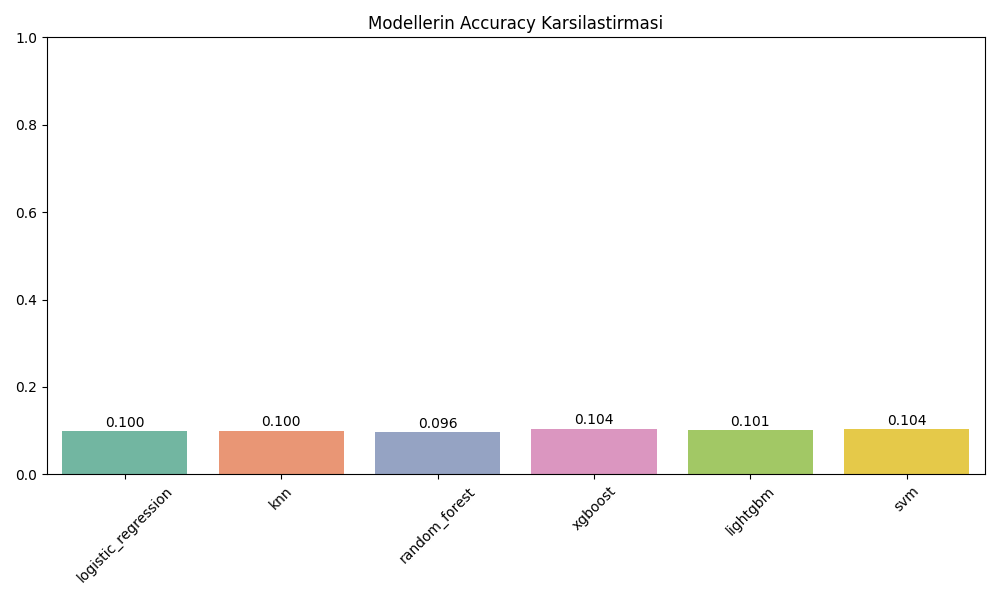
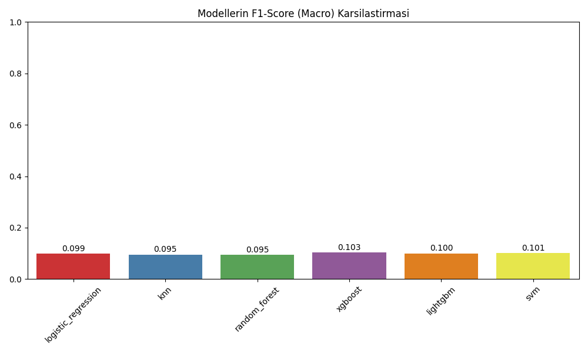

# CI/CD failure_type Tahmini - Modellerin Karsilastirilmasi

Bu belgede 6 farkli makine ogrenmesi modelinin 10 sinifli `failure_type` tahmini uzerindeki performanslari ozetlenmistir.

## 1. Sonuclar Tablosu

| Model | Accuracy | F1-Score (Macro) |
|-------|----------|-----------------|
| **xgboost** | 0.1043 | 0.1033 |
| **svm** | 0.1037 | 0.1014 |
| **lightgbm** | 0.1007 | 0.1000 |
| **knn** | 0.1004 | 0.0953 |
| **logistic_regression** | 0.0996 | 0.0993 |
| **random_forest** | 0.0962 | 0.0949 |

## 2. Grafiksel Gorseller

Ayrintilar ve grafikler her modelin kendi klasoru icerisinde (`confusion_matrix.png`, `feature_importance.png`) bulunabilir.

