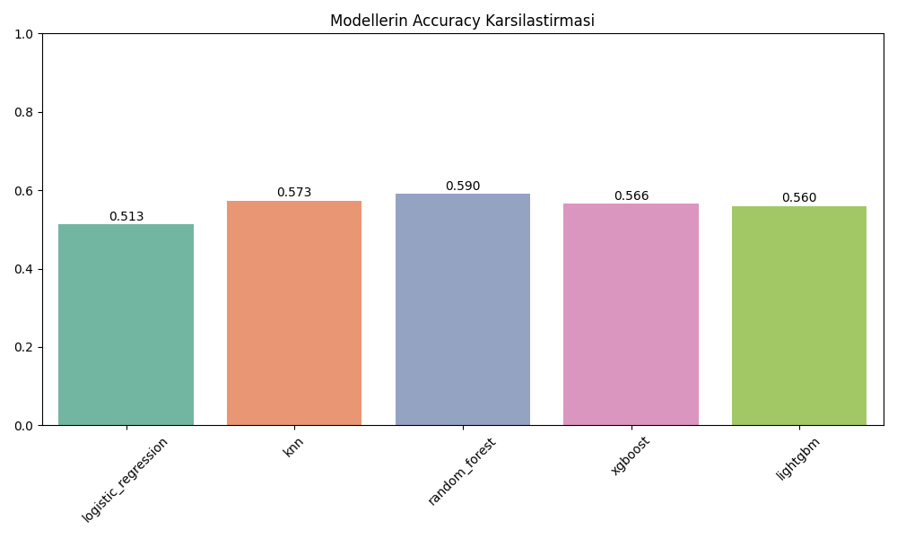
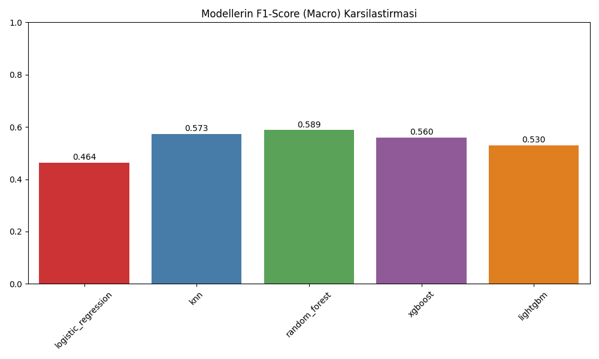

# Code Metrics Refactoring Tahmini - Modellerin Karsilastirilmasi

Bu belgede 5 farkli makine ogrenmesi modelinin `refactoring` ihtiyaci (ikili siniflandirma)  uzerindeki performanslari ozetlenmistir.

## 1. Sonuclar Tablosu

| Model | Accuracy | F1-Score (Macro) |
|-------|----------|-----------------|
| **random_forest** | 0.5901 | 0.5887 |
| **knn** | 0.5734 | 0.5733 |
| **xgboost** | 0.5656 | 0.5598 |
| **lightgbm** | 0.5599 | 0.5304 |
| **logistic_regression** | 0.5129 | 0.4636 |

## 2. Grafiksel Gorseller

Ayrintilar ve grafikler her modelin kendi klasoru icerisinde (`confusion_matrix.png`, `feature_importance.png`) bulunabilir.

