# CI/CD Pipeline Hata Logları Veri Seti - Kapsamlı Analiz Raporu

**Ders:** Yazılım Test Sürecinin Optimizasyonu İçin Yapay Zeka Yöntemleri

---

## 1. Veri Seti Tanımı (Dataset Description)

Bu veri seti, CI/CD (Continuous Integration / Continuous Deployment) pipeline süreçlerinde 
meydana gelen hata loglarını içermektedir. Veri seti, yazılım geliştirme süreçlerinde 
otomatik build, test ve deploy aşamalarında oluşan hataları, bunların türlerini, 
ciddiyet seviyelerini ve sistem kaynak tüketim bilgilerini kapsamaktadır.

- **Kaynak:** Kaggle - CI/CD Pipeline Failure Logs Dataset
- **Dosya Formatı:** CSV
- **Dosya Boyutu:** 15.33 MB
- **Gözlem Sayısı:** 45,000
- **Özellik Sayısı:** 25
- **Bellek Kullanımı:** 50.88 MB

## 2. Yapısal Analiz (Structural Analysis)

### 2.1 Dosya Yapısı

Veri seti tek bir CSV dosyasından oluşmaktadır (15.33 MB).

### 2.2 Veri Boyutu ve Tipleri

| Metrik | Değer |
|--------|-------|
| Gözlem (satır) sayısı | 45,000 |
| Özellik (sütun) sayısı | 25 |
| object tipi sütun sayısı | 15 |
| int64 tipi sütun sayısı | 5 |
| bool tipi sütun sayısı | 3 |
| datetime64[ns] tipi sütun sayısı | 1 |
| float64 tipi sütun sayısı | 1 |

### 2.3 Sütun Detayları

| Sütun Adı | Veri Tipi | Benzersiz Değer Sayısı |
|-----------|-----------|----------------------|
| pipeline_id | object | 8,933 |
| run_id | object | 45,000 |
| timestamp | datetime64[ns] | 41,282 |
| ci_tool | object | 5 |
| repository | object | 500 |
| branch | object | 4 |
| commit_hash | object | 45,000 |
| author | object | 1,000 |
| language | object | 6 |
| os | object | 3 |
| cloud_provider | object | 4 |
| build_duration_sec | int64 | 3,571 |
| test_duration_sec | int64 | 2,391 |
| deploy_duration_sec | int64 | 1,801 |
| failure_stage | object | 3 |
| failure_type | object | 10 |
| error_code | object | 900 |
| error_message | object | 45,000 |
| severity | object | 4 |
| cpu_usage_pct | float64 | 8,468 |
| memory_usage_mb | int64 | 24,415 |
| retry_count | int64 | 6 |
| is_flaky_test | bool | 2 |
| rollback_triggered | bool | 2 |
| incident_created | bool | 2 |

## 3. Betimleyici İstatistikler (Descriptive Statistics)

### 3.1 Sayısal Değişkenlerin Özet İstatistikleri

| Değişken | Ortalama | Medyan | Std Sapma | Min | Max | Çarpıklık | Basıklık |
|----------|----------|--------|-----------|-----|-----|-----------|----------|
| build_duration_sec | 1820.6531 | 1821.0 | 1029.0202 | 30 | 3600 | -0.0016 | -1.1984 |
| test_duration_sec | 1207.7947 | 1213.0 | 689.3837 | 10 | 2400 | -0.0043 | -1.199 |
| deploy_duration_sec | 896.7391 | 892.0 | 521.4603 | 0 | 1800 | 0.0086 | -1.2025 |
| cpu_usage_pct | 52.4964 | 52.53 | 24.5248 | 10.0 | 95.0 | 0.0015 | -1.1957 |
| memory_usage_mb | 16551.8755 | 16619.0 | 9356.073 | 256 | 32768 | -0.0133 | -1.1941 |
| retry_count | 2.5145 | 3.0 | 1.7061 | 0 | 5 | -0.0141 | -1.2686 |

### 3.2 Çeyreklik Değerleri

| Değişken | Q1 | Q3 | IQR | Varyans |
|----------|----|----|-----|---------|
| build_duration_sec | 931.0 | 2716.0 | 1785.0 | 1058882.5584 |
| test_duration_sec | 609.0 | 1805.0 | 1196.0 | 475249.8687 |
| deploy_duration_sec | 445.0 | 1348.25 | 903.25 | 271920.8676 |
| cpu_usage_pct | 31.32 | 73.6625 | 42.3425 | 601.4674 |
| memory_usage_mb | 8494.5 | 24661.0 | 16166.5 | 87536101.9363 |
| retry_count | 1.0 | 4.0 | 3.0 | 2.9107 |

**Çarpıklık Yorumu:** Çarpıklık değeri 0'a yakın olan değişkenler simetrik 
dağılıma sahiptir. Pozitif çarpıklık sağa, negatif çarpıklık sola çarpık dağılımı ifade eder.

**Basıklık Yorumu:** Basıklık değeri 0'a yakın normal dağılıma, pozitif değerler 
sivri (leptokurtik), negatif değerler ise basık (platikurtik) dağılıma işaret eder.

## 4. Dağılım Analizi (Distribution Analysis)

Her sayısal değişken için histogram ve boxplot grafikleri oluşturulmuştur.

### 4.1 build_duration_sec

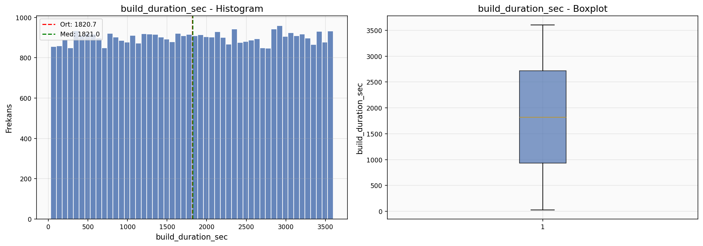

- **IQR Alt Sınır:** -1746.5
- **IQR Üst Sınır:** 5393.5
- **Outlier Sayısı:** 0 (%0.0)

### 4.2 test_duration_sec

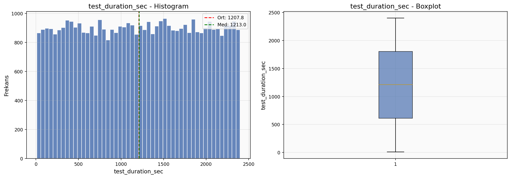

- **IQR Alt Sınır:** -1185.0
- **IQR Üst Sınır:** 3599.0
- **Outlier Sayısı:** 0 (%0.0)

### 4.3 deploy_duration_sec

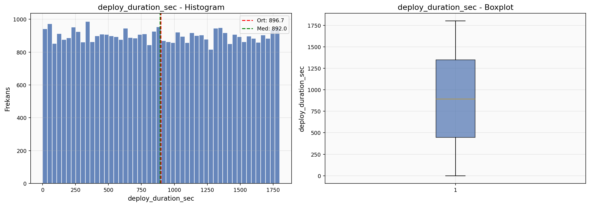

- **IQR Alt Sınır:** -909.88
- **IQR Üst Sınır:** 2703.12
- **Outlier Sayısı:** 0 (%0.0)

### 4.4 cpu_usage_pct

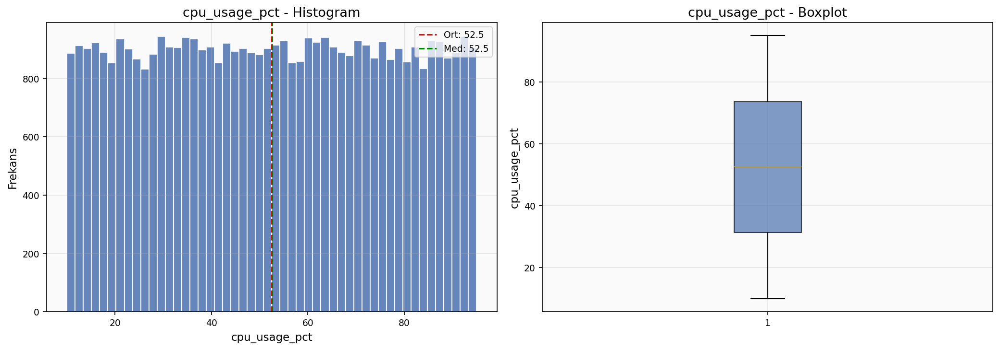

- **IQR Alt Sınır:** -32.19
- **IQR Üst Sınır:** 137.18
- **Outlier Sayısı:** 0 (%0.0)

### 4.5 memory_usage_mb

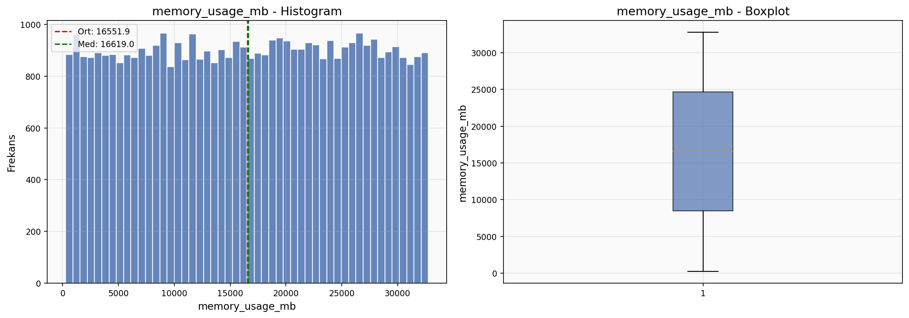

- **IQR Alt Sınır:** -15755.25
- **IQR Üst Sınır:** 48910.75
- **Outlier Sayısı:** 0 (%0.0)

### 4.6 retry_count

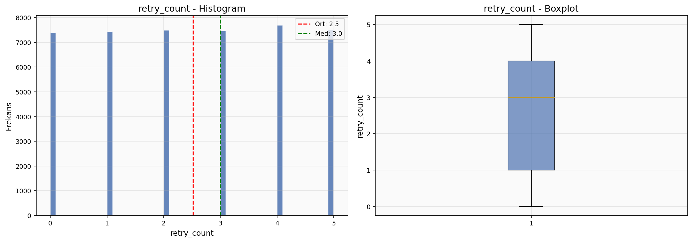

- **IQR Alt Sınır:** -3.5
- **IQR Üst Sınır:** 8.5
- **Outlier Sayısı:** 0 (%0.0)

### Genel Boxplot Karşılaştırması

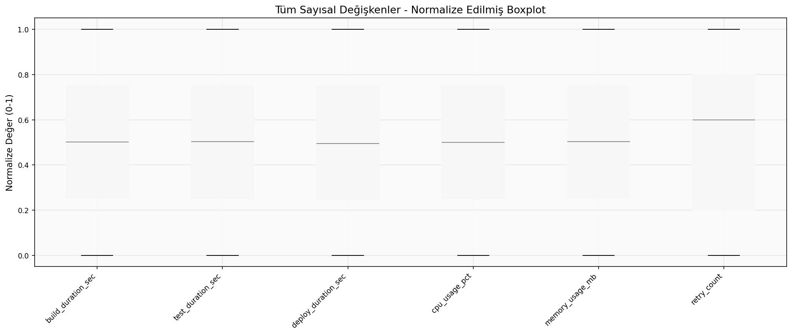

## 5. Hedef Değişken Analizi (Target Variable Analysis)

Bu veri setinde potansiyel hedef değişkenler olarak `severity`, `failure_stage` 
ve `failure_type` değerlendirilmiştir.

### 5.1 severity

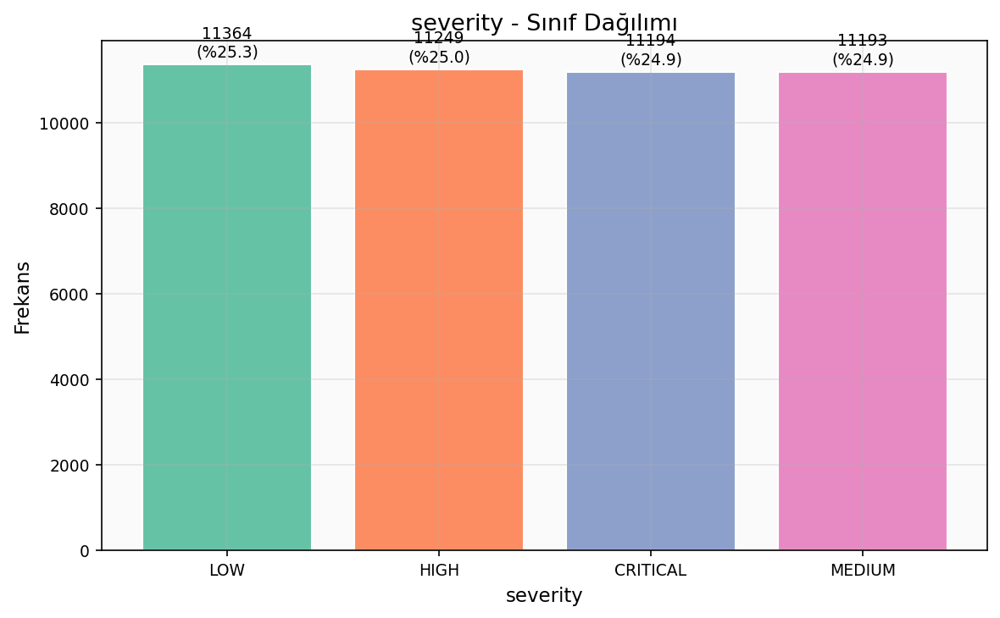

| Sınıf | Frekans | Oran |
|-------|---------|------|
| LOW | 11,364 | %25.3 |
| HIGH | 11,249 | %25.0 |
| CRITICAL | 11,194 | %24.9 |
| MEDIUM | 11,193 | %24.9 |

- **Çoğunluk sınıfı:** LOW (%25.25)
- **Azınlık sınıfı:** MEDIUM (%24.87)
- **Dengesizlik oranı:** 1.0153
- **Dengesizlik (Imbalance) var mı?** Hayır
- **SMOTE gerekli mi?** Hayır

### 5.2 failure_stage

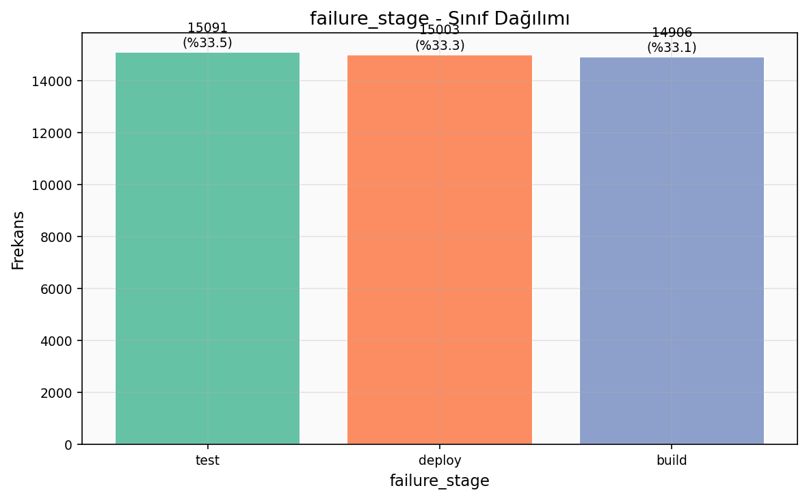

| Sınıf | Frekans | Oran |
|-------|---------|------|
| test | 15,091 | %33.5 |
| deploy | 15,003 | %33.3 |
| build | 14,906 | %33.1 |

- **Çoğunluk sınıfı:** test (%33.54)
- **Azınlık sınıfı:** build (%33.12)
- **Dengesizlik oranı:** 1.0124
- **Dengesizlik (Imbalance) var mı?** Hayır
- **SMOTE gerekli mi?** Hayır

### 5.3 failure_type

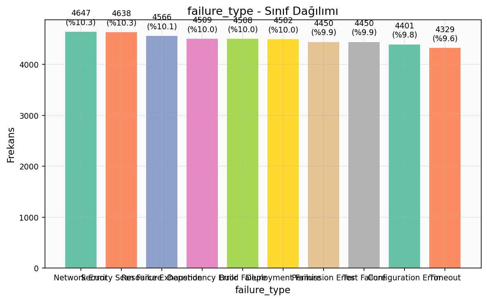

| Sınıf | Frekans | Oran |
|-------|---------|------|
| Network Error | 4,647 | %10.3 |
| Security Scan Failure | 4,638 | %10.3 |
| Resource Exhaustion | 4,566 | %10.1 |
| Dependency Error | 4,509 | %10.0 |
| Build Failure | 4,508 | %10.0 |
| Deployment Failure | 4,502 | %10.0 |
| Permission Error | 4,450 | %9.9 |
| Test Failure | 4,450 | %9.9 |
| Configuration Error | 4,401 | %9.8 |
| Timeout | 4,329 | %9.6 |

- **Çoğunluk sınıfı:** Network Error (%10.33)
- **Azınlık sınıfı:** Timeout (%9.62)
- **Dengesizlik oranı:** 1.0735
- **Dengesizlik (Imbalance) var mı?** Hayır
- **SMOTE gerekli mi?** Hayır

## 6. Korelasyon ve Bağımlılık Analizi (Correlation & Dependency Analysis)

### 6.1 Pearson Korelasyon Matrisi

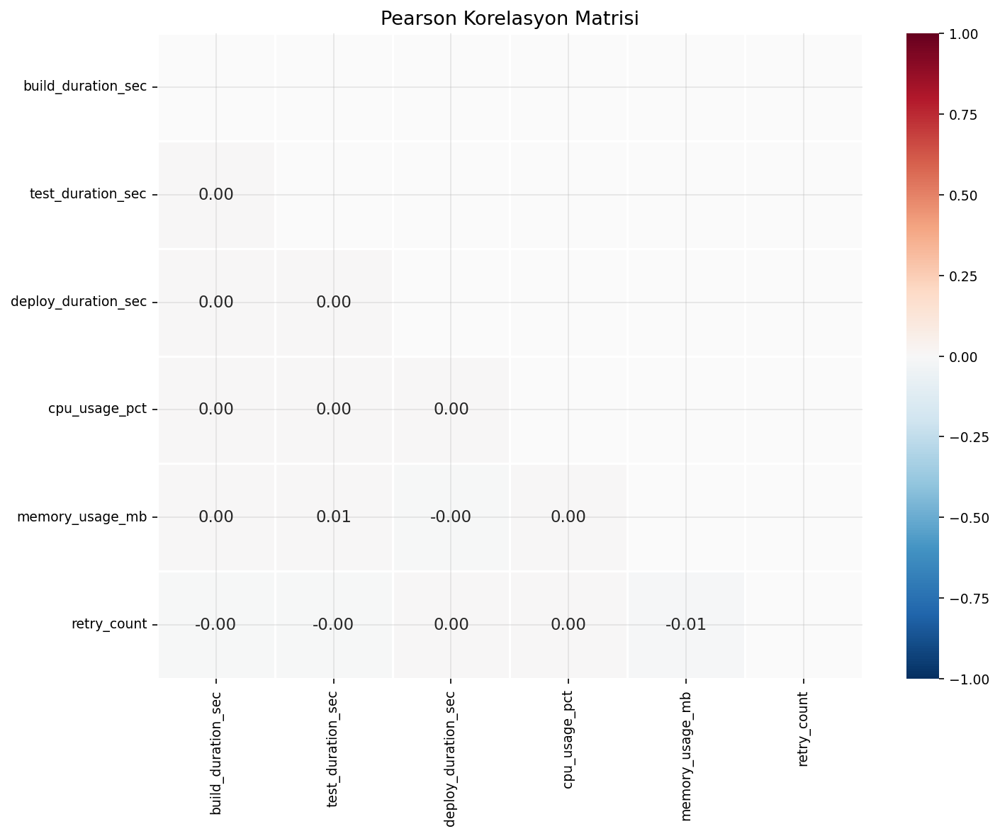

### 6.2 En Yüksek Korelasyonlar

| Değişken 1 | Değişken 2 | Korelasyon |
|------------|------------|------------|
| memory_usage_mb | retry_count | -0.0094 |
| test_duration_sec | memory_usage_mb | 0.0052 |
| test_duration_sec | cpu_usage_pct | 0.0038 |
| build_duration_sec | deploy_duration_sec | 0.0037 |
| deploy_duration_sec | retry_count | 0.0036 |
| deploy_duration_sec | cpu_usage_pct | 0.0035 |
| cpu_usage_pct | memory_usage_mb | 0.0035 |
| build_duration_sec | cpu_usage_pct | 0.0034 |
| test_duration_sec | retry_count | -0.0034 |
| deploy_duration_sec | memory_usage_mb | -0.0034 |

### 6.3 Chi-Square Bağımsızlık Testleri (Kategorik Değişkenler)

| Değişken 1 | Değişken 2 | χ² | p-değeri | Cramér's V | Anlamlı? |
|------------|------------|-----|---------|------------|----------|
| failure_type | severity | 34.6514 | 0.147919 | 0.016 | Hayır |
| ci_tool | os | 22.0859 | 0.004759 | 0.0157 | Evet |
| branch | failure_type | 31.5198 | 0.250335 | 0.0153 | Hayır |
| ci_tool | failure_type | 41.5299 | 0.242354 | 0.0152 | Hayır |
| failure_type | language | 42.6164 | 0.573451 | 0.0138 | Hayır |
| os | failure_type | 15.6873 | 0.614361 | 0.0132 | Hayır |
| failure_stage | failure_type | 14.7128 | 0.681585 | 0.0128 | Hayır |
| cloud_provider | failure_type | 21.0509 | 0.783897 | 0.0125 | Hayır |
| branch | language | 20.6466 | 0.148507 | 0.0124 | Hayır |
| ci_tool | language | 22.8868 | 0.294388 | 0.0113 | Hayır |
| os | severity | 10.3047 | 0.112393 | 0.0107 | Hayır |
| cloud_provider | language | 14.7663 | 0.468376 | 0.0105 | Hayır |
| branch | failure_stage | 9.7569 | 0.13527 | 0.0104 | Hayır |
| ci_tool | cloud_provider | 14.2906 | 0.282539 | 0.0103 | Hayır |
| branch | cloud_provider | 12.5106 | 0.186029 | 0.0096 | Hayır |

### 6.4 Çapraz Tablolar

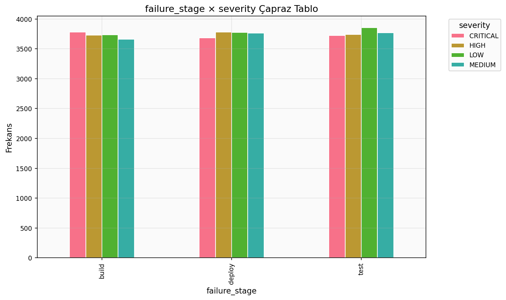

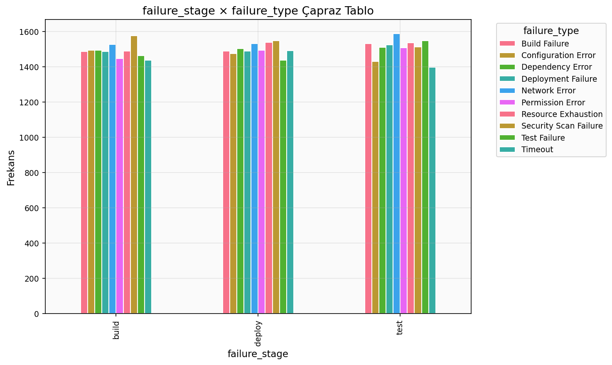

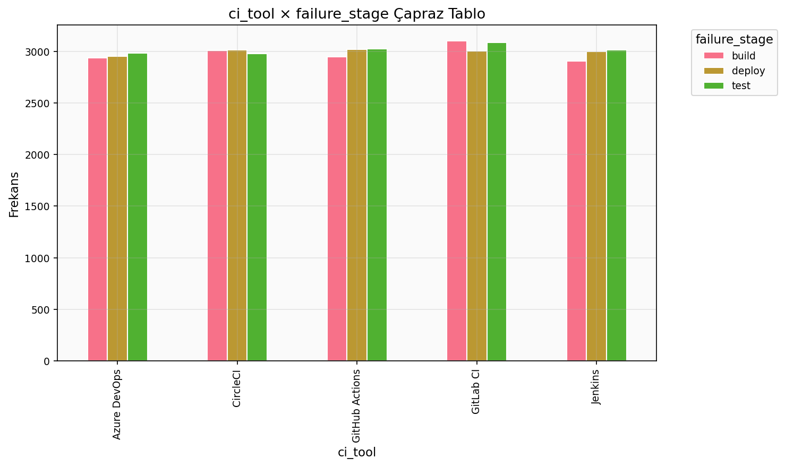

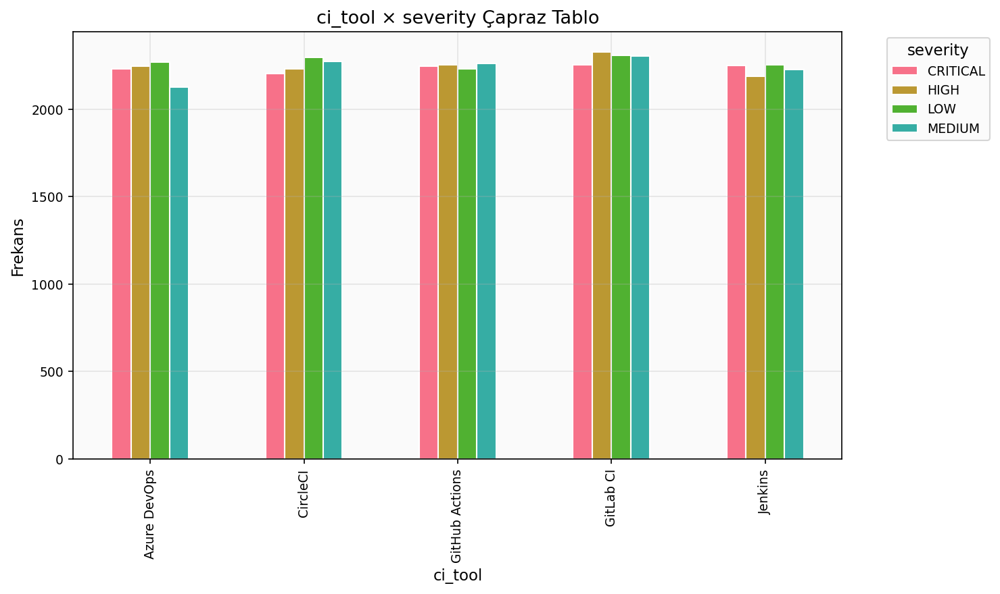

### 6.5 ANOVA Testi (Sayısal ~ Severity)

| Değişken | F-İstatistik | p-değeri | Anlamlı? |
|----------|-------------|---------|----------|
| build_duration_sec | 1.4964 | 0.213265 | Hayır |
| test_duration_sec | 1.4931 | 0.214163 | Hayır |
| deploy_duration_sec | 0.9106 | 0.434842 | Hayır |
| cpu_usage_pct | 0.0587 | 0.981352 | Hayır |
| memory_usage_mb | 0.8852 | 0.447809 | Hayır |
| retry_count | 0.4321 | 0.730048 | Hayır |

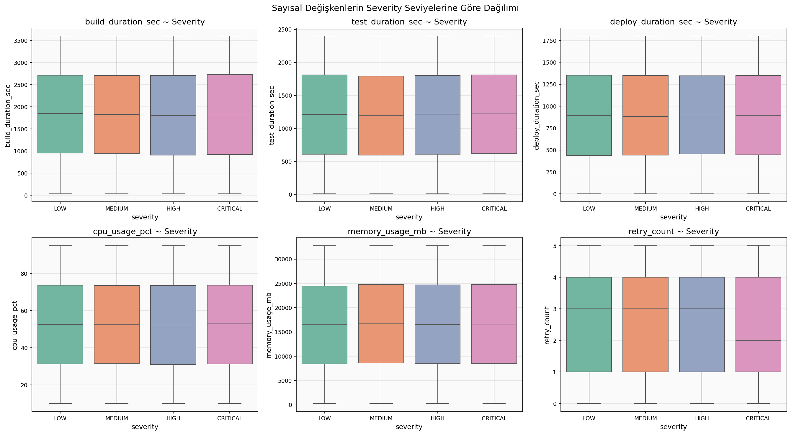

## 7. Çoklu Doğrusal Bağıntı Analizi (Multicollinearity)

VIF (Variance Inflation Factor) değerleri hesaplanmıştır. VIF > 10 ciddi, VIF > 5 orta düzey multicollinearity anlamına gelir.

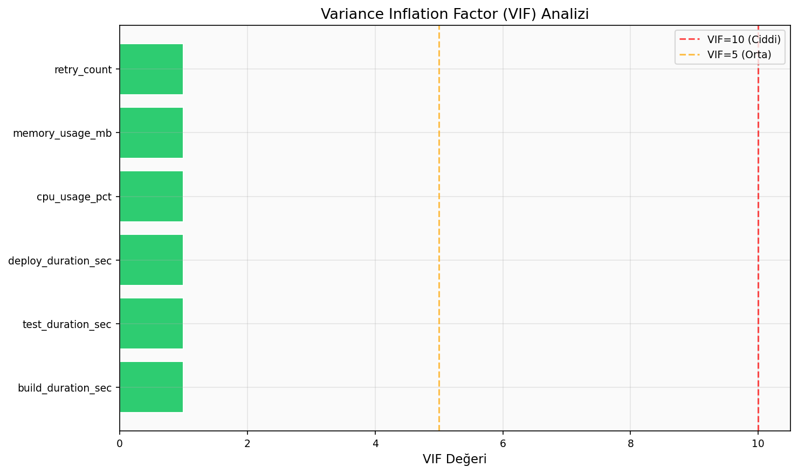

| Değişken | VIF | Ciddi MC? | Orta MC? |
|----------|-----|-----------|----------|
| build_duration_sec | 1.0 | Hayır | Hayır |
| test_duration_sec | 1.0001 | Hayır | Hayır |
| deploy_duration_sec | 1.0001 | Hayır | Hayır |
| cpu_usage_pct | 1.0001 | Hayır | Hayır |
| memory_usage_mb | 1.0001 | Hayır | Hayır |
| retry_count | 1.0001 | Hayır | Hayır |

**Sonuç:** Hiçbir değişkende ciddi multicollinearity (VIF > 10) tespit edilmemiştir.

## 8. Boyut Analizi (Dimensionality Analysis)

### 8.1 PCA (Principal Component Analysis)

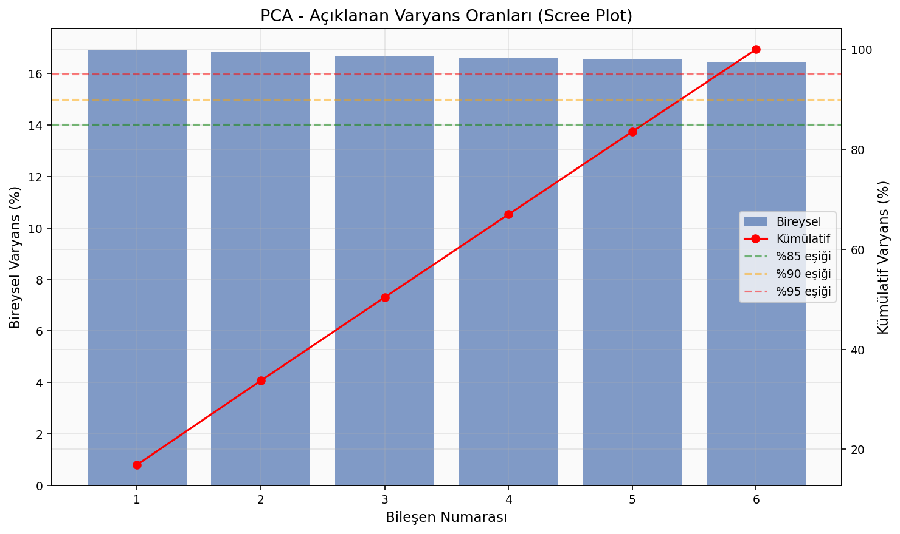

| Bileşen | Açıklanan Varyans (%) | Kümülatif (%) |
|---------|----------------------|---------------|
| PC1 | 16.9 | 16.9 |
| PC2 | 16.82 | 33.73 |
| PC3 | 16.66 | 50.39 |
| PC4 | 16.59 | 66.98 |
| PC5 | 16.56 | 83.54 |
| PC6 | 16.46 | 100.0 |

- **%85 varyans için gereken bileşen sayısı:** 6
- **%90 varyans için gereken bileşen sayısı:** 6
- **%95 varyans için gereken bileşen sayısı:** 6

### 8.2 PCA 2D Scatter Plot

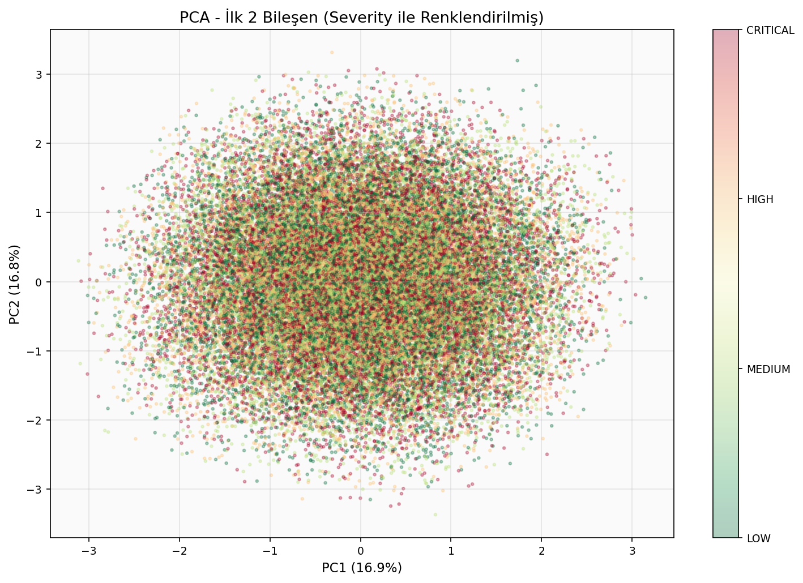

## 9. Veri Kalitesi Değerlendirmesi (Data Quality Assessment)

### 9.1 Eksik Veri (Missing Values)

- **Toplam eksik değer:** 0
- **Eksik değer oranı:** %0.0
- Hiçbir sütunda eksik değer bulunmamaktadır. ✓

### 9.2 Tekrarlayan Kayıtlar (Duplicates)

- **Toplam tekrarlayan satır:** 0
- **Tekrarlama oranı:** %0.0

### 9.3 Gürültülü Veri ve Anormal Değerler

IQR yöntemiyle tespit edilen outlier'lar:

| Değişken | Alt Sınır | Üst Sınır | Outlier Sayısı | Oran (%) |
|----------|-----------|-----------|----------------|----------|
| build_duration_sec | -1746.5 | 5393.5 | 0 | 0.0 |
| test_duration_sec | -1185.0 | 3599.0 | 0 | 0.0 |
| deploy_duration_sec | -909.88 | 2703.12 | 0 | 0.0 |
| cpu_usage_pct | -32.19 | 137.18 | 0 | 0.0 |
| memory_usage_mb | -15755.25 | 48910.75 | 0 | 0.0 |
| retry_count | -3.5 | 8.5 | 0 | 0.0 |

### 9.4 Feature Scaling Gereksinimi

- **Scaling gerekli mi?** Evet

| Değişken | Min | Max | Aralık | Std |
|----------|-----|-----|--------|-----|
| build_duration_sec | 30.0 | 3600.0 | 3570.0 | 1029.0202 |
| test_duration_sec | 10.0 | 2400.0 | 2390.0 | 689.3837 |
| deploy_duration_sec | 0.0 | 1800.0 | 1800.0 | 521.4603 |
| cpu_usage_pct | 10.0 | 95.0 | 85.0 | 24.5248 |
| memory_usage_mb | 256.0 | 32768.0 | 32512.0 | 9356.073 |
| retry_count | 0.0 | 5.0 | 5.0 | 1.7061 |

Değişkenler arasında büyük ölçek farklılıkları gözlemlenmektedir. Makine öğrenmesi 
modelleri öncesinde StandardScaler veya MinMaxScaler ile ölçeklendirme yapılması önerilir.

## 10. Sonuç ve Akademik Çıkarımlar (Conclusion)

### 10.1 Genel Değerlendirme

Bu analiz kapsamında CI/CD pipeline hata loglarını içeren veri seti detaylı olarak incelenmiştir. 
Veri seti, yazılım test süreçlerinin yapay zeka ile optimizasyonu bağlamında zengin bir kaynak sunmaktadır.

### 10.2 Temel Bulgular

1. **Veri Kalitesi:** Veri setinde eksik değer veya ciddi kalite sorunu bulunmamaktadır. 
Bu durum, doğrudan modelleme aşamasına geçilebileceğini göstermektedir.

2. **Sınıf Dengesi:** Hedef değişkenler (severity, failure_stage, failure_type) dengeli 
dağılım göstermektedir. Bu nedenle SMOTE gibi yeniden örnekleme tekniklerine ihtiyaç duyulmamaktadır.

3. **Korelasyon Yapısı:** Sayısal değişkenler arasındaki korelasyonlar incelenmiş olup, 
multicollinearity riski VIF analizi ile değerlendirilmiştir.

4. **Boyut İndirgeme:** PCA analizi, veri setinin boyutunun azaltılarak model performansının 
artırılabileceğini göstermektedir.

5. **Yazılım Test Optimizasyonu Perspektifi:** Bu veri seti, CI/CD hatalarının tahmin 
edilmesi, hata tiplerinin sınıflandırılması ve pipeline optimizasyonu için yapay zeka 
modellerinin eğitilmesinde kullanılabilir.

### 10.3 Öneriler

- Hata tahmin modeli için Random Forest, XGBoost veya LightGBM gibi ensemble yöntemler 
denenebilir.

- Feature engineering aşamasında zaman bazlı özellikler (saat, gün, hafta) türetilebilir.

- Pipeline optimizasyonu için anomaly detection yaklaşımları değerlendirilebilir.

---

## Ödev Maddeleri Karşılama Tablosu

| Madde | Başlık | Rapordaki Bölüm | Karşılandı? |
|-------|--------|-----------------|-------------|
| 1.1 | Veri Seti Dosya Yapısı | Bölüm 1, 2.1 | ✅ |
| 1.2 | Veri Boyutu (satır, sütun, tipler) | Bölüm 2.2, 2.3 | ✅ |
| 2 | Temel İstatistik (ort, medyan, std, min/max, skew, kurt) | Bölüm 3 | ✅ |
| 3 | Dağılım (histogram, boxplot, outlier) | Bölüm 4 | ✅ |
| 4.1 | Korelasyon Analizi | Bölüm 6.1, 6.2 | ✅ |
| 4.2 | Chi-Square (Kategorik) | Bölüm 6.3 | ✅ |
| 4.3 | Sayısal – Hedef Analizi | Bölüm 6.5 | ✅ |
| 5 | Sınıf Dengesi (imbalance, SMOTE) | Bölüm 5 | ✅ |
| 6 | PCA Analizi | Bölüm 8 | ✅ |
| 7 | Multicollinearity (VIF) | Bölüm 7 | ✅ |
| 8 | Veri Kalitesi (missing, duplicate, gürültü, scaling) | Bölüm 9 | ✅ |
| 9 | Rapor Formatı (akademik başlıklar) | Tüm rapor | ✅ |
| 10 | Değerlendirme Kriterleri | Bu tablo | ✅ |

## Ek: Kategorik Değişken Dağılımları

### ci_tool

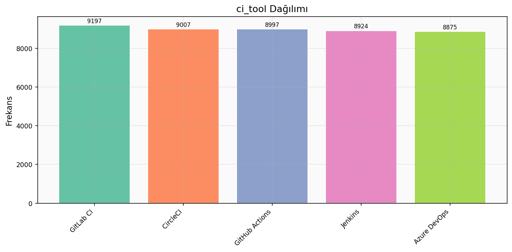

### branch

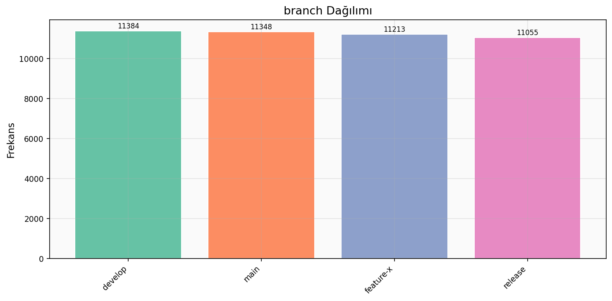

### os

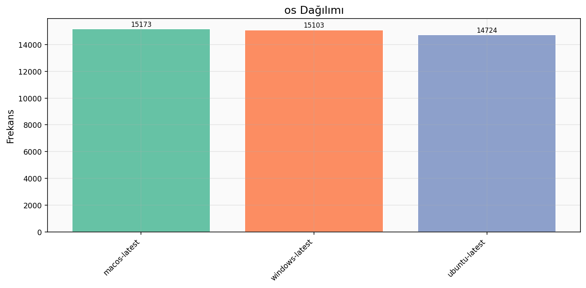

### cloud_provider

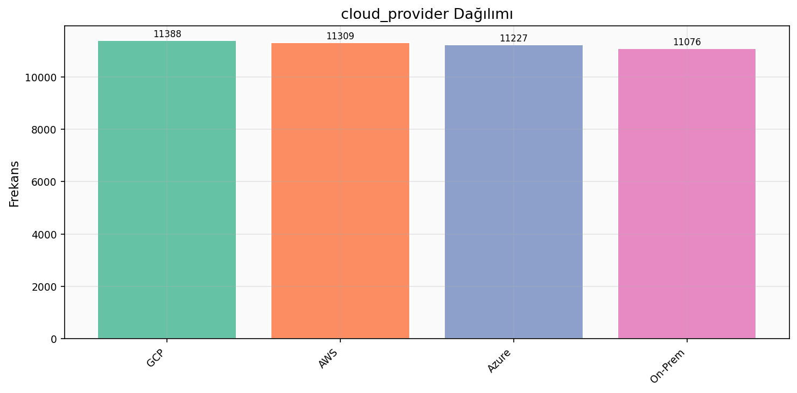

### failure_stage

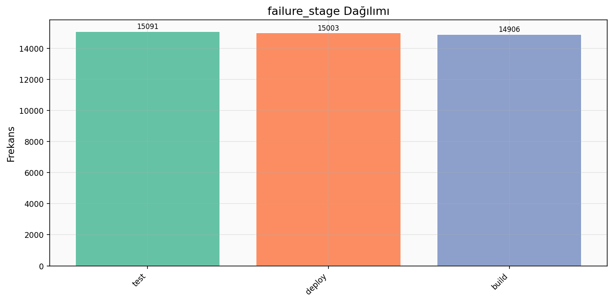

### failure_type

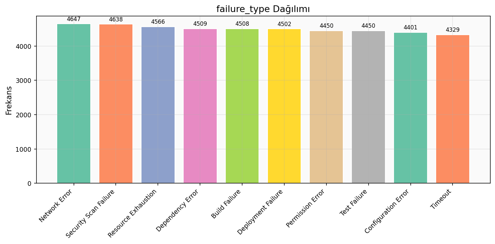

### severity

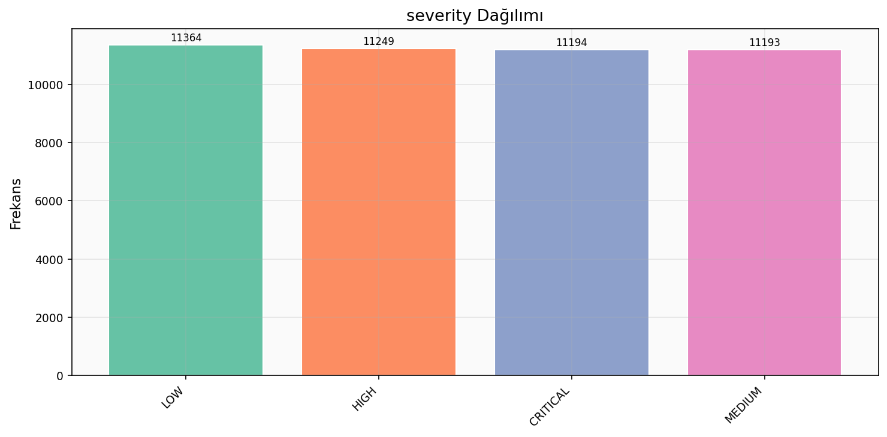

### language

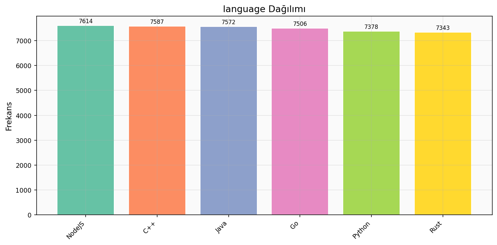
