# Code Metrics Dataset (SoftwareProjectStructure) - Kapsamlı Analiz Raporu

**Ders:** Yazılım Test Sürecinin Optimizasyonu İçin Yapay Zeka Yöntemleri

---

## 1. Veri Seti Tanımı (Dataset Description)

Bu veri seti, yazılım projelerinin kaynak kod metriklerini içermektedir. Java projelerinden elde edilen 
CK (Chidamber-Kemerer) ve diğer nesne yönelimli tasarım metrikleri, sınıf düzeyinde ölçümlenmiştir. 
Veri seti, yazılım refactoring ihtiyacının tahmin edilmesi amacıyla oluşturulmuş olup, 
"trivial" ve "non-trivial" refactoring olmak üzere iki alt dosyadan meydana gelmektedir.

- **Kaynak:** Kaggle - Code Metrics Dataset SoftwareProjectStructure
- **Dosya Formatı:** CSV
- **Toplam Dosya Sayısı:** 2
- **Toplam Veri Boyutu:** 158.75 MB
- **Toplam Gözlem Sayısı:** 741,894
- **Özellik Sayısı:** 53

## 2. Yapısal Analiz (Structural Analysis)

### 2.1 Dosya Yapısı

| Dosya | Boyut (MB) | Gözlem Sayısı | Özellik Sayısı |
|-------|-----------|---------------|----------------|
| OnlyNonTrivial_dt.csv | 109.96 | 509,426 | 53 |
| OnlyTrivial_dt.csv | 48.79 | 232,468 | 53 |
| **Toplam** | **158.75** | **741,894** | **53** |

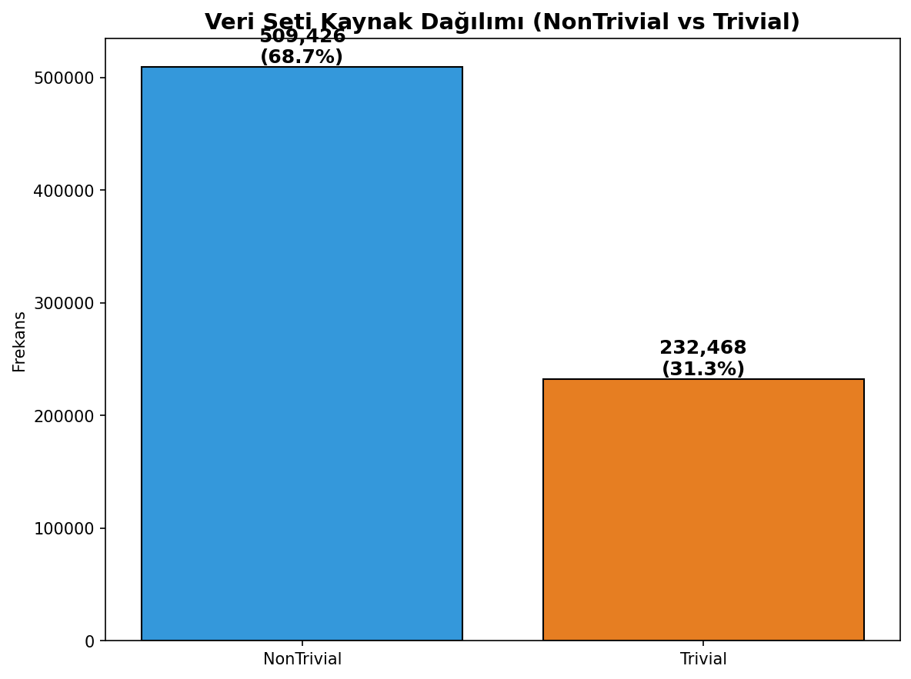

### 2.2 Veri Boyutu ve Tipleri

| Metrik | Değer |
|--------|-------|
| Toplam gözlem (satır) sayısı | 741,894 |
| Özellik (sütun) sayısı | 53 |
| int64 tipi sütun sayısı | 47 |
| float64 tipi sütun sayısı | 3 |
| object tipi sütun sayısı | 3 |

### 2.3 Sütun Detayları

| Sütun Adı | Veri Tipi | Açıklama |
|-----------|-----------|----------|
| refactoring | int64 | Hedef değişken (0/1) |
| file | object | Kaynak dosya yolu |
| class | object | Sınıf adı |
| type | object | Sınıf tipi (class, interface, enum, innerclass, anonymous) |
| cbo | int64 | Coupling Between Objects |
| cboModified | int64 | Modifiye CBO |
| fanin | int64 | Fan-in (gelen bağımlılıklar) |
| fanout | int64 | Fan-out (giden bağımlılıklar) |
| wmc | int64 | Weighted Methods per Class |
| dit | int64 | Depth of Inheritance Tree |
| noc | int64 | Number of Children |
| rfc | int64 | Response for a Class |
| lcom | int64 | Lack of Cohesion of Methods |
| lcom* | float64 | Normalize edilmiş LCOM |
| tcc | float64 | Tight Class Cohesion |
| lcc | float64 | Loose Class Cohesion |
| totalMethodsQty | int64 | Toplam metot sayısı |
| staticMethodsQty | int64 | Statik metot sayısı |
| publicMethodsQty | int64 | Public metot sayısı |
| privateMethodsQty | int64 | Private metot sayısı |
| protectedMethodsQty | int64 | Protected metot sayısı |
| defaultMethodsQty | int64 | Default metot sayısı |
| visibleMethodsQty | int64 | Erişilebilir metot sayısı |
| abstractMethodsQty | int64 | Abstract metot sayısı |
| finalMethodsQty | int64 | Final metot sayısı |
| synchronizedMethodsQty | int64 | Synchronized metot sayısı |
| totalFieldsQty | int64 | Toplam alan (field) sayısı |
| staticFieldsQty | int64 | Statik alan sayısı |
| publicFieldsQty | int64 | Public alan sayısı |
| privateFieldsQty | int64 | Private alan sayısı |
| protectedFieldsQty | int64 | Protected alan sayısı |
| defaultFieldsQty | int64 | Default alan sayısı |
| finalFieldsQty | int64 | Final alan sayısı |
| synchronizedFieldsQty | int64 | Synchronized alan sayısı |
| nosi | int64 | Number of Static Invocations |
| loc | int64 | Lines of Code |
| returnQty | int64 | Return ifade sayısı |
| loopQty | int64 | Döngü sayısı |
| comparisonsQty | int64 | Karşılaştırma sayısı |
| tryCatchQty | int64 | Try-catch blok sayısı |
| parenthesizedExpsQty | int64 | Parantez ifade sayısı |
| stringLiteralsQty | int64 | String literal sayısı |
| numbersQty | int64 | Sayı literal sayısı |
| assignmentsQty | int64 | Atama sayısı |
| mathOperationsQty | int64 | Matematik işlem sayısı |
| variablesQty | int64 | Değişken sayısı |
| maxNestedBlocksQty | int64 | Maksimum iç içe blok derinliği |
| anonymousClassesQty | int64 | Anonim sınıf sayısı |
| innerClassesQty | int64 | İç sınıf sayısı |
| lambdasQty | int64 | Lambda ifade sayısı |
| uniqueWordsQty | int64 | Benzersiz kelime sayısı |
| modifiers | int64 | Modifier sayısı |
| logStatementsQty | int64 | Log ifade sayısı |

## 3. Betimleyici İstatistikler (Descriptive Statistics)

### 3.1 Sayısal Değişkenlerin Özet İstatistikleri

| Değişken | Ortalama | Medyan | Std Sapma | Min | Max | Çarpıklık | Basıklık |
|----------|----------|--------|-----------|-----|-----|-----------|----------|
| cbo | 5.1561 | 3.0 | 5.8931 | 0 | 192 | 4.2396 | 62.6666 |
| cboModified | 6.8967 | 5.0 | 7.4942 | 0 | 471 | 6.9031 | 270.2567 |
| fanin | 1.7406 | 1.0 | 3.8387 | 0 | 469 | 33.4526 | 3660.4778 |
| fanout | 5.1562 | 3.0 | 5.8932 | 0 | 192 | 4.2395 | 62.665 |
| wmc | 7.6432 | 3.0 | 14.9835 | 0 | 666 | 9.6888 | 219.9243 |
| dit | 1.4315 | 1.0 | 0.8218 | 1 | 75 | 5.6543 | 221.9581 |
| noc | 0.1058 | 0.0 | 0.8426 | 0 | 25 | 16.2012 | 354.7236 |
| rfc | 8.103 | 3.0 | 14.227 | 0 | 237 | 4.5396 | 33.3049 |
| lcom | 36.0081 | 0.0 | 1504.0433 | 0 | 221445 | 106.0877 | 12102.9184 |
| loc | 36.8468 | 15.0 | 87.9248 | 1 | 6667 | 29.9193 | 1660.9943 |
| totalMethodsQty | 4.599 | 2.0 | 8.8134 | 0 | 666 | 25.7606 | 1455.8686 |
| totalFieldsQty | 2.2682 | 1.0 | 4.776 | 0 | 149 | 8.9666 | 159.2861 |
| nosi | 0.9941 | 0.0 | 4.6066 | 0 | 604 | 60.8274 | 7182.3364 |
| returnQty | 2.4587 | 0.0 | 7.8062 | 0 | 666 | 36.5133 | 2401.1126 |
| loopQty | 0.4299 | 0.0 | 1.8194 | 0 | 77 | 10.2283 | 179.7172 |
| comparisonsQty | 1.0232 | 0.0 | 3.6482 | 0 | 153 | 10.4018 | 224.0721 |
| variablesQty | 5.4887 | 2.0 | 11.3463 | 0 | 369 | 6.6908 | 83.8105 |
| maxNestedBlocksQty | 0.7122 | 0.0 | 1.1038 | 0 | 14 | 2.3434 | 9.3081 |
| uniqueWordsQty | 31.1643 | 19.0 | 44.8212 | 0 | 2866 | 18.5622 | 994.9848 |

### 3.2 Çeyreklik Değerleri

| Değişken | Q1 | Q3 | IQR |
|----------|----|----|-----|
| cbo | 1.0 | 7.0 | 6.0 |
| cboModified | 2.0 | 9.0 | 7.0 |
| fanin | 0.0 | 2.0 | 2.0 |
| fanout | 1.0 | 7.0 | 6.0 |
| wmc | 1.0 | 8.0 | 7.0 |
| dit | 1.0 | 2.0 | 1.0 |
| noc | 0.0 | 0.0 | 0.0 |
| rfc | 0.0 | 10.0 | 10.0 |
| lcom | 0.0 | 4.0 | 4.0 |
| loc | 7.0 | 39.0 | 32.0 |
| totalMethodsQty | 1.0 | 5.0 | 4.0 |
| totalFieldsQty | 0.0 | 3.0 | 3.0 |
| nosi | 0.0 | 1.0 | 1.0 |
| returnQty | 0.0 | 2.0 | 2.0 |
| loopQty | 0.0 | 0.0 | 0.0 |
| comparisonsQty | 0.0 | 0.0 | 0.0 |
| variablesQty | 0.0 | 6.0 | 6.0 |
| maxNestedBlocksQty | 0.0 | 1.0 | 1.0 |
| uniqueWordsQty | 9.0 | 39.0 | 30.0 |

**Çarpıklık Yorumu:** Tüm değişkenler güçlü pozitif çarpıklık göstermektedir. Özellikle 
`lcom` (106.09), `nosi` (60.83) ve `returnQty` (36.51) aşırı sağa çarpık dağılımlara sahiptir. 
Bu, kod metriklerinin büyük çoğunluğunun düşük değerlerde yoğunlaştığını, 
az sayıda sınıfın çok yüksek karmaşıklık değerlerine sahip olduğunu göstermektedir.

**Basıklık Yorumu:** Tüm değişkenlerde yüksek pozitif basıklık (leptokurtik) gözlemlenmektedir. 
`lcom` (12102.92) ve `nosi` (7182.34) gibi değişkenler aşırı sivri dağılımlara sahiptir. 
Bu durum, uç değerlerin varlığına ve ağır kuyruklu dağılımlara işaret etmektedir.

## 4. Dağılım Analizi (Distribution Analysis)

Her sayısal değişken için histogram ve boxplot grafikleri oluşturulmuştur.

### 4.1 cbo (Coupling Between Objects)

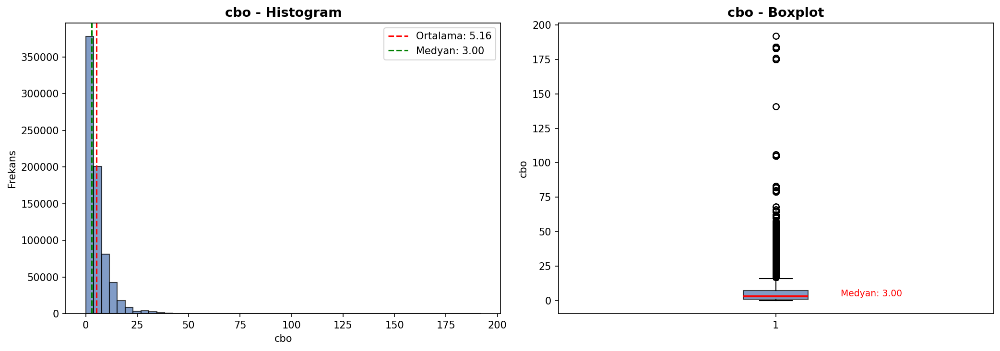

- **IQR Alt Sınır:** -8.0
- **IQR Üst Sınır:** 16.0
- **Outlier Sayısı:** 33,701 (%4.54)

### 4.2 cboModified

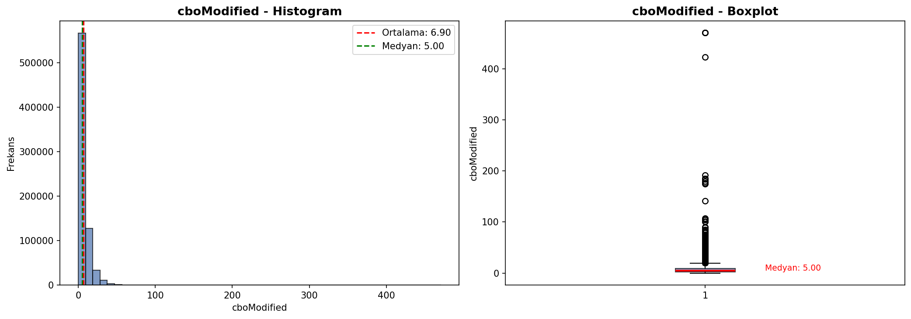

- **IQR Alt Sınır:** -8.5
- **IQR Üst Sınır:** 19.5
- **Outlier Sayısı:** 42,581 (%5.74)

### 4.3 fanin

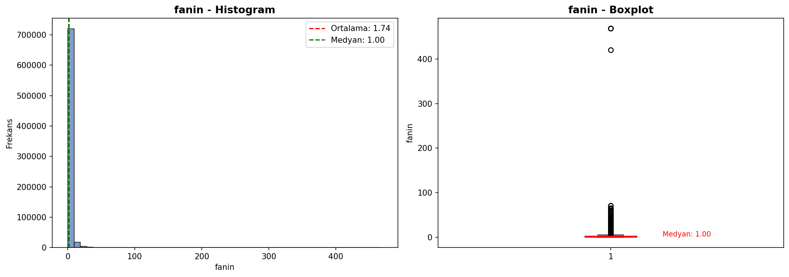

- **IQR Alt Sınır:** -3.0
- **IQR Üst Sınır:** 5.0
- **Outlier Sayısı:** 57,294 (%7.72)

### 4.4 fanout

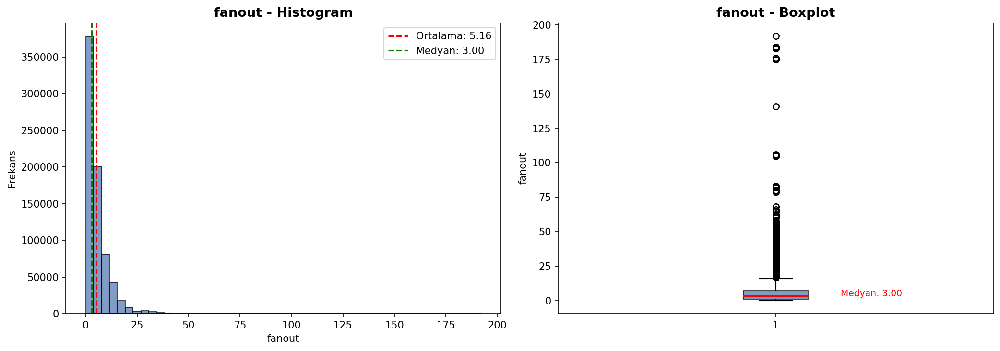

- **IQR Alt Sınır:** -8.0
- **IQR Üst Sınır:** 16.0
- **Outlier Sayısı:** 33,701 (%4.54)

### 4.5 wmc (Weighted Methods per Class)

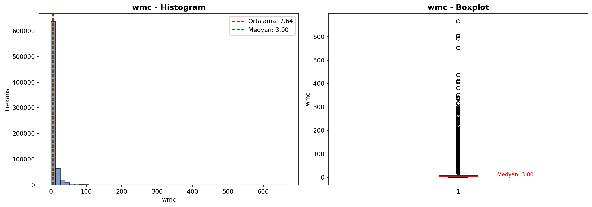

- **IQR Alt Sınır:** -9.5
- **IQR Üst Sınır:** 18.5
- **Outlier Sayısı:** 69,918 (%9.42)

### 4.6 dit (Depth of Inheritance Tree)

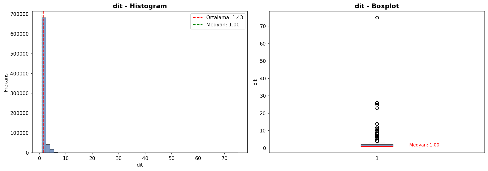

- **IQR Alt Sınır:** -0.5
- **IQR Üst Sınır:** 3.5
- **Outlier Sayısı:** 20,401 (%2.75)

### 4.7 noc (Number of Children)

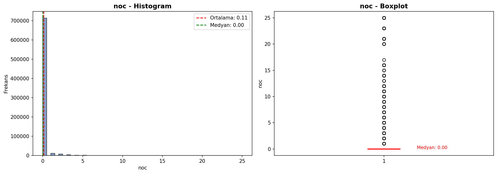

- **IQR Alt Sınır:** 0.0
- **IQR Üst Sınır:** 0.0
- **Outlier Sayısı:** 28,225 (%3.8)

### 4.8 rfc (Response for a Class)

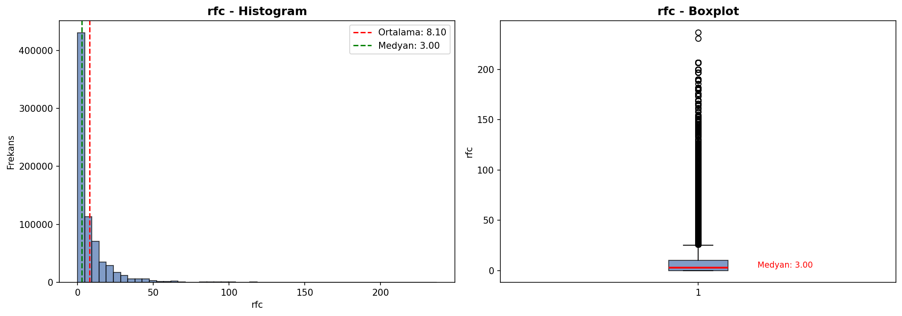

- **IQR Alt Sınır:** -15.0
- **IQR Üst Sınır:** 25.0
- **Outlier Sayısı:** 56,150 (%7.57)

### 4.9 lcom (Lack of Cohesion of Methods)

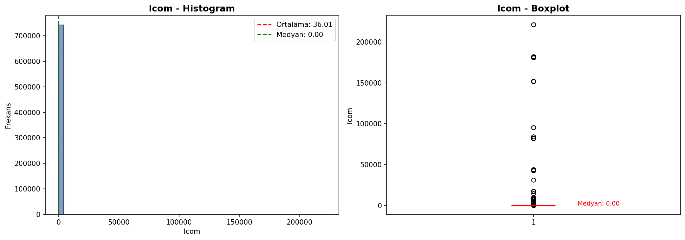

- **IQR Alt Sınır:** -6.0
- **IQR Üst Sınır:** 10.0
- **Outlier Sayısı:** 119,210 (%16.07)

### 4.10 loc (Lines of Code)

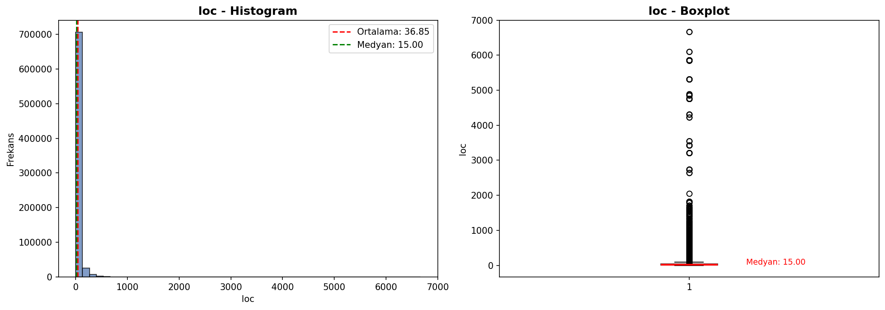

- **IQR Alt Sınır:** -41.0
- **IQR Üst Sınır:** 87.0
- **Outlier Sayısı:** 69,575 (%9.38)

### 4.11 totalMethodsQty

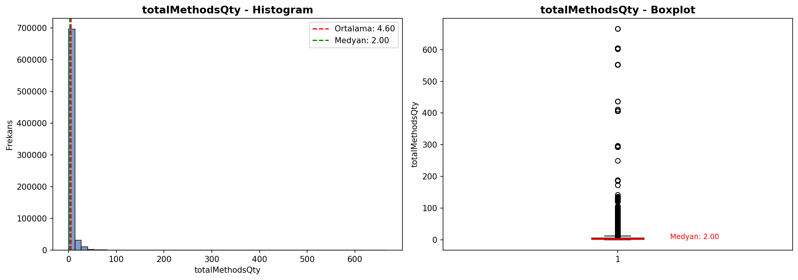

- **IQR Alt Sınır:** -5.0
- **IQR Üst Sınır:** 11.0
- **Outlier Sayısı:** 63,883 (%8.61)

### 4.12 variablesQty

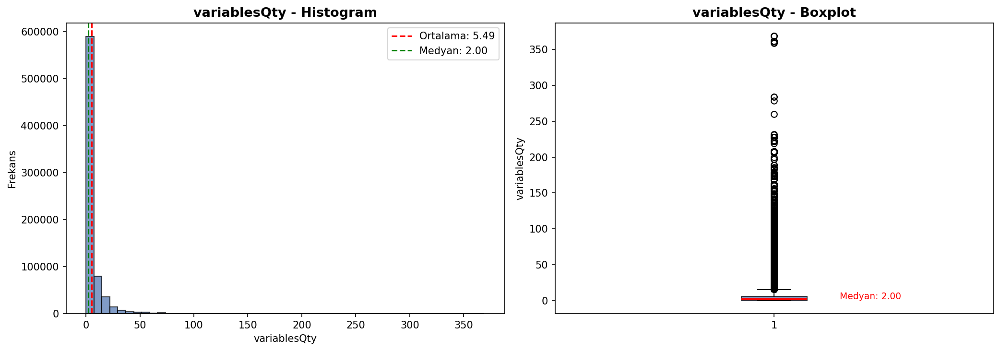

- **IQR Alt Sınır:** -9.0
- **IQR Üst Sınır:** 15.0
- **Outlier Sayısı:** 66,315 (%8.94)

### 4.13 comparisonsQty

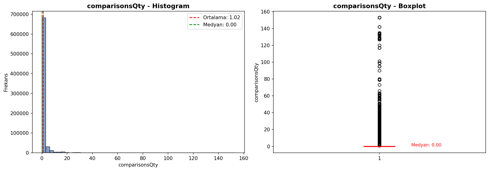

- **IQR Alt Sınır:** 0.0
- **IQR Üst Sınır:** 0.0
- **Outlier Sayısı:** 173,364 (%23.37)

### 4.14 uniqueWordsQty

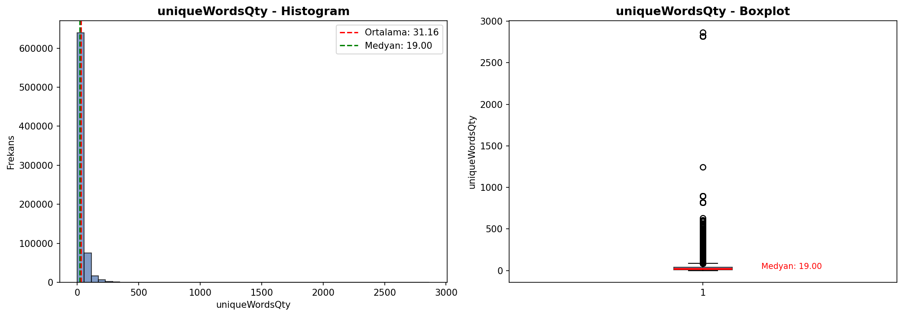

- **IQR Alt Sınır:** -36.0
- **IQR Üst Sınır:** 84.0
- **Outlier Sayısı:** 51,075 (%6.88)

### Genel Boxplot Karşılaştırması

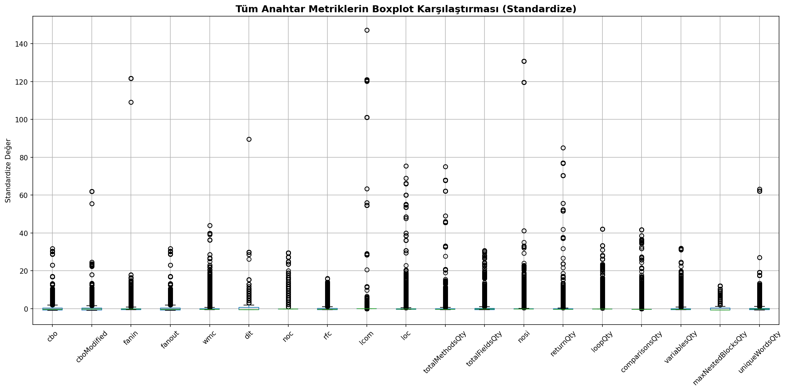

## 5. Hedef Değişken Analizi (Target Variable Analysis)

Bu veri setinde hedef değişken `refactoring` olup ikili sınıflandırma (binary classification) 
problemi için kullanılmaktadır. Değer 1 sınıfta refactoring uygulandığını, 0 ise uygulanmadığını 
göstermektedir.

### 5.1 Birleşik Veri Seti - Refactoring Dağılımı

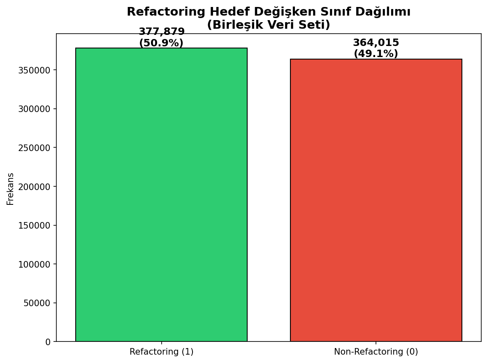

| Sınıf | Frekans | Oran |
|-------|---------|------|
| Refactoring (1) | 377,879 | %50.9 |
| Non-Refactoring (0) | 364,015 | %49.1 |

- **Çoğunluk sınıfı:** Refactoring (1) (%50.93)
- **Azınlık sınıfı:** Non-Refactoring (0) (%49.07)
- **Dengesizlik oranı:** 1.0381
- **Dengesizlik (Imbalance) var mı?** Hayır
- **SMOTE gerekli mi?** Hayır

### 5.2 Alt Veri Setleri Bazında Dağılım

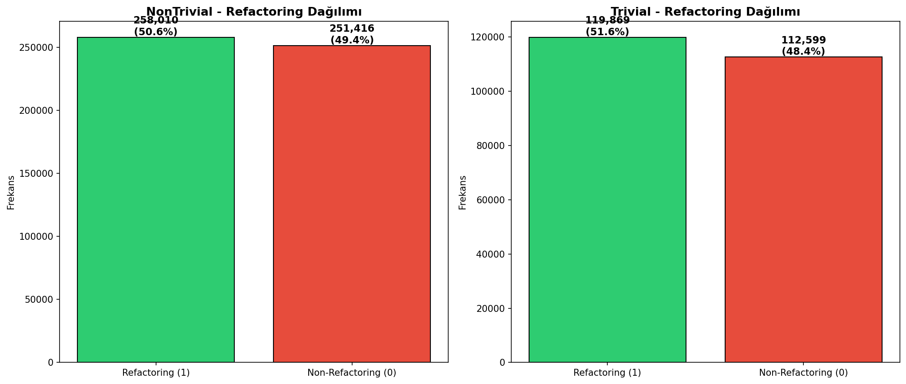

| Veri Seti | Refactoring (1) | Non-Refactoring (0) | Oran |
|-----------|-----------------|---------------------|------|
| NonTrivial | 258,010 (%50.65) | 251,416 (%49.35) | 1.0262 |
| Trivial | 119,869 (%51.55) | 112,599 (%48.45) | 1.0646 |

Her iki alt veri setinde de sınıf dengesi korunmaktadır.

### 5.3 Sınıf Tipi (type) Dağılımı

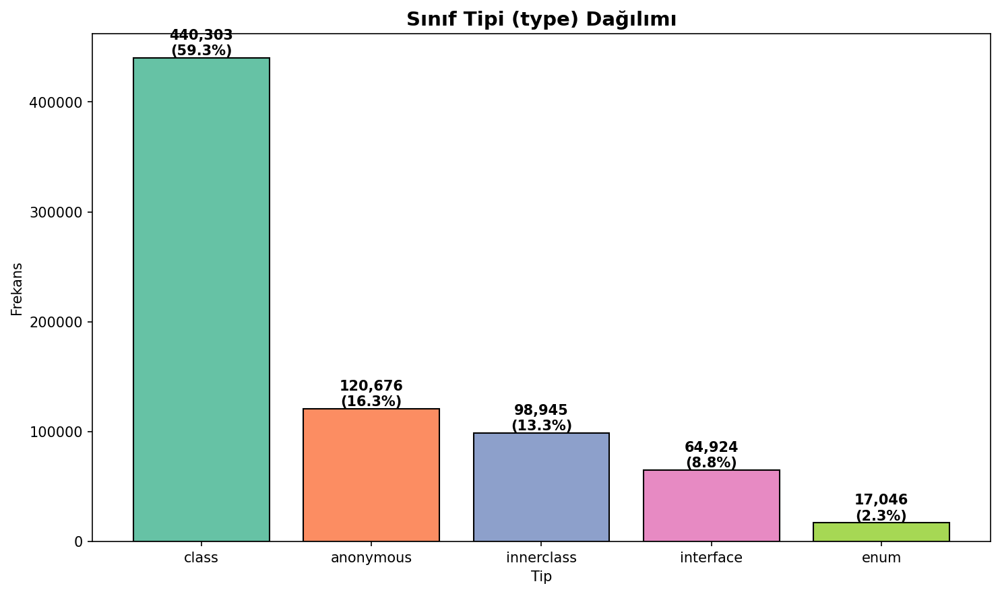

| Tip | Frekans | Oran |
|-----|---------|------|
| class | 440,303 | %59.3 |
| anonymous | 120,676 | %16.3 |
| innerclass | 98,945 | %13.3 |
| interface | 64,924 | %8.8 |
| enum | 17,046 | %2.3 |

## 6. Korelasyon ve Bağımlılık Analizi (Correlation & Dependency Analysis)

### 6.1 Pearson Korelasyon Matrisi

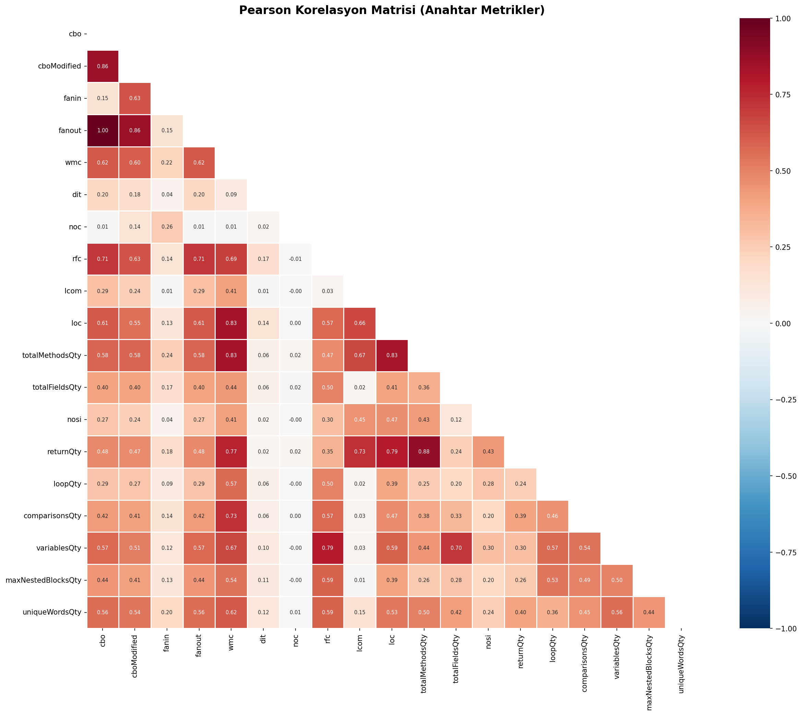

### 6.2 En Yüksek Korelasyonlar

| Değişken 1 | Değişken 2 | Korelasyon |
|------------|------------|------------|
| cbo | fanout | 1.0000 |
| totalMethodsQty | returnQty | 0.8764 |
| wmc | totalMethodsQty | 0.8299 |
| wmc | loc | 0.8291 |
| loc | totalMethodsQty | 0.8268 |
| loc | returnQty | 0.7860 |
| rfc | variablesQty | 0.7859 |
| wmc | returnQty | 0.7677 |
| lcom | returnQty | 0.7328 |
| wmc | comparisonsQty | 0.7270 |
| cbo | rfc | 0.7144 |
| fanout | rfc | 0.7144 |
| totalFieldsQty | variablesQty | 0.7049 |
| wmc | rfc | 0.6874 |
| wmc | variablesQty | 0.6699 |

**Yorum:** `cbo` ve `fanout` arasında mükemmel korelasyon (1.0) bulunmaktadır; bu iki metrik 
aynı bilgiyi taşımaktadır. Ayrıca `wmc`, `loc`, `totalMethodsQty` ve `returnQty` arasında 
güçlü (>0.75) korelasyonlar mevcuttur. Bu durum, sınıf büyüklüğünü yansıtan metriklerin 
birbirleriyle yüksek bağımlılık gösterdiğine işaret etmektedir.

### 6.3 Chi-Square Bağımsızlık Testleri (Kategorik Değişkenler)

| Değişken 1 | Değişken 2 | χ² | p-değeri | Cramér's V | Anlamlı? |
|------------|------------|-----|---------|------------|----------|
| type | refactoring | 32.2842 | 0.000002 | 0.0066 | Evet |
| dataset | refactoring | 53.6095 | 0.000000 | 0.0085 | Evet |
| type | dataset | 9936.5048 | 0.000000 | 0.1157 | Evet |

**Yorum:** Tüm kategorik değişken çiftleri için istatistiksel olarak anlamlı ilişki 
tespit edilmiştir (p < 0.05). Ancak Cramér's V değerleri düşük olup, bu ilişkilerin 
pratikte zayıf olduğunu göstermektedir. `type` ile `dataset` arasındaki ilişki 
görece daha güçlüdür (V = 0.1157).

### 6.4 Çapraz Tablolar

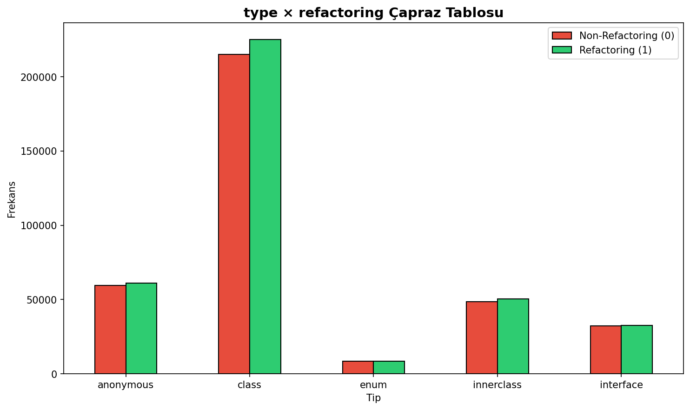

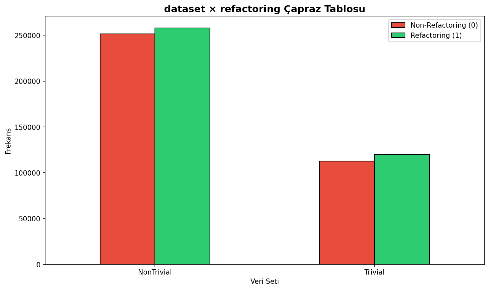

### 6.5 ANOVA Testi (Sayısal ~ Refactoring)

| Değişken | F-İstatistik | p-değeri | Anlamlı? |
|----------|-------------|---------|----------|
| cbo | 22.4663 | 0.000002 | Evet |
| cboModified | 24.35 | 0.000001 | Evet |
| fanin | 5.6694 | 0.017263 | Evet |
| fanout | 22.3179 | 0.000002 | Evet |
| wmc | 14.4756 | 0.000142 | Evet |
| dit | 4.5803 | 0.032342 | Evet |
| noc | 3.4887 | 0.061788 | Hayır |
| rfc | 7.3758 | 0.006611 | Evet |
| lcom | 0.0026 | 0.959652 | Hayır |
| loc | 4.8474 | 0.027689 | Evet |
| totalMethodsQty | 8.5495 | 0.003456 | Evet |
| totalFieldsQty | 2.6236 | 0.105287 | Hayır |
| nosi | 8.846 | 0.002937 | Evet |
| returnQty | 4.6576 | 0.030917 | Evet |
| loopQty | 0.8205 | 0.365045 | Hayır |
| comparisonsQty | 14.5406 | 0.000137 | Evet |
| variablesQty | 0.3219 | 0.570462 | Hayır |
| maxNestedBlocksQty | 19.283 | 0.000011 | Evet |
| uniqueWordsQty | 0.267 | 0.605325 | Hayır |

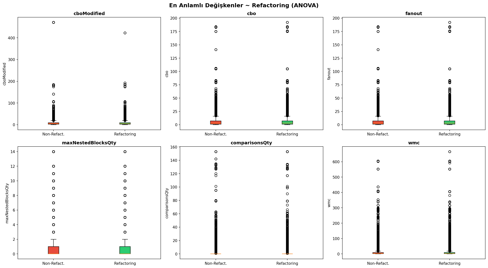

**Yorum:** `cboModified` (F=24.35), `cbo` (F=22.47), `maxNestedBlocksQty` (F=19.28), 
`wmc` (F=14.48) ve `comparisonsQty` (F=14.54) değişkenleri refactoring hedef değişkeni ile 
istatistiksel olarak anlamlı farklılıklar göstermektedir. Bu metrikler, refactoring ihtiyacının 
tahmin edilmesinde potansiyel olarak önemli özelliklerdir.

## 7. Çoklu Doğrusal Bağıntı Analizi (Multicollinearity)

VIF (Variance Inflation Factor) değerleri hesaplanmıştır. VIF > 10 ciddi, VIF > 5 orta düzey 
multicollinearity anlamına gelir.

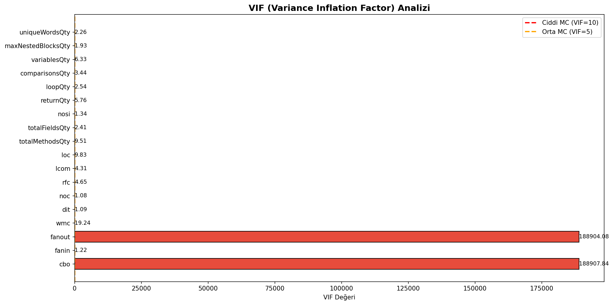

| Değişken | VIF | Ciddi MC? (>10) | Orta MC? (>5) |
|----------|-----|-----------------|---------------|
| cbo | 188,907.84 | Evet | Evet |
| fanin | 1.22 | Hayır | Hayır |
| fanout | 188,904.08 | Evet | Evet |
| wmc | 19.24 | Evet | Evet |
| dit | 1.09 | Hayır | Hayır |
| noc | 1.08 | Hayır | Hayır |
| rfc | 4.65 | Hayır | Hayır |
| lcom | 4.31 | Hayır | Hayır |
| loc | 9.83 | Hayır | Evet |
| totalMethodsQty | 9.51 | Hayır | Evet |
| totalFieldsQty | 2.41 | Hayır | Hayır |
| nosi | 1.34 | Hayır | Hayır |
| returnQty | 5.76 | Hayır | Evet |
| loopQty | 2.54 | Hayır | Hayır |
| comparisonsQty | 3.44 | Hayır | Hayır |
| variablesQty | 6.33 | Hayır | Evet |
| maxNestedBlocksQty | 1.93 | Hayır | Hayır |
| uniqueWordsQty | 2.26 | Hayır | Hayır |

**Sonuç:** `cbo` ve `fanout` arasında aşırı yüksek VIF değerleri (188,907) tespit edilmiştir. 
Bu, iki değişkenin neredeyse aynı bilgiyi taşıdığını (korelasyon = 1.0) doğrulamaktadır. 
`wmc` (VIF=19.24) değişkeninde de ciddi multicollinearity mevcuttur. Model oluşturmadan önce 
`fanout` veya `cbo`'dan birinin çıkarılması ve `wmc` ile ilişkili değişkenlerin gözden 
geçirilmesi önerilmektedir.

## 8. Boyut Analizi (Dimensionality Analysis)

### 8.1 PCA (Principal Component Analysis)

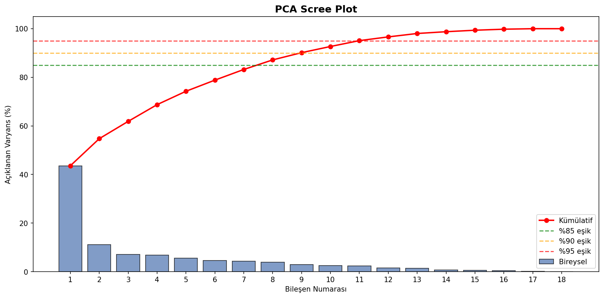

| Bileşen | Açıklanan Varyans (%) | Kümülatif (%) |
|---------|----------------------|---------------|
| PC1 | 43.59 | 43.59 |
| PC2 | 11.15 | 54.74 |
| PC3 | 7.12 | 61.86 |
| PC4 | 6.88 | 68.74 |
| PC5 | 5.51 | 74.25 |
| PC6 | 4.58 | 78.83 |
| PC7 | 4.39 | 83.22 |
| PC8 | 3.94 | 87.16 |
| PC9 | 2.98 | 90.14 |
| PC10 | 2.54 | 92.68 |
| PC11 | 2.41 | 95.09 |

- **%85 varyans için gereken bileşen sayısı:** 8
- **%90 varyans için gereken bileşen sayısı:** 9
- **%95 varyans için gereken bileşen sayısı:** 11

**Yorum:** İlk bileşen (PC1) tek başına varyansın %43.59'unu açıklamaktadır. Bu, veri 
setindeki değişkenlerin önemli bir kısmının ortak bir faktör (sınıf büyüklüğü/karmaşıklığı) ile 
ilişkili olduğunu göstermektedir. 18 değişkenden %95 varyansı açıklamak için 11 bileşen 
gerekmektedir; bu da moderat düzeyde bir boyut indirgeme fırsatı sunmaktadır.

### 8.2 PCA 2D Scatter Plot

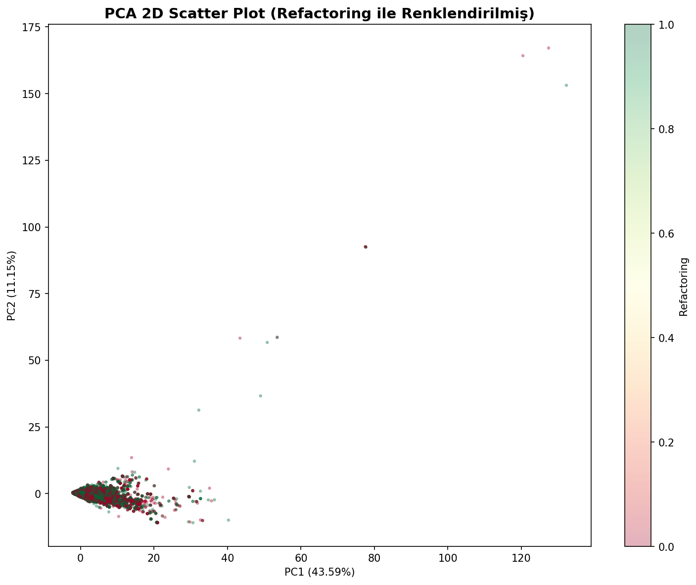

## 9. Veri Kalitesi Değerlendirmesi (Data Quality Assessment)

### 9.1 Eksik Veri (Missing Values)

| Sütun | Eksik Değer | Oran (%) |
|-------|-------------|----------|
| lcom* | 19,683 | %2.65 |
| tcc | 239,016 | %32.22 |
| lcc | 239,016 | %32.22 |
| Diğer tüm sütunlar | 0 | %0.0 |

**Yorum:** `tcc` (Tight Class Cohesion) ve `lcc` (Loose Class Cohesion) sütunlarında yaklaşık 
%32 oranında eksik değer bulunmaktadır. Bu sütunlar, metot çiftleri arasındaki 
bağlantılılık ölçütleridir ve yalnızca yeterli sayıda metot bulunan sınıflarda hesaplanabilir. 
`lcom*` sütununda ise %2.65 oranında eksik değer mevcuttur.

### 9.2 Tekrarlayan Kayıtlar (Duplicates)

- **NonTrivial tekrarlayan satır:** 0
- **Trivial tekrarlayan satır:** 0
- **Birleşik tekrarlayan satır:** 0
- **Tekrarlama oranı:** %0.0

### 9.3 Gürültülü Veri ve Anormal Değerler

IQR yöntemiyle tespit edilen outlier'lar:

| Değişken | Alt Sınır | Üst Sınır | Outlier Sayısı | Oran (%) |
|----------|-----------|-----------|----------------|----------|
| cbo | -8.0 | 16.0 | 33,701 | 4.54 |
| cboModified | -8.5 | 19.5 | 42,581 | 5.74 |
| fanin | -3.0 | 5.0 | 57,294 | 7.72 |
| fanout | -8.0 | 16.0 | 33,701 | 4.54 |
| wmc | -9.5 | 18.5 | 69,918 | 9.42 |
| dit | -0.5 | 3.5 | 20,401 | 2.75 |
| noc | 0.0 | 0.0 | 28,225 | 3.80 |
| rfc | -15.0 | 25.0 | 56,150 | 7.57 |
| lcom | -6.0 | 10.0 | 119,210 | 16.07 |
| loc | -41.0 | 87.0 | 69,575 | 9.38 |
| totalMethodsQty | -5.0 | 11.0 | 63,883 | 8.61 |
| totalFieldsQty | -4.5 | 7.5 | 51,746 | 6.97 |
| nosi | -1.5 | 2.5 | 75,774 | 10.21 |
| returnQty | -3.0 | 5.0 | 93,119 | 12.55 |
| loopQty | 0.0 | 0.0 | 109,982 | 14.82 |
| comparisonsQty | 0.0 | 0.0 | 173,364 | 23.37 |
| variablesQty | -9.0 | 15.0 | 66,315 | 8.94 |
| maxNestedBlocksQty | -1.5 | 2.5 | 54,323 | 7.32 |
| uniqueWordsQty | -36.0 | 84.0 | 51,075 | 6.88 |

**Yorum:** Kod metrikleri veri setlerinde yüksek outlier oranları beklenen bir durumdur. 
Yazılım projelerinde az sayıda "God Class" veya aşırı karmaşık sınıflar, metrik değerlerini 
önemli ölçüde artırabilmektedir. Özellikle `comparisonsQty` (%23.37), `lcom` (%16.07), 
`loopQty` (%14.82) ve `returnQty` (%12.55) değişkenlerinde yüksek outlier oranları 
gözlemlenmektedir. Bu outlier'lar veri hatası değil, yazılım mühendisliğindeki doğal 
karmaşıklık varyasyonunu yansıtmaktadır.

### 9.4 Feature Scaling Gereksinimi

| Değişken | Min | Max | Aralık | Std |
|----------|-----|-----|--------|-----|
| cbo | 0 | 192 | 192 | 5.8931 |
| cboModified | 0 | 471 | 471 | 7.4942 |
| fanin | 0 | 469 | 469 | 3.8387 |
| fanout | 0 | 192 | 192 | 5.8932 |
| wmc | 0 | 666 | 666 | 14.9835 |
| dit | 1 | 75 | 74 | 0.8218 |
| noc | 0 | 25 | 25 | 0.8426 |
| rfc | 0 | 237 | 237 | 14.227 |
| lcom | 0 | 221445 | 221445 | 1504.0433 |
| loc | 1 | 6667 | 6666 | 87.9248 |
| totalMethodsQty | 0 | 666 | 666 | 8.8134 |
| totalFieldsQty | 0 | 149 | 149 | 4.776 |
| nosi | 0 | 604 | 604 | 4.6066 |
| returnQty | 0 | 666 | 666 | 7.8062 |
| loopQty | 0 | 77 | 77 | 1.8194 |
| comparisonsQty | 0 | 153 | 153 | 3.6482 |
| variablesQty | 0 | 369 | 369 | 11.3463 |
| maxNestedBlocksQty | 0 | 14 | 14 | 1.1038 |
| uniqueWordsQty | 0 | 2866 | 2866 | 44.8212 |

- **Scaling gerekli mi?** Evet

Değişkenler arasında çok büyük ölçek farklılıkları bulunmaktadır (ör: `lcom` aralığı 221,445 
iken `maxNestedBlocksQty` aralığı 14). Makine öğrenmesi modelleri öncesinde 
**RobustScaler** (outlier'lar nedeniyle) veya **StandardScaler** ile ölçeklendirme 
yapılması önerilir.

## 10. Sonuç ve Akademik Çıkarımlar (Conclusion)

### 10.1 Genel Değerlendirme

Bu analiz kapsamında, Code Metrics Dataset (SoftwareProjectStructure) veri seti detaylı olarak 
incelenmiştir. Veri seti, Java projelerindeki sınıf düzeyinde nesne yönelimli tasarım metriklerini 
içermekte olup, yazılım refactoring ihtiyacının tahmin edilmesi için zengin bir kaynak sunmaktadır.

### 10.2 Temel Bulgular

1. **Veri Kalitesi:** Veri setinde `tcc` ve `lcc` sütunlarında %32 oranında eksik değer 
bulunmakta olup, diğer sütunlarda eksik veri yoktur. Tekrarlayan kayıt bulunmamaktadır.

2. **Sınıf Dengesi:** Hedef değişken (`refactoring`) dengeli dağılım göstermektedir 
(1.04:1 oranı). SMOTE gibi yeniden örnekleme tekniklerine ihtiyaç duyulmamaktadır.

3. **Korelasyon Yapısı:** `cbo` ve `fanout` tam korelasyon (1.0) göstermektedir; bu iki 
değişkenden biri çıkarılmalıdır. `wmc`, `loc`, `totalMethodsQty` ve `returnQty` arasında 
güçlü korelasyonlar bulunmaktadır.

4. **Multicollinearity:** `cbo`-`fanout` çifti aşırı multicollinearity göstermektedir 
(VIF ≈ 189K). `wmc` (VIF=19.24) ve `loc` (VIF=9.83) da yüksek VIF değerlerine sahiptir.

5. **Boyut İndirgeme:** PCA analizi, ilk bileşenin varyansın %43.59'unu açıkladığını 
göstermektedir. %95 varyans için 11 bileşen (18 üzerinden) yeterlidir.

6. **Outlier Yapısı:** Kod metriklerinde doğal olarak yüksek outlier oranları 
gözlemlenmektedir. Bu, yazılım projelerindeki karmaşıklık dağılımının doğal bir 
yansımasıdır.

### 10.3 Yazılım Test Optimizasyonu Perspektifi

- **Refactoring Tahmini:** Bu veri seti, yazılım sınıflarının refactoring ihtiyacının 
otomatik tahmin edilmesi için sınıflandırma modelleri (Random Forest, XGBoost, SVM) 
ile kullanılabilir.

- **Feature Selection:** `cbo`/`fanout` çiftinden birinin çıkarılması ve VIF>10 olan 
değişkenlerin yeniden değerlendirilmesi önerilir. ANOVA sonuçlarına göre 
`cboModified`, `cbo`, `maxNestedBlocksQty`, `comparisonsQty` ve `wmc` en ayırt edici 
metriklerdir.

- **Test Önceliklendirme:** Kod metrikleri, yazılım test süreçlerinde hangi modüllerin 
öncelikli test edilmesi gerektiğini belirlemek için yapay zeka modelleriyle entegre 
edilebilir.

- **Kod Kalitesi İzleme:** CK metrikleri, CI/CD pipeline'larına entegre edilerek 
sürekli kod kalitesi izleme ve otomatik refactoring önerisi sistemleri kurulabilir.

### 10.4 NonTrivial vs Trivial Karşılaştırma

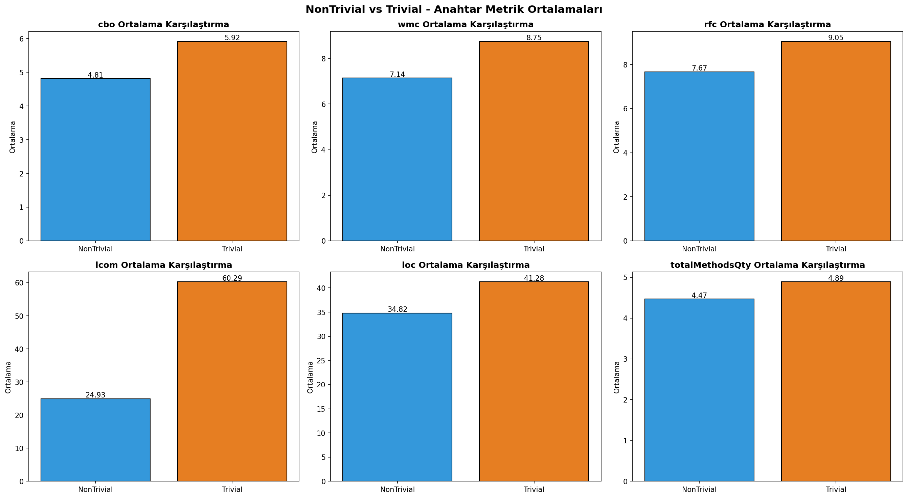

NonTrivial refactoring örnekleri, Trivial örneklere kıyasla genel olarak benzer metrik 
dağılımları sergilemektedir. Bu durum, refactoring türünün (trivial/non-trivial) metrik 
değerlerinden çok daha fazla bağlamsal bilgiye dayandığını düşündürmektedir.

---

## Ödev Maddeleri Karşılama Tablosu

| Madde | Başlık | Rapordaki Bölüm | Karşılandı? |
|-------|--------|-----------------|-------------|
| 1.1 | Veri Seti Dosya Yapısı | Bölüm 1, 2.1 | ✅ |
| 1.2 | Veri Boyutu (satır, sütun, tipler) | Bölüm 2.2, 2.3 | ✅ |
| 2 | Temel İstatistik (ort, medyan, std, min/max, skew, kurt) | Bölüm 3 | ✅ |
| 3 | Dağılım (histogram, boxplot, outlier) | Bölüm 4 | ✅ |
| 4.1 | Korelasyon Analizi | Bölüm 6.1, 6.2 | ✅ |
| 4.2 | Chi-Square (Kategorik) | Bölüm 6.3 | ✅ |
| 4.3 | Sayısal – Hedef Analizi | Bölüm 6.5 | ✅ |
| 5 | Sınıf Dengesi (imbalance, SMOTE) | Bölüm 5 | ✅ |
| 6 | PCA Analizi | Bölüm 8 | ✅ |
| 7 | Multicollinearity (VIF) | Bölüm 7 | ✅ |
| 8 | Veri Kalitesi (missing, duplicate, gürültü, scaling) | Bölüm 9 | ✅ |
| 9 | Rapor Formatı (akademik başlıklar) | Tüm rapor | ✅ |
| 10 | Değerlendirme Kriterleri | Bu tablo | ✅ |
