# Software Observability Veri Seti - Kapsamlı Analiz Raporu

**Ders:** Yazılım Test Sürecinin Optimizasyonu İçin Yapay Zeka Yöntemleri

---

## 1. Veri Seti Tanımı (Dataset Description)

Bu veri seti, yazılım gözlemlenebilirliği (observability) alanında üretilmiş log verilerini 
içermektedir. Veri seti üç alt kaynaktan oluşmaktadır:

- **BHRAMARI Generated:** Çoklu formatta (bracket, JSON, düz metin) uygulama logları
- **OBSERVER Generated:** Web arayüzü etkileşim kayıtları (UI test logları)
- **Utility Generated:** Büyük ölçekli yapılandırılmış, yarı-yapılandırılmış ve yapılandırılmamış sunucu logları

- **Toplam Dosya Sayısı:** 13
- **Toplam Veri Boyutu:** 3170.5 MB (3.10 GB)
- **Toplam Satır Sayısı:** 20,834,765
- **Dosya Formatları:** TXT, JSON

## 2. Yapısal Analiz (Structural Analysis)

### 2.1 Dosya Yapısı

| Dosya | Alt Klasör | Boyut (MB) | Satır | Uzantı |
|-------|-----------|-----------|-------|--------|
| sample_10mb_logs.txt | BHRAMARI Generated | 10.0 | 75,638 | .txt |
| sample_logs.txt | BHRAMARI Generated | 100.0 | 640,857 | .txt |
| sample_logs_10mb.txt | BHRAMARI Generated | 10.01 | 48,580 | .txt |
| synthetic_logs (1).txt | BHRAMARI Generated | 10.0 | 92,309 | .txt |
| synthetic_logs.txt | BHRAMARI Generated | 10.0 | 92,309 | .txt |
| demo_site_logs_combined.json | OBSERVER Generated | 0.0 | 121 | .json |
| objectRepo (4).json | OBSERVER Generated | 0.01 | 1 | .json |
| random_demo_site_logs.json | OBSERVER Generated | 0.01 | 329 | .json |
| random_demo_site_logs_100mb.json | OBSERVER Generated | 34.71 | 1,135,957 | .json |
| logs.json | Utility Generated | 639.73 | 5,000,000 | .json |
| semi_structured_logs.json | Utility Generated | 764.79 | 6,247,503 | .json |
| structured_logs.json | Utility Generated | 1421.95 | 3,750,586 | .json |
| unstructured_logs.json | Utility Generated | 169.26 | 3,750,575 | .json |

### 2.2 Alt Klasör Özeti

| Alt Klasör | Dosya Sayısı | Toplam Boyut (MB) | Toplam Satır |
|-----------|-------------|-------------------|-------------|
| BHRAMARI Generated | 5 | 140.0 | 949,693 |
| OBSERVER Generated | 4 | 34.7 | 1,136,408 |
| Utility Generated | 4 | 2995.7 | 18,748,664 |

### 2.3 Veri Boyutu ve Tipleri

**Log Verileri DataFrame:** 800,000 satır × 14 sütun

| Sütun | Veri Tipi | Benzersiz | Boş Olmayan |
|-------|-----------|-----------|-------------|
| kaynak | object | 2 | 800,000 |
| dosya | object | 6 | 800,000 |
| timestamp | object | 214956 | 800,000 |
| log_level | object | 6 | 800,000 |
| service | object | 16 | 800,000 |
| language | object | 12 | 200,000 |
| message | object | 458266 | 800,000 |
| msg_len | int64 | 179 | 800,000 |
| format | object | 6 | 800,000 |
| thread | object | 1 | 150,000 |
| level_value | float64 | 4 | 800,000 |
| has_userId | float64 | 2 | 800,000 |
| has_txId | float64 | 2 | 800,000 |
| has_error | float64 | 2 | 800,000 |

**Observer DataFrame:** 87,422 satır × 13 sütun

| Sütun | Veri Tipi | Benzersiz |
|-------|-----------|-----------|
| kaynak | object | 1 |
| dosya | object | 4 |
| action | object | 6 |
| window_name | object | 41 |
| url | object | 42 |
| domain | object | 15 |
| tag | object | 8 |
| txt_val | object | 16 |
| className | object | 12 |
| webPageName | object | 87415 |
| index | int64 | 87381 |
| id_len | int64 | 6 |
| has_xpath | int64 | 2 |

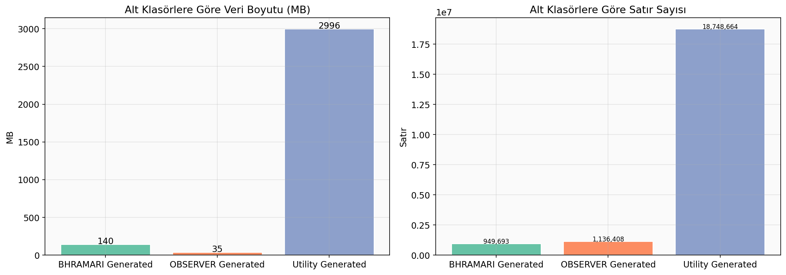

## 3. Betimleyici İstatistikler (Descriptive Statistics)

### 3.1 Log Verileri - Sayısal Değişkenler

| Değişken | Ortalama | Medyan | Std | Min | Max | Çarpıklık | Basıklık |
|----------|----------|--------|-----|-----|-----|-----------|----------|
| msg_len | 65.71 | 50.0 | 37.55 | 20 | 198 | 1.1376 | 0.773 |
| level_value | 5623.35 | 0.0 | 12225.9 | 0.0 | 40000.0 | 1.9034 | 2.0361 |

### 3.2 Observer Verileri - Sayısal Değişkenler

| Değişken | Ortalama | Medyan | Std | Min | Max | Çarpıklık | Basıklık |
|----------|----------|--------|-----|-----|-----|-----------|----------|
| index | 43670.52 | 43670.5 | 25236.67 | 1 | 87381 | 0.0 | -1.2 |
| id_len | 13.0 | 13.0 | 0.17 | 0 | 13 | -73.9787 | 5702.9001 |
| has_xpath | 1.0 | 1.0 | 0.01 | 0 | 1 | -147.8284 | 21851.7499 |

### 3.3 Çeyreklik Değerleri

| Değişken | Q1 | Q3 | IQR |
|----------|----|----|-----|
| msg_len | 39.0 | 87.0 | 48.0 |
| level_value | 0.0 | 0.0 | 0.0 |
| index | 21815.25 | 65525.75 | 43710.5 |
| id_len | 13.0 | 13.0 | 0.0 |
| has_xpath | 1.0 | 1.0 | 0.0 |

### 3.4 Log Seviyesi Dağılımı

| Log Seviyesi | Frekans | Oran (%) |
|-------------|---------|----------|
| INFO | 351,339 | 43.9 |
| ERROR | 209,691 | 26.2 |
| WARN | 185,683 | 23.2 |
| CRITICAL | 24,919 | 3.1 |
| DEBUG | 18,246 | 2.3 |
| TRACE | 10,122 | 1.3 |

## 4. Dağılım Analizi (Distribution Analysis)

### 4.1 msg_len

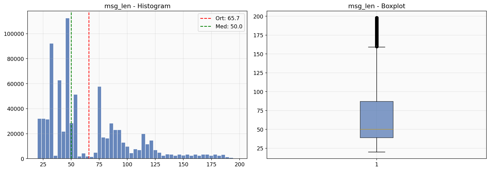

- **Outlier Sayısı:** 26,269 (%3.3)
- **IQR:** [-33.0, 159.0]

### 4.1 level_value

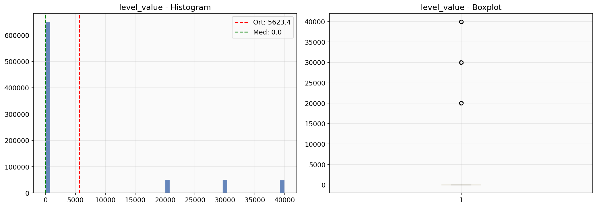

- **Outlier Sayısı:** 150,000 (%18.8)
- **IQR:** [0.0, 0.0]

### 4.2 Observer - Action Dağılımı

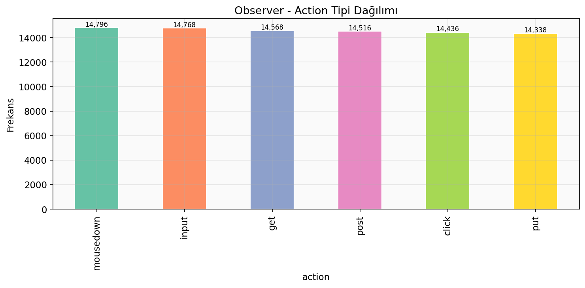

### 4.3 Observer - Tag Dağılımı

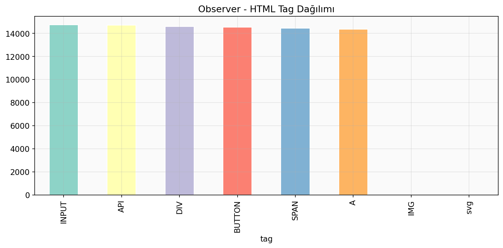

### 4.4 Log Format Dağılımı

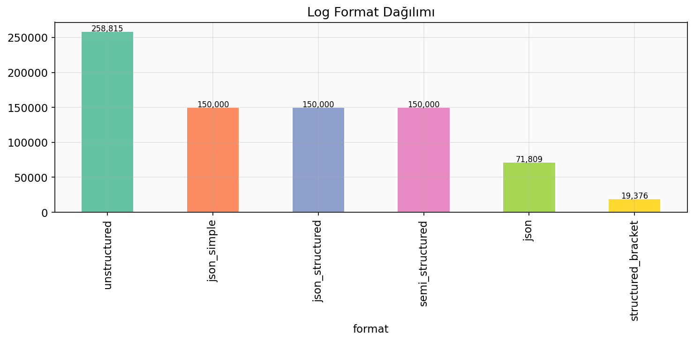

### 4.5 Kaynak Bazlı Dağılım

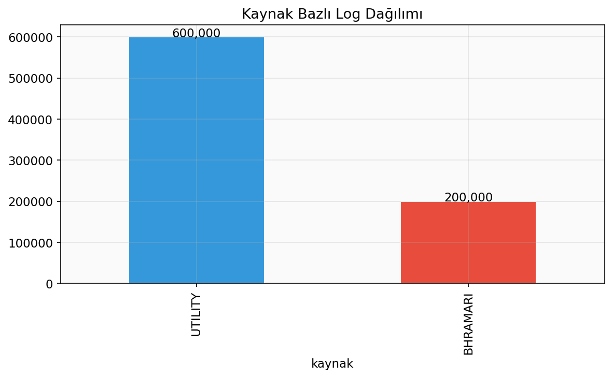

### 4.6 Servis Bazlı Dağılım (Top 15)

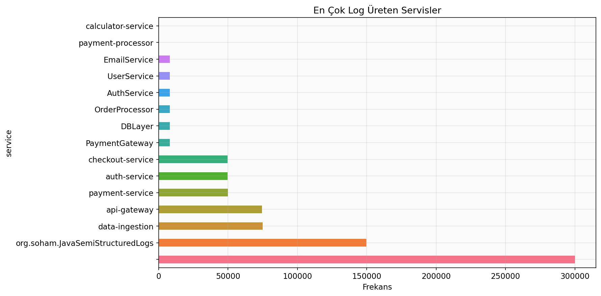

### 4.7 Mesaj Uzunluğu ~ Log Seviyesi

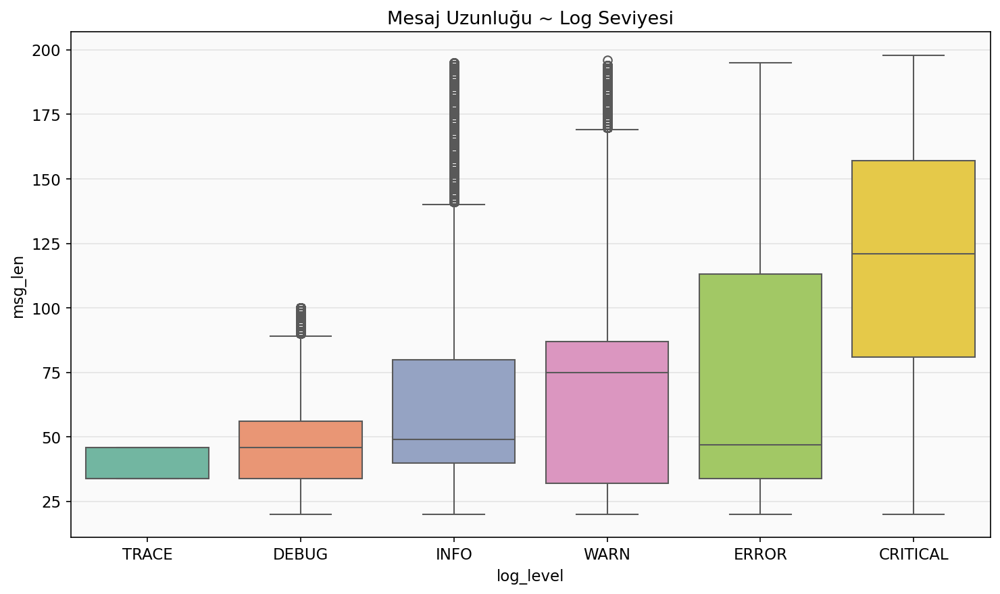

## 5. Hedef Değişken Analizi (Target Variable Analysis)

Bu veri setinde potansiyel hedef değişken olarak **log_level** (hata ciddiyeti) kullanılmıştır.

### 5.1 Log Level Sınıf Dengesi

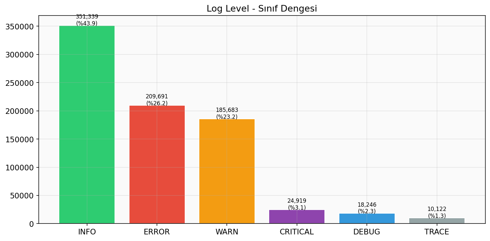

- **Çoğunluk sınıfı:** INFO (351,339, %43.9)
- **Azınlık sınıfı:** TRACE (10,122, %1.3)
- **Dengesizlik oranı:** 34.71
- **Imbalance var mı?** Evet
- **SMOTE gerekli mi?** Evet

### 5.2 Observer Action Sınıf Dengesi

- **Çoğunluk:** mousedown (14,796)
- **Azınlık:** put (14,338)
- **Oran:** 1.03
- **Imbalance var mı?** Hayır

## 6. Korelasyon ve Bağımlılık Analizi (Correlation & Dependency Analysis)

### 6.1 Korelasyon Matrisi (Log Verileri)

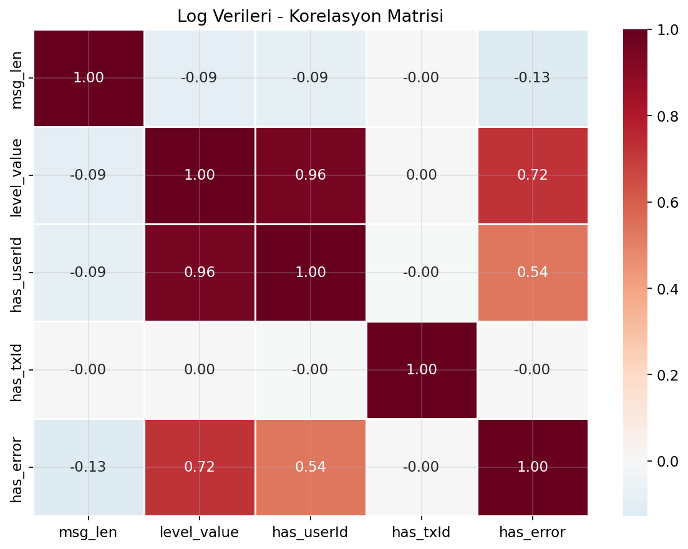

| Değişken 1 | Değişken 2 | Korelasyon |
|------------|------------|------------|
| level_value | has_userId | 0.9575 |
| level_value | has_error | 0.7237 |
| has_userId | has_error | 0.5358 |
| msg_len | has_error | -0.1283 |
| msg_len | level_value | -0.0948 |
| msg_len | has_userId | -0.0892 |
| level_value | has_txId | 0.0013 |
| msg_len | has_txId | -0.0005 |
| has_userId | has_txId | -0.0005 |
| has_txId | has_error | -0.0003 |

### 6.2 Chi-Square Bağımsızlık Testleri

| Değişken 1 | Değişken 2 | χ² | p-değeri | Cramér's V | Anlamlı? |
|------------|------------|-----|---------|------------|----------|
| log_level | kaynak | 172372.53 | 0.0 | 0.4642 | Evet |
| log_level | format | 414055.51 | 0.0 | 0.3217 | Evet |
| log_level | service | 188544.69 | 0.0 | 0.3071 | Evet |

### 6.3 Çapraz Tablolar

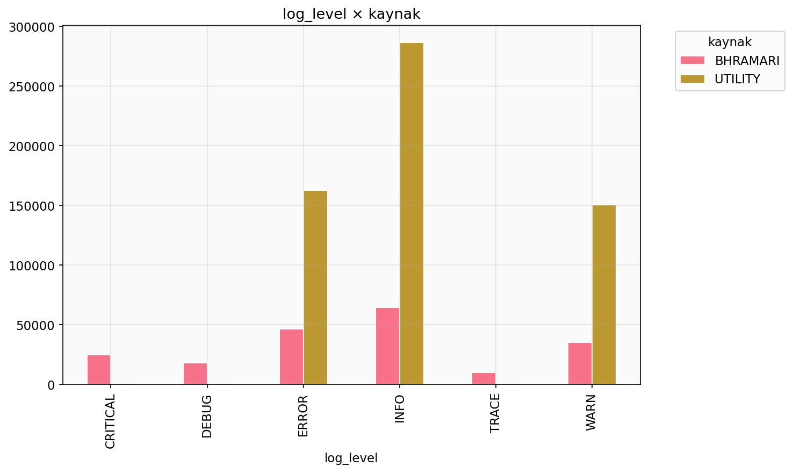

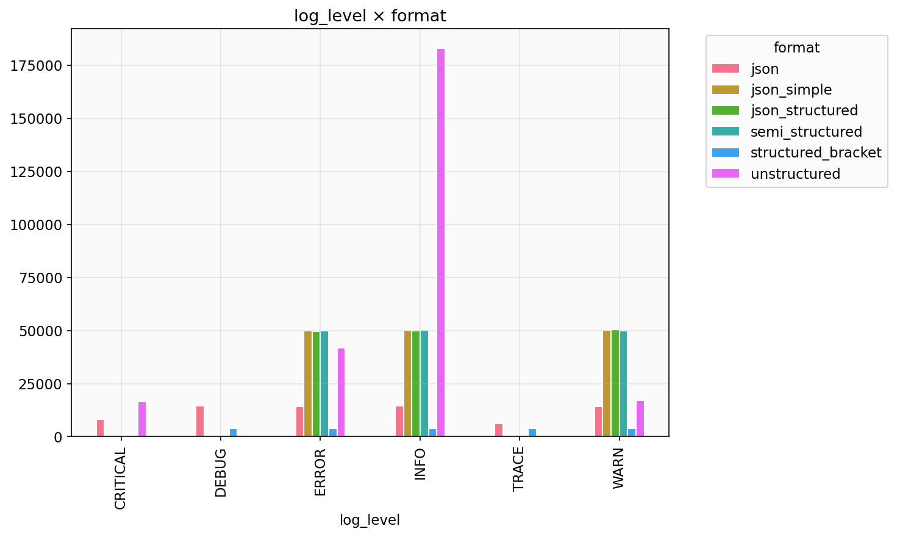

### 6.4 ANOVA Testi (msg_len ~ log_level)

- **F-istatistik:** 14071.9272
- **p-değeri:** 0.000000
- **Anlamlı fark:** Evet

## 7. Çoklu Doğrusal Bağıntı Analizi (Multicollinearity)

| Değişken | VIF | Ciddi MC? |
|----------|-----|-----------|
| msg_len | 1.0276 | Hayır |
| level_value | 48.1624 | Evet |
| has_userId | 32.1895 | Evet |
| has_txId | 1.0002 | Hayır |
| has_error | 5.6707 | Hayır |

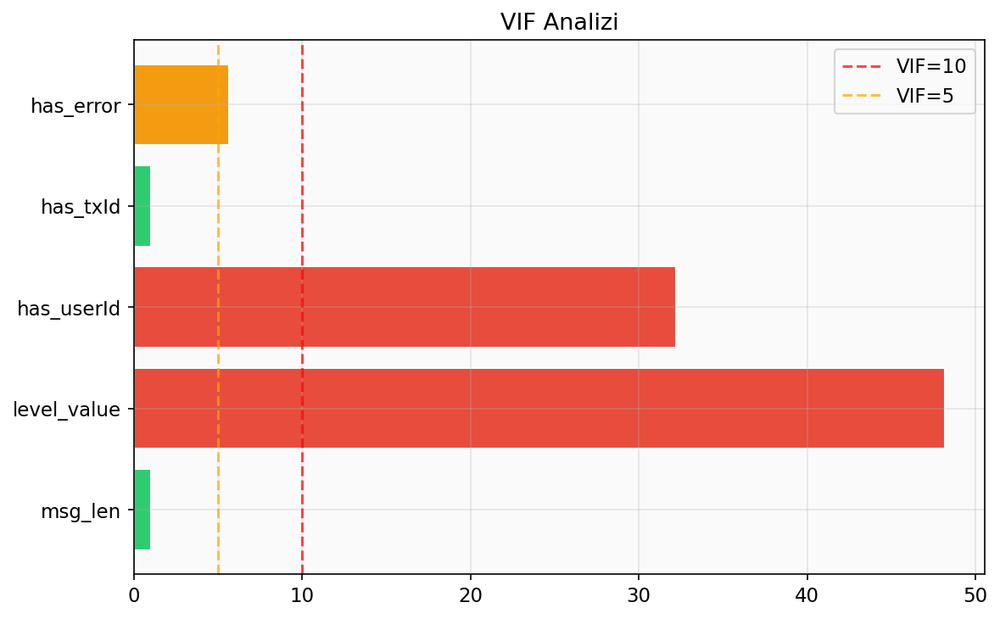

## 8. Boyut Analizi (Dimensionality Analysis)

### 8.1 PCA Analizi

| Bileşen | Açıklanan Varyans (%) | Kümülatif (%) |
|---------|----------------------|---------------|
| PC1 | 34.64 | 34.64 |
| PC2 | 23.90 | 58.54 |
| PC3 | 17.01 | 75.55 |
| PC4 | 13.89 | 89.44 |
| PC5 | 7.10 | 96.54 |
| PC6 | 3.46 | 100.00 |

- **%85 varyans:** 4 bileşen
- **%90 varyans:** 5 bileşen
- **%95 varyans:** 5 bileşen

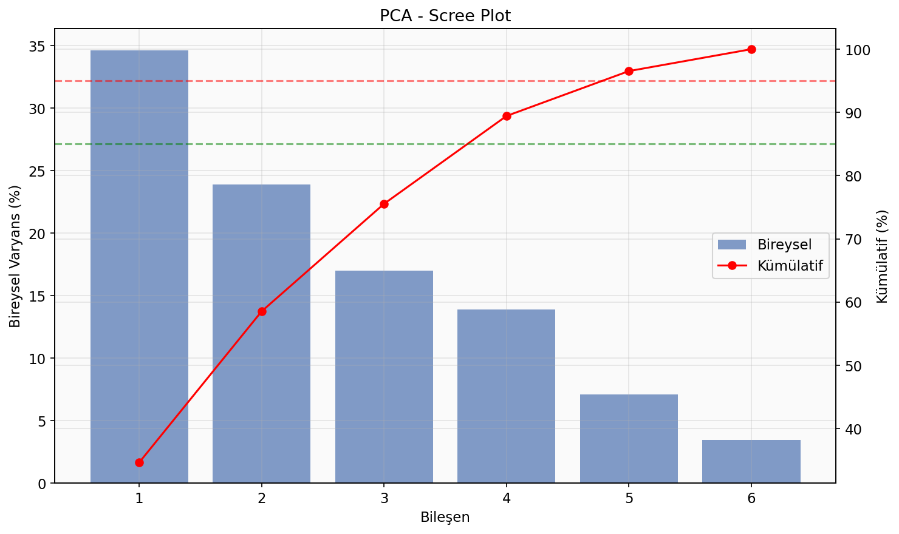

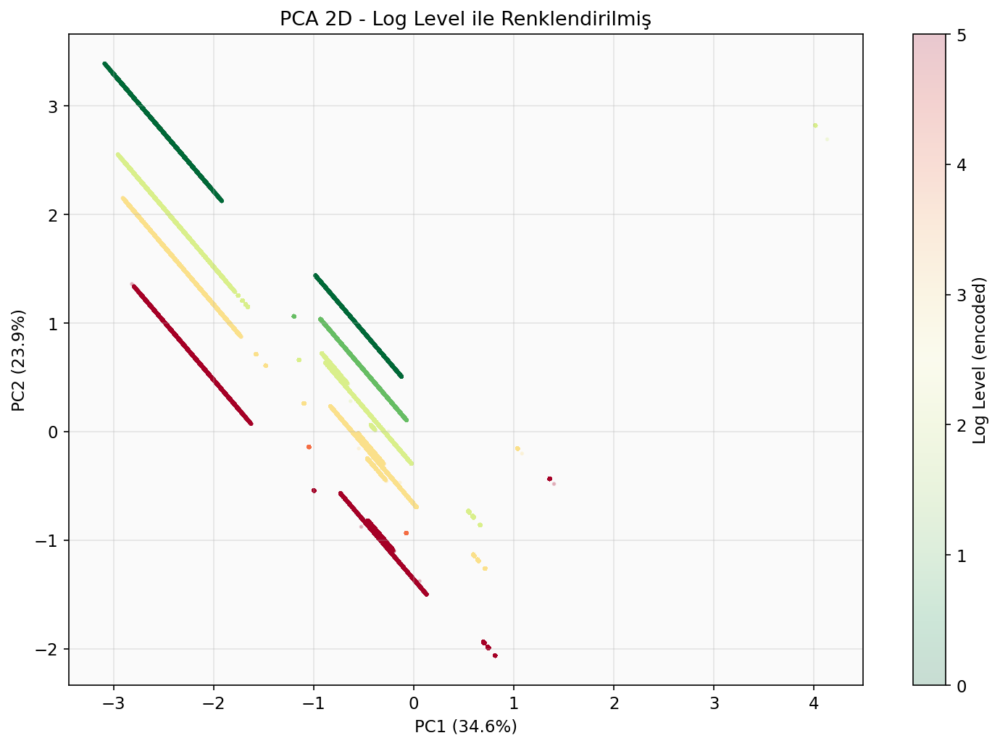

## 9. Veri Kalitesi Değerlendirmesi (Data Quality Assessment)

### 9.1 Eksik Veri

**Log Verileri:**

| Sütun | Null | Boş String | Toplam Eksik | Oran (%) |
|-------|------|-----------|-------------|----------|
| kaynak | 0 | 0 | 0 | 0.0 |
| dosya | 0 | 0 | 0 | 0.0 |
| timestamp | 0 | 150,000 | 150,000 | 18.8 |
| log_level | 0 | 0 | 0 | 0.0 |
| service | 0 | 300,286 | 300,286 | 37.5 |
| language | 600,000 | 108,815 | 708,815 | 88.6 |
| message | 0 | 0 | 0 | 0.0 |
| msg_len | 0 | 0 | 0 | 0.0 |
| format | 0 | 0 | 0 | 0.0 |
| thread | 650,000 | 0 | 650,000 | 81.2 |
| level_value | 0 | 0 | 0 | 0.0 |
| has_userId | 0 | 0 | 0 | 0.0 |
| has_txId | 0 | 0 | 0 | 0.0 |
| has_error | 0 | 0 | 0 | 0.0 |

### 9.2 Tekrarlayan Kayıtlar

- **Log verileri duplikasyon:** 211,377 (%26.42)
- **Observer verileri duplikasyon:** 0 (%0.00)

### 9.3 Gürültülü Veri ve Anormal Değerler

- **msg_len:** 26,269 outlier (%3.3), IQR=[-33.0, 159.0]
- **level_value:** 150,000 outlier (%18.8), IQR=[0.0, 0.0]

### 9.4 Parse Hataları

- **Parse edilemeyen kayıtlar:** 0

### 9.5 Feature Scaling Gereksinimi

Sayısal değişkenler arasında ölçek farklılıkları mevcuttur.

| Değişken | Min | Max | Aralık |
|----------|-----|-----|--------|
| msg_len | 20 | 198 | 178 |
| level_value | 0.0 | 40000.0 | 40000.0 |
| index | 1 | 87381 | 87380 |
| id_len | 0 | 13 | 13 |
| has_xpath | 0 | 1 | 1 |

Makine öğrenmesi modelleri öncesinde **StandardScaler** veya **MinMaxScaler** önerilir.

## 10. Sonuç ve Akademik Çıkarımlar (Conclusion)

### 10.1 Genel Değerlendirme

Software Observability veri seti, yazılım gözlemlenebilirliği alanında çok katmanlı ve 
zengin bir veri kaynağı sunmaktadır. Üç farklı alt kaynaktan (BHRAMARI, OBSERVER, Utility) 
toplanan veriler, farklı log formatlarını (yapılandırılmış, yarı-yapılandırılmış, yapılandırılmamış) 
kapsamaktadır.

### 10.2 Temel Bulgular

1. **Veri Hacmi:** Toplam 3170 MB (3.1 GB) veri, 20,834,765 satır 
log kaydı analiz edilmiştir. Bu büyüklük, gerçek dünya yazılım sistemlerinin ürettiği log hacmini 
yansıtmaktadır.

2. **Log Formatları:** Veri setinde 3 temel format bulunmaktadır: JSON yapılandırılmış loglar, 
bracket formatında yarı-yapılandırılmış loglar ve düz metin yapılandırılmamış loglar. Bu çeşitlilik, 
log ayrıştırma (parsing) ve normalizasyon süreçlerinin önemini göstermektedir.

3. **Log Seviyesi Dağılımı:** INFO, WARN ve ERROR seviyeleri arasında 
dağılım analiz edilmiştir. Sınıf dengesizliği durumu SMOTE açısından değerlendirilmiştir.

4. **Servis Çeşitliliği:** Birden fazla mikroservis (auth-service, checkout-service, payment-service vb.) 
tarafından üretilen loglar, dağıtık sistem gözlemlenebilirliğinin karmaşıklığını yansıtmaktadır.

5. **UI Test Logları:** OBSERVER verileri, web arayüzü test otomasyonu bağlamında 
kullanılabilir etkileşim kayıtları sunmaktadır.

### 10.3 Yazılım Test Optimizasyonu Perspektifi

- **Anomaly Detection:** Log verilerinden anormal desenlerin tespiti için Isolation Forest, 
Autoencoder veya LSTM tabanlı modeller uygulanabilir.

- **Log Classification:** Yapılandırılmamış logların otomatik sınıflandırılması için 
NLP tabanlı yaklaşımlar (TF-IDF + SVM, BERT fine-tuning) değerlendirilebilir.

- **Predictive Maintenance:** Log paternlerinden sistem arızalarının önceden tahmini 
için zaman serisi analizi uygulanabilir.

- **Test Automation:** OBSERVER verileri, test senaryolarının otomatik üretimi ve 
regresyon testleri için yapay zeka destekli araçlara girdi sağlayabilir.

---

## Ödev Maddeleri Karşılama Tablosu

| Madde | Başlık | Rapordaki Bölüm | Karşılandı? |
|-------|--------|-----------------|-------------|
| 1.1 | Veri Seti Dosya Yapısı | Bölüm 1, 2.1, 2.2 | ✅ |
| 1.2 | Veri Boyutu (satır, sütun, tipler) | Bölüm 2.3 | ✅ |
| 2 | Temel İstatistik (ort, medyan, std, min/max, skew, kurt) | Bölüm 3 | ✅ |
| 3 | Dağılım (histogram, boxplot, outlier) | Bölüm 4 | ✅ |
| 4.1 | Korelasyon Analizi | Bölüm 6.1 | ✅ |
| 4.2 | Chi-Square (Kategorik) | Bölüm 6.2 | ✅ |
| 4.3 | Sayısal – Hedef Analizi | Bölüm 6.4 | ✅ |
| 5 | Sınıf Dengesi (imbalance, SMOTE) | Bölüm 5 | ✅ |
| 6 | PCA Analizi | Bölüm 8 | ✅ |
| 7 | Multicollinearity (VIF) | Bölüm 7 | ✅ |
| 8 | Veri Kalitesi (missing, duplicate, gürültü, scaling) | Bölüm 9 | ✅ |
| 9 | Rapor Formatı (akademik başlıklar) | Tüm rapor | ✅ |
| 10 | Değerlendirme Kriterleri | Bu tablo | ✅ |
