# Software Quality Attributes Dataset - Kapsamlı Analiz Raporu

**Ders:** Yazılım Test Sürecinin Optimizasyonu İçin Yapay Zeka Yöntemleri

---

## 1. Veri Seti Tanımı (Dataset Description)

Bu veri seti, 10 büyük ölçekli açık kaynak Java projesinin yazılım kalite niteliklerini 
(quality attributes) ve kod kokusu (code smell) metriklerini içermektedir. Veriler 2016-2021 
yılları arasında altı farklı sürüm için toplanmış olup, sınıf düzeyinde nesne yönelimli 
tasarım metrikleri, paket düzeyinde bağımlılık ölçümleri ve God Class tespiti bilgilerini 
kapsamaktadır.

- **Kaynak:** Kaggle - Software Quality Attributes Dataset
- **Dosya Formatı:** CSV
- **Toplam Veri Boyutu:** ~1,268 MB (1.24 GB)
- **Ana Analiz Dosyası:** class_level_quality_code_smell_mdi.csv (57.32 MB)
- **Toplam Gözlem Sayısı:** 190,707
- **Özellik Sayısı:** 51

### Analiz Edilen Projeler

| # | Proje | Repository | Commits | Stars |
|---|-------|-----------|---------|-------|
| 1 | Spring Framework | spring-projects/spring-framework | 22,208 | 41,400 |
| 2 | JUnit 5 | junit-team/junit5 | 6,621 | 4,400 |
| 3 | Apache Kafka | apache/kafka | 8,590 | 18,000 |
| 4 | Apache Lucene-Solr | apache/lucene-solr | 34,789 | 4,100 |
| 5 | Dropwizard | dropwizard/dropwizard | 5,702 | 7,900 |
| 6 | Checkstyle | checkstyle/checkstyle | 9,922 | 5,800 |
| 7 | Apache Hadoop | apache/hadoop | 24,612 | 11,300 |
| 8 | Selenium | SeleniumHQ/selenium | 26,532 | 19,800 |
| 9 | Apache Skywalking | apache/skywalking | 6,242 | 16,100 |
| 10 | Signal Android | signalapp/Signal-Android | 7,015 | 19,800 |

## 2. Yapısal Analiz (Structural Analysis)

### 2.1 Dosya Yapısı

Veri seti aşağıdaki bileşenlerden oluşmaktadır:

| Bileşen | Dosya Sayısı | Boyut (MB) | Açıklama |
|---------|-------------|-----------|----------|
| resulted/ | 1 | 57.32 | Birleştirilmiş ana analiz dosyası |
| codesmells/csv/ | 60 | 1,038.62 | Proje başına yıllık kod kokusu verileri |
| quality_attributes/ | 60 | 172.63 | Proje başına yıllık kalite nitelikleri |
| attribute-details.csv | 1 | <0.01 | 47 metriğin açıklamaları |
| repositories.csv | 1 | <0.01 | 10 projenin bilgileri |
| versions.csv | 1 | 0.01 | Sürüm bilgileri |
| **Toplam** | **124** | **~1,268** | |

### 2.2 Veri Boyutu ve Tipleri (Ana Dosya)

| Metrik | Değer |
|--------|-------|
| Gözlem (satır) sayısı | 190,707 |
| Özellik (sütun) sayısı | 51 |
| float64 tipi sütun sayısı | 42 |
| object tipi sütun sayısı | 6 |
| int64 tipi sütun sayısı | 3 |

### 2.3 Sütun Detayları (Anahtar Metrikler)

| Sütun Adı | Veri Tipi | Açıklama |
|-----------|-----------|----------|
| QualifiedName | object | Sınıfın tam nitelikli adı |
| Name | object | Sınıf adı |
| Complexity | object | Karmaşıklık seviyesi (low/medium/high) |
| Coupling | object | Bağımlılık seviyesi (low/medium/high) |
| Size | object | Boyut seviyesi (low/medium/high) |
| Lack of Cohesion | object | Uyum eksikliği seviyesi (low/medium/high) |
| CBO | float64 | Coupling Between Object Classes |
| RFC | float64 | Response For a Class |
| SRFC | float64 | Simple Response For a Class |
| DIT | float64 | Depth of Inheritance Tree |
| NOC | float64 | Number of Children |
| WMC | float64 | Weighted Method Count |
| LOC | float64 | Lines of Code |
| CMLOC | float64 | Class-Methods Lines of Code |
| NOF | float64 | Number of Fields |
| NOM | float64 | Number of Methods |
| LCOM | float64 | Lack of Cohesion of Methods |
| LCAM | float64 | Lack of Cohesion Among Methods |
| LTCC | float64 | Lack of Tight Class Cohesion |
| ATFD | float64 | Access to Foreign Data |
| SI | float64 | Specialization Index |
| GodClass | int64 | **Hedef değişken** (0/1) |
| ps_LOC / ps_WMC / ps_ATFD / ps_LTCC / ps_NOM | float64 | Proje-seviye normalize skorlar |
| mdi_godclass | float64 | MDI God Class olasılık skoru |
| filename | object | Proje-yıl tanımlayıcı |

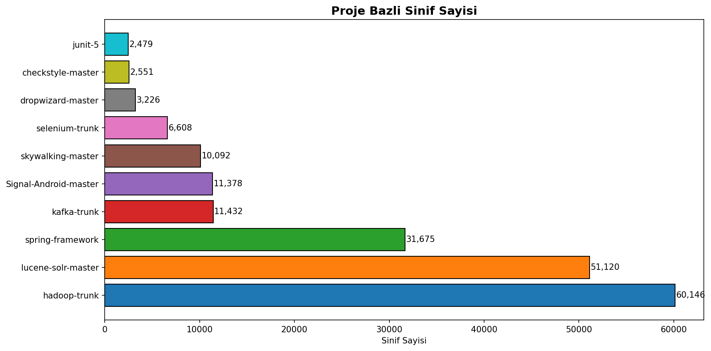

## 3. Betimleyici İstatistikler (Descriptive Statistics)

### 3.1 Sayısal Değişkenlerin Özet İstatistikleri

| Değişken | Ortalama | Medyan | Std Sapma | Min | Max | Çarpıklık | Basıklık |
|----------|----------|--------|-----------|-----|-----|-----------|----------|
| CBO | 1.5391 | 0.0 | 4.7696 | 0.0 | 199.0 | 8.6542 | 143.5421 |
| RFC | 16.2904 | 1.0 | 68.507 | 0.0 | 4,185.0 | 16.2775 | 514.6213 |
| SRFC | 3.7349 | 0.0 | 12.9411 | 0.0 | 780.0 | 11.0311 | 275.5176 |
| DIT | 0.7521 | 0.0 | 1.1541 | 0.0 | 10.0 | 2.4925 | 8.7342 |
| NOC | 0.3068 | 0.0 | 2.5099 | 0.0 | 171.0 | 29.7688 | 1260.8151 |
| WMC | 6.7734 | 2.0 | 19.5985 | 0.0 | 1,262.0 | 17.8174 | 737.465 |
| LOC | 58.3015 | 20.0 | 309.3402 | 0.0 | 40,736.0 | 82.1504 | 8523.5161 |
| CMLOC | 20.5192 | 3.0 | 64.4645 | 0.0 | 4,113.0 | 15.0504 | 468.0889 |
| NOF | 1.0885 | 0.0 | 2.6566 | 0.0 | 76.0 | 6.4114 | 76.3037 |
| NOSF | 0.6704 | 0.0 | 5.485 | 0.0 | 772.0 | 66.228 | 7073.7692 |
| NOM | 3.1888 | 1.0 | 6.9281 | 0.0 | 349.0 | 9.0616 | 175.2475 |
| NOSM | 0.2733 | 0.0 | 2.1125 | 0.0 | 284.0 | 45.3543 | 4564.1002 |
| LCOM | 0.1449 | 0.0 | 0.3198 | 0.0 | 2.0 | 2.0965 | 3.4688 |
| LCAM | 0.1754 | 0.0 | 0.2551 | 0.0 | 0.97 | 1.0946 | -0.2324 |
| LTCC | 0.1753 | 0.0 | 0.3463 | 0.0 | 1.0 | 1.6162 | 0.8468 |
| ATFD | 0.104 | 0.0 | 0.6007 | 0.0 | 41.0 | 16.1343 | 535.3342 |
| SI | 0.0496 | 0.0 | 0.3116 | 0.0 | 12.0 | 10.3537 | 166.2642 |
| ps_LOC | 0.2171 | 0.108 | 0.2669 | 0.0 | 1.0 | 1.8013 | 2.3402 |
| ps_WMC | 0.1459 | 0.0426 | 0.23 | 0.0 | 1.0 | 2.3611 | 5.2466 |
| ps_ATFD | 0.0232 | 0.0 | 0.0918 | 0.0 | 1.0 | 5.8275 | 43.4408 |
| ps_LTCC | 0.2568 | 0.0 | 0.434 | 0.0 | 1.0 | 1.1106 | -0.7526 |
| ps_NOM | 0.1872 | 0.1111 | 0.2526 | 0.0 | 1.0 | 1.8213 | 2.7235 |
| mdi_godclass | 0.166 | 0.0594 | 0.2066 | 0.0 | 1.0 | 1.5375 | 1.7342 |

### 3.2 Çeyreklik Değerleri

| Değişken | Q1 | Q3 | IQR |
|----------|----|----|-----|
| CBO | 0.0 | 1.0 | 1.0 |
| RFC | 0.0 | 7.0 | 7.0 |
| SRFC | 0.0 | 2.0 | 2.0 |
| DIT | 0.0 | 1.0 | 1.0 |
| NOC | 0.0 | 0.0 | 0.0 |
| WMC | 0.0 | 6.0 | 6.0 |
| LOC | 8.0 | 52.0 | 44.0 |
| CMLOC | 0.0 | 18.0 | 18.0 |
| NOF | 0.0 | 1.0 | 1.0 |
| NOM | 0.0 | 4.0 | 4.0 |
| LCOM | 0.0 | 0.0 | 0.0 |
| LCAM | 0.0 | 0.375 | 0.375 |
| LTCC | 0.0 | 0.0 | 0.0 |
| ATFD | 0.0 | 0.0 | 0.0 |
| SI | 0.0 | 0.0 | 0.0 |

**Çarpıklık Yorumu:** Tüm metrikler güçlü pozitif çarpıklık göstermektedir. Özellikle 
`LOC` (82.15), `NOSF` (66.23), `NOSM` (45.35) ve `NOC` (29.77) aşırı sağa çarpık 
dağılımlara sahiptir. Bu, büyük çoğunluk sınıfların küçük ve basit olduğunu, az sayıda 
karmaşık sınıfın metrikleri yukarı çektiğini göstermektedir.

**Basıklık Yorumu:** `LOC` (8523.52), `NOSF` (7073.77), `NOSM` (4564.10) gibi değişkenler 
aşırı sivri (leptokurtik) dağılımlara sahiptir. Bu, uç değerdeki "God Class" tarzı 
karmaşık sınıfların varlığına işaret etmektedir.

## 4. Dağılım Analizi (Distribution Analysis)

Her sayısal değişken için histogram ve boxplot grafikleri oluşturulmuştur.

### 4.1 CBO (Coupling Between Objects)

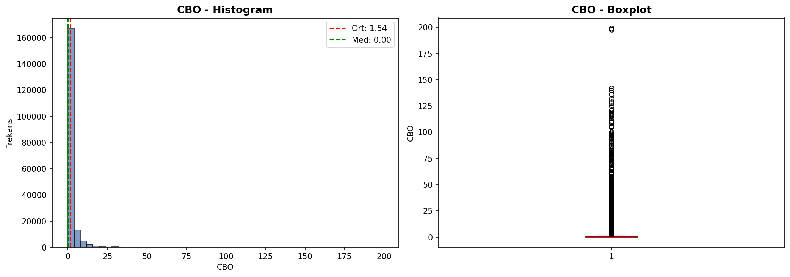

- **IQR Alt Sınır:** -1.5
- **IQR Üst Sınır:** 2.5
- **Outlier Sayısı:** 30,839 (%16.18)

### 4.2 RFC (Response For a Class)

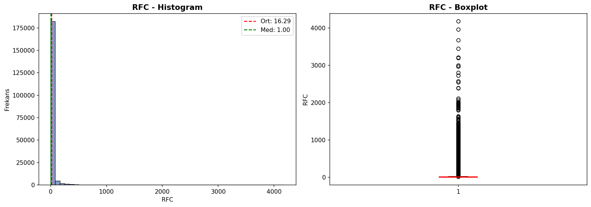

- **IQR Alt Sınır:** -10.5
- **IQR Üst Sınır:** 17.5
- **Outlier Sayısı:** 27,608 (%14.48)

### 4.3 WMC (Weighted Method Count)

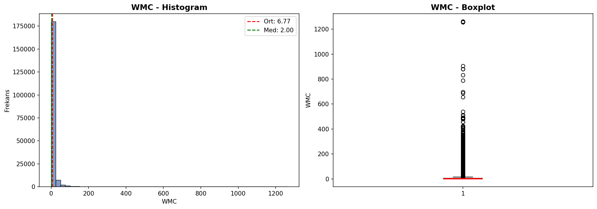

- **IQR Alt Sınır:** -9.0
- **IQR Üst Sınır:** 15.0
- **Outlier Sayısı:** 20,404 (%10.70)

### 4.4 LOC (Lines of Code)

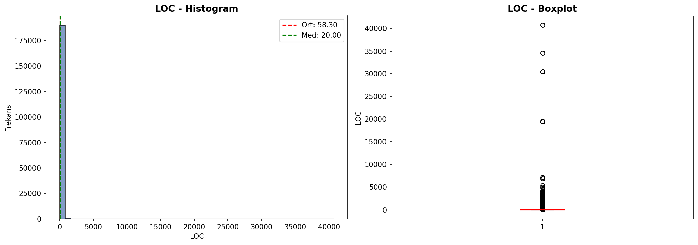

- **IQR Alt Sınır:** -58.0
- **IQR Üst Sınır:** 118.0
- **Outlier Sayısı:** 20,580 (%10.79)

### 4.5 LCOM (Lack of Cohesion of Methods)

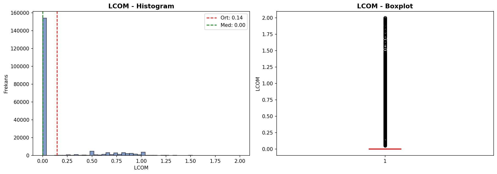

- **IQR Alt Sınır:** 0.0
- **IQR Üst Sınır:** 0.0
- **Outlier Sayısı:** 36,618 (%19.21)

### 4.6 LTCC (Lack of Tight Class Cohesion)

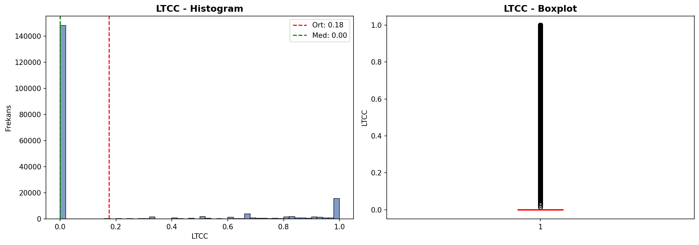

- **IQR Alt Sınır:** 0.0
- **IQR Üst Sınır:** 0.0
- **Outlier Sayısı:** 42,502 (%22.29)

### 4.7 ATFD (Access to Foreign Data)

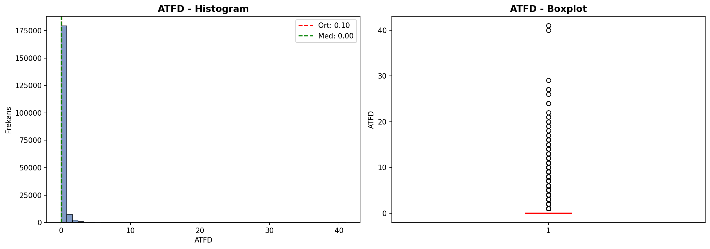

- **IQR Alt Sınır:** 0.0
- **IQR Üst Sınır:** 0.0
- **Outlier Sayısı:** 11,384 (%5.97)

### 4.8 NOM (Number of Methods)

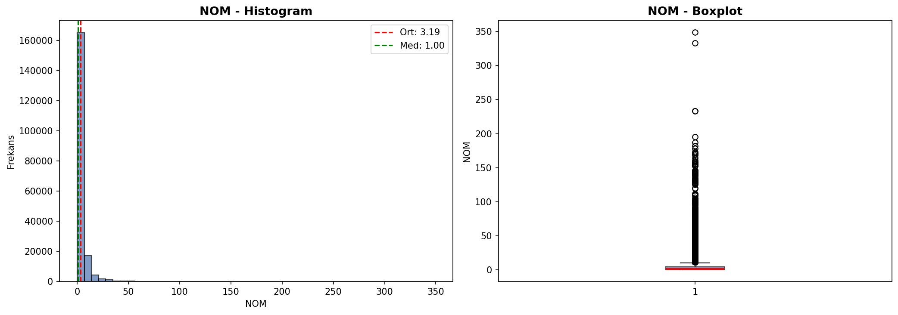

- **IQR Alt Sınır:** -6.0
- **IQR Üst Sınır:** 10.0
- **Outlier Sayısı:** 12,919 (%6.78)

### 4.9 DIT (Depth of Inheritance Tree)

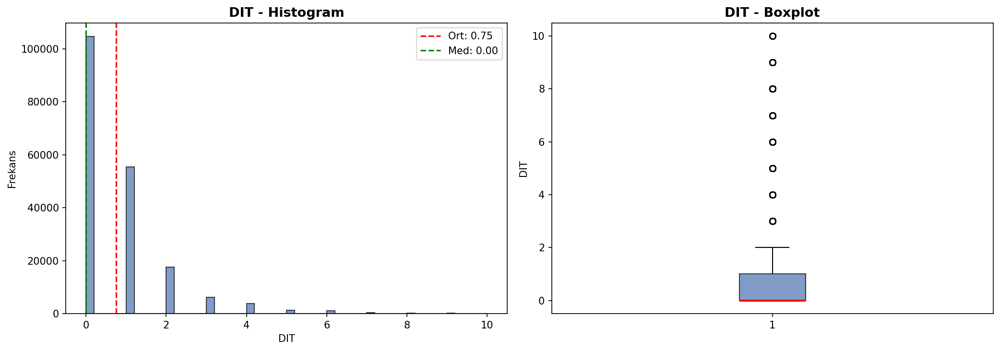

- **IQR Alt Sınır:** -1.5
- **IQR Üst Sınır:** 2.5
- **Outlier Sayısı:** 13,172 (%6.91)

### Genel Boxplot Karşılaştırması

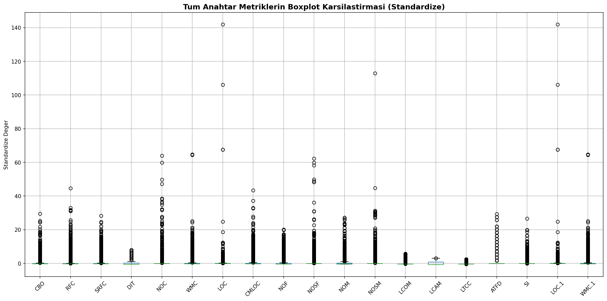

### Kategorik Değişken Dağılımları

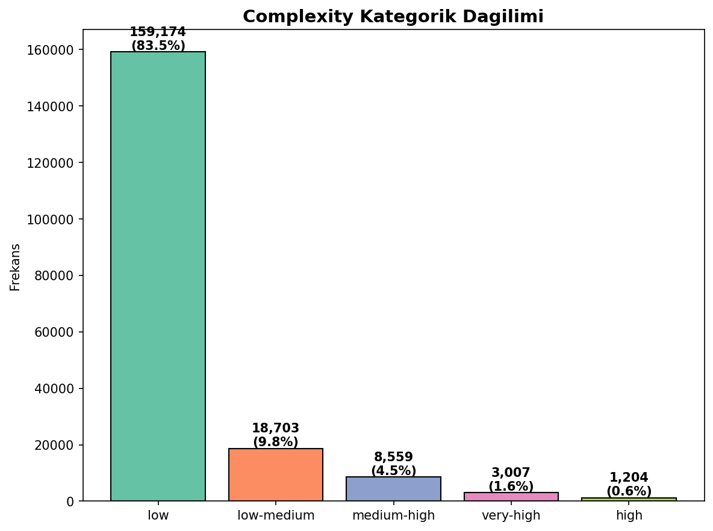

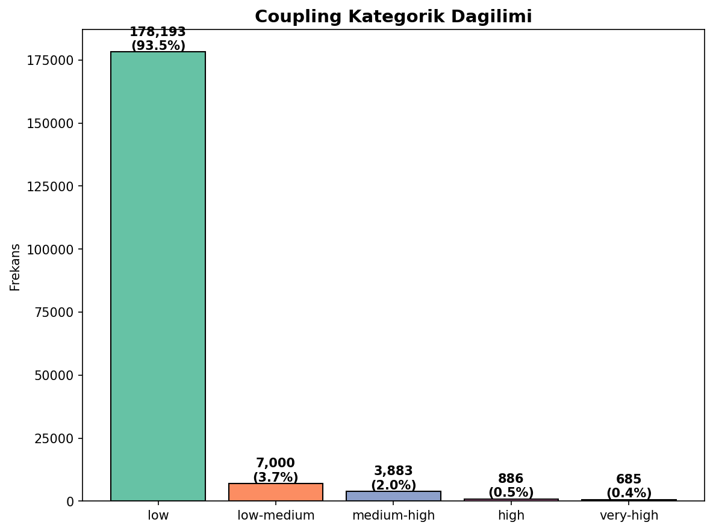

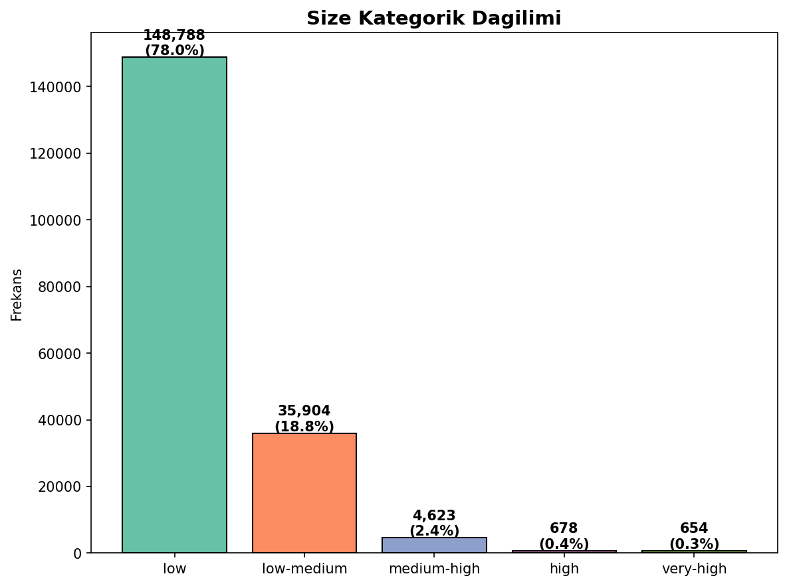

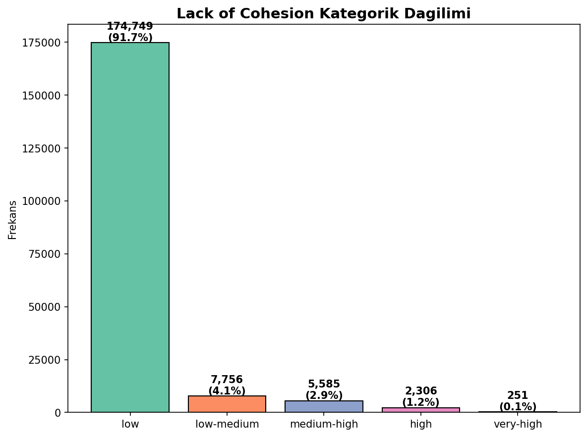

## 5. Hedef Değişken Analizi (Target Variable Analysis)

Bu veri setinde hedef değişken `GodClass` olup, bir sınıfın "God Class" anti-pattern'ine 
sahip olup olmadığını belirten ikili sınıflandırma değişkenidir. God Class, aşırı büyük, 
karmaşık ve düşük uyumlu sınıfları tanımlar.

### 5.1 GodClass Sınıf Dağılımı

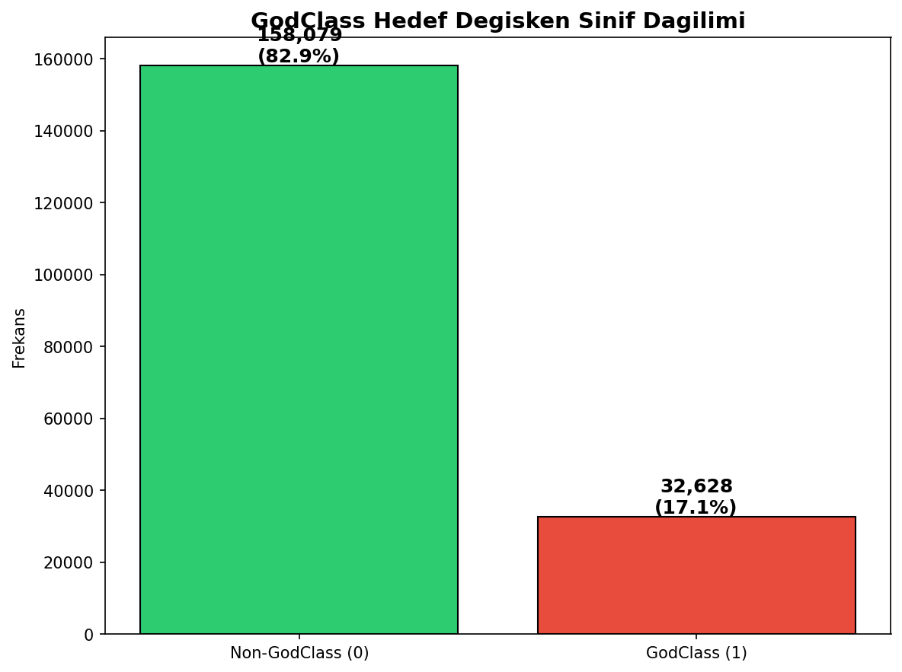

| Sınıf | Frekans | Oran |
|-------|---------|------|
| Non-GodClass (0) | 158,079 | %82.89 |
| GodClass (1) | 32,628 | %17.11 |

- **Çoğunluk sınıfı:** Non-GodClass (0) (%82.89)
- **Azınlık sınıfı:** GodClass (1) (%17.11)
- **Dengesizlik oranı:** 4.8449
- **Dengesizlik (Imbalance) var mı?** Evet
- **SMOTE gerekli mi?** Evet (azınlık sınıfı %17 oranında)

### 5.2 MDI GodClass Olasılık Skoru Dağılımı

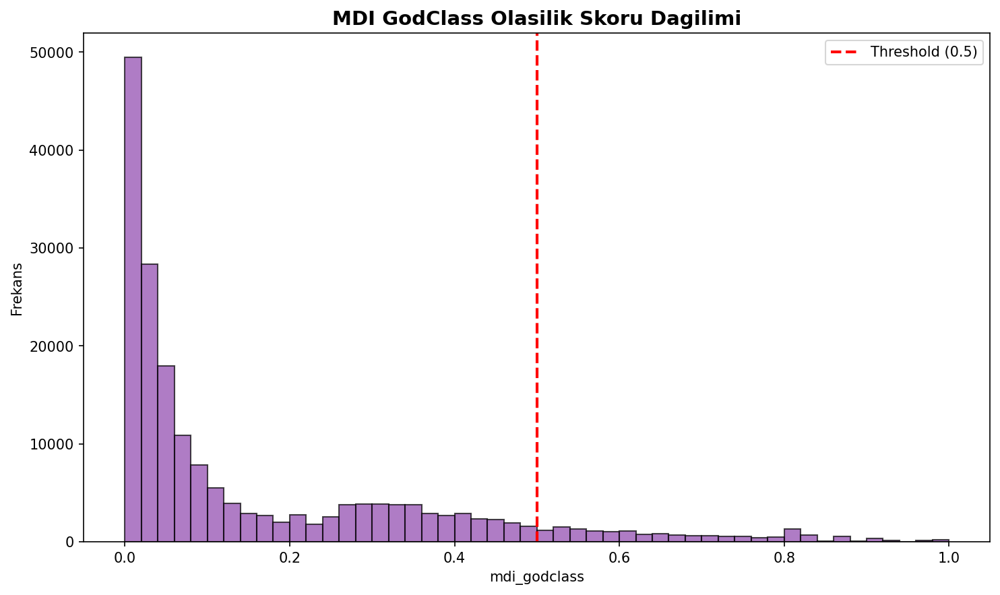

MDI (Multiple Data Imputation) yöntemiyle hesaplanan God Class olasılık skoru 0-1 arasında 
dağılmaktadır. Ortalama skor 0.166 olup, çoğu sınıfın düşük God Class olasılığına sahip 
olduğu görülmektedir.

### 5.3 Proje Bazlı GodClass Oranı

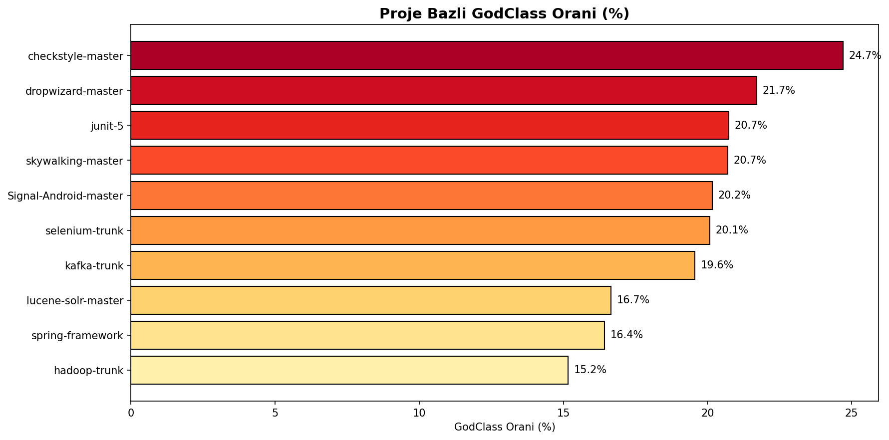

| Proje | GodClass Sayısı | Toplam Sınıf | GodClass Oranı |
|-------|-----------------|-------------|----------------|
| Checkstyle | 630 | 2,551 | %24.70 |
| Dropwizard | 700 | 3,226 | %21.70 |
| JUnit 5 | 514 | 2,479 | %20.73 |
| Skywalking | 2,090 | 10,092 | %20.71 |
| Signal Android | 2,295 | 11,378 | %20.17 |
| Selenium | 1,327 | 6,608 | %20.08 |
| Kafka | 2,236 | 11,432 | %19.56 |
| Lucene-Solr | 8,517 | 51,120 | %16.66 |
| Spring Framework | 5,203 | 31,675 | %16.43 |
| Hadoop | 9,116 | 60,146 | %15.16 |

**Yorum:** Checkstyle (%24.70) ve Dropwizard (%21.70) projelerinde en yüksek God Class oranı 
gözlemlenirken, Hadoop (%15.16) ve Spring Framework (%16.43) en düşük oranlara sahiptir. 
Daha büyük projelerin (Hadoop, Spring) daha düşük God Class oranına sahip olması, 
iyi yapılandırılmış kod mimarisinin etkisini göstermektedir.

## 6. Korelasyon ve Bağımlılık Analizi (Correlation & Dependency Analysis)

### 6.1 Pearson Korelasyon Matrisi

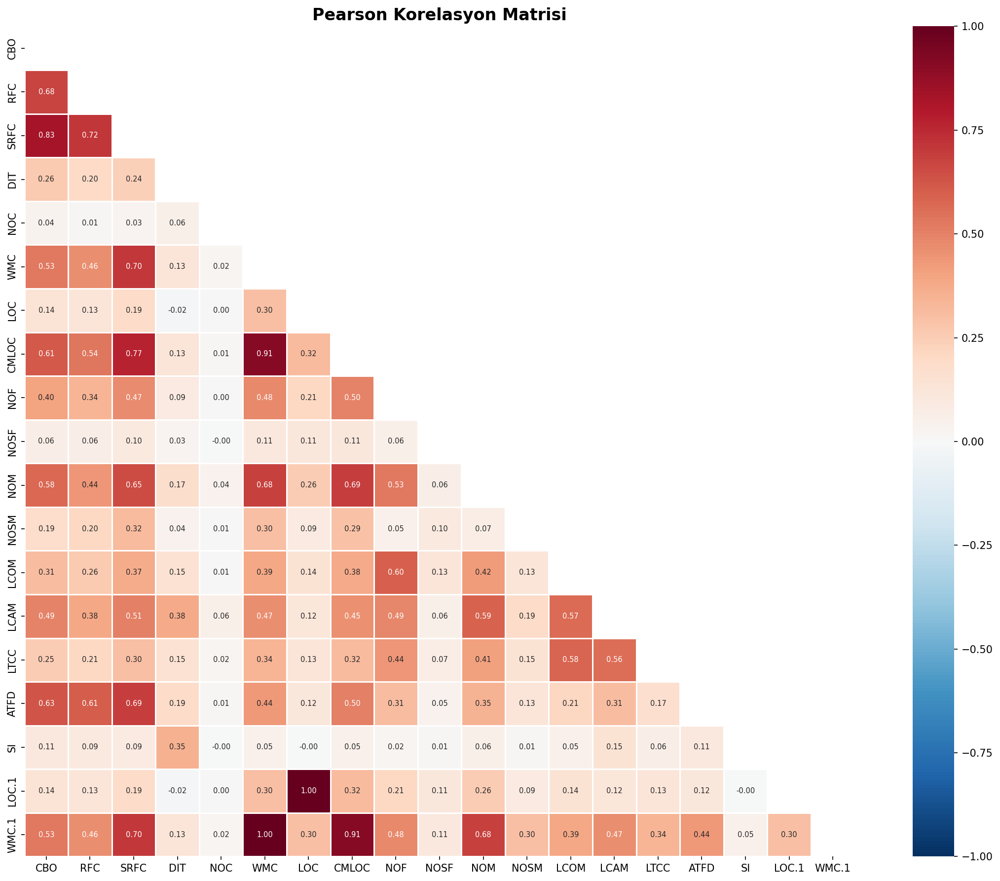

### 6.2 En Yüksek Korelasyonlar

| Değişken 1 | Değişken 2 | Korelasyon |
|------------|------------|------------|
| WMC | WMC.1 | 1.0000 |
| LOC | LOC.1 | 1.0000 |
| WMC | CMLOC | 0.9065 |
| CMLOC | WMC.1 | 0.9065 |
| CBO | SRFC | 0.8289 |
| SRFC | CMLOC | 0.7675 |
| RFC | SRFC | 0.7167 |
| SRFC | WMC | 0.7037 |
| CMLOC | NOM | 0.6921 |
| SRFC | ATFD | 0.6888 |
| WMC | NOM | 0.6810 |
| CBO | RFC | 0.6792 |
| SRFC | NOM | 0.6520 |

**Yorum:** `WMC` ve `WMC.1` ile `LOC` ve `LOC.1` arasında tam korelasyon (1.0) bulunmaktadır; 
bunlar aynı metriğin farklı kaynaklardan gelen tekrarlarıdır. `WMC`-`CMLOC` (0.91) arasında 
çok güçlü korelasyon mevcuttur; her ikisi de sınıf karmaşıklığını ölçmektedir. `CBO`-`SRFC` 
(0.83) bağımlılık metrikleri arasındaki güçlü ilişkiyi göstermektedir.

### 6.3 Chi-Square Bağımsızlık Testleri (Kategorik Değişkenler)

| Değişken 1 | Değişken 2 | χ² | p-değeri | Cramér's V | Anlamlı? |
|------------|------------|-----|---------|------------|----------|
| Complexity | GodClass | 2,590.46 | 0.000000 | 0.1165 | Evet |
| Coupling | GodClass | 2,445.26 | 0.000000 | 0.1132 | Evet |
| Size | GodClass | 11,112.49 | 0.000000 | 0.2414 | Evet |
| Lack of Cohesion | GodClass | 3,292.16 | 0.000000 | 0.1314 | Evet |

**Yorum:** Tüm kategorik kalite nitelikleri, God Class hedef değişkeni ile istatistiksel 
olarak anlamlı ilişkiye sahiptir (p < 0.001). `Size` kategorisi en güçlü ilişkiyi 
göstermektedir (V = 0.2414), bu da sınıf boyutunun God Class tespitinde en önemli 
kategorik gösterge olduğuna işaret etmektedir.

### 6.4 Çapraz Tablolar

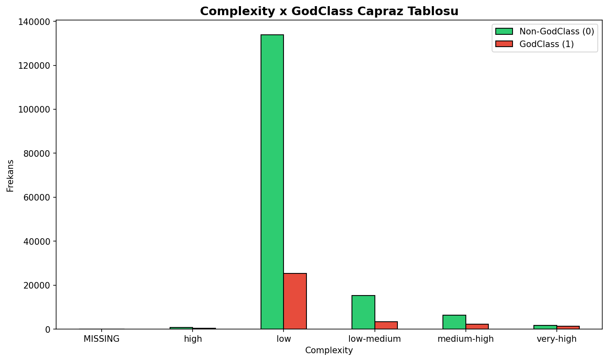

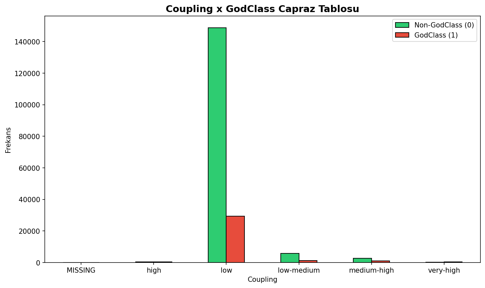

### 6.5 ANOVA Testi (Sayısal ~ GodClass)

| Değişken | F-İstatistik | p-değeri | Anlamlı? |
|----------|-------------|---------|----------|
| CBO | 1,083.17 | 0.000000 | Evet |
| RFC | 1,184.41 | 0.000000 | Evet |
| SRFC | 3,417.59 | 0.000000 | Evet |
| DIT | 163.12 | 0.000000 | Evet |
| NOC | 1.15 | 0.283094 | Hayır |
| WMC | 4,889.77 | 0.000000 | Evet |
| LOC | 1,873.72 | 0.000000 | Evet |
| CMLOC | 4,740.42 | 0.000000 | Evet |
| NOF | 2,705.44 | 0.000000 | Evet |
| NOSF | 183.71 | 0.000000 | Evet |
| NOM | 2,980.87 | 0.000000 | Evet |
| NOSM | 1,044.72 | 0.000000 | Evet |
| LCOM | 1,626.97 | 0.000000 | Evet |
| LCAM | 687.23 | 0.000000 | Evet |
| LTCC | 1,280.40 | 0.000000 | Evet |
| ATFD | 1,288.76 | 0.000000 | Evet |
| SI | 13.45 | 0.000245 | Evet |

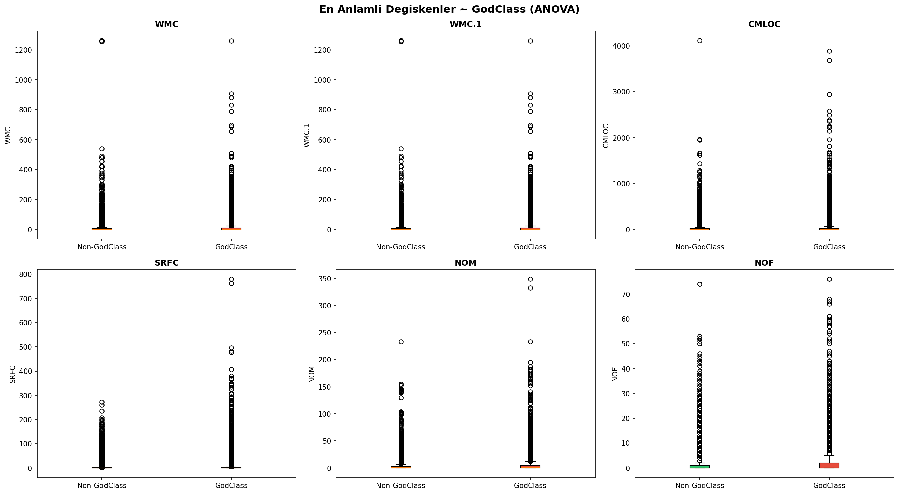

**Yorum:** `NOC` hariç tüm sayısal metrikler God Class ile istatistiksel olarak anlamlı 
farklılık göstermektedir. En yüksek F değerlerine sahip metrikler: `WMC` (F=4,889.77), 
`CMLOC` (F=4,740.42), `SRFC` (F=3,417.59), `NOM` (F=2,980.87) ve `NOF` (F=2,705.44). 
Bu metrikler God Class tespitinde en ayırt edici özelliklerdir.

## 7. Çoklu Doğrusal Bağıntı Analizi (Multicollinearity)

VIF (Variance Inflation Factor) değerleri hesaplanmıştır. VIF > 10 ciddi, VIF > 5 orta düzey 
multicollinearity anlamına gelir.

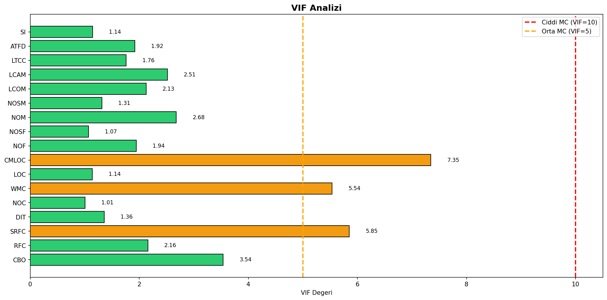

| Değişken | VIF | Ciddi MC? (>10) | Orta MC? (>5) |
|----------|-----|-----------------|---------------|
| CBO | 3.54 | Hayır | Hayır |
| RFC | 2.16 | Hayır | Hayır |
| SRFC | 5.85 | Hayır | Evet |
| DIT | 1.36 | Hayır | Hayır |
| NOC | 1.01 | Hayır | Hayır |
| WMC | 5.54 | Hayır | Evet |
| LOC | 1.14 | Hayır | Hayır |
| CMLOC | 7.35 | Hayır | Evet |
| NOF | 1.94 | Hayır | Hayır |
| NOSF | 1.07 | Hayır | Hayır |
| NOM | 2.68 | Hayır | Hayır |
| NOSM | 1.31 | Hayır | Hayır |
| LCOM | 2.13 | Hayır | Hayır |
| LCAM | 2.51 | Hayır | Hayır |
| LTCC | 1.76 | Hayır | Hayır |
| ATFD | 1.92 | Hayır | Hayır |
| SI | 1.14 | Hayır | Hayır |

**Sonuç:** Hiçbir değişkende ciddi multicollinearity (VIF > 10) tespit edilmemiştir. 
`CMLOC` (VIF=7.35), `SRFC` (VIF=5.85) ve `WMC` (VIF=5.54) orta düzey multicollinearity 
göstermektedir. Bu değişkenler sınıf karmaşıklığı ile ilgili metrikleri temsil etmekte 
olup, aralarındaki korelasyon beklenen bir durumdur.

## 8. Boyut Analizi (Dimensionality Analysis)

### 8.1 PCA (Principal Component Analysis)

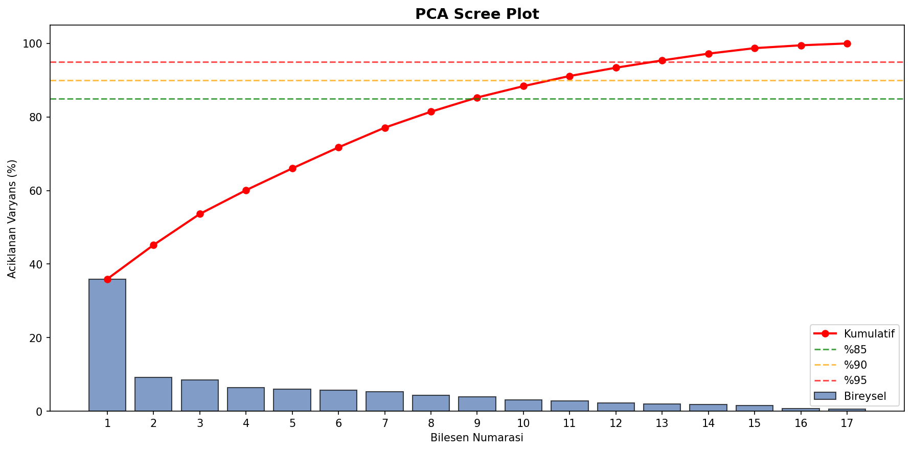

| Bileşen | Açıklanan Varyans (%) | Kümülatif (%) |
|---------|----------------------|---------------|
| PC1 | 35.94 | 35.94 |
| PC2 | 9.25 | 45.19 |
| PC3 | 8.43 | 53.62 |
| PC4 | 6.47 | 60.09 |
| PC5 | 5.93 | 66.02 |
| PC6 | 5.71 | 71.74 |
| PC7 | 5.36 | 77.09 |
| PC8 | 4.34 | 81.44 |
| PC9 | 3.86 | 85.29 |
| PC10 | 3.10 | 88.39 |
| PC11 | 2.75 | 91.14 |
| PC12 | 2.26 | 93.40 |
| PC13 | 1.99 | 95.39 |

- **%85 varyans için gereken bileşen sayısı:** 9
- **%90 varyans için gereken bileşen sayısı:** 11
- **%95 varyans için gereken bileşen sayısı:** 13

**Yorum:** İlk bileşen (PC1) varyansın %35.94'ünü açıklamakta olup, sınıf büyüklüğü ve 
karmaşıklık metriklerinin ortak faktörünü temsil etmektedir. 17 değişkenden %85 varyansı 
açıklamak için 9 bileşen yeterlidir; bu, yaklaşık %47 boyut indirgeme fırsatı sunmaktadır.

### 8.2 PCA 2D Scatter Plot

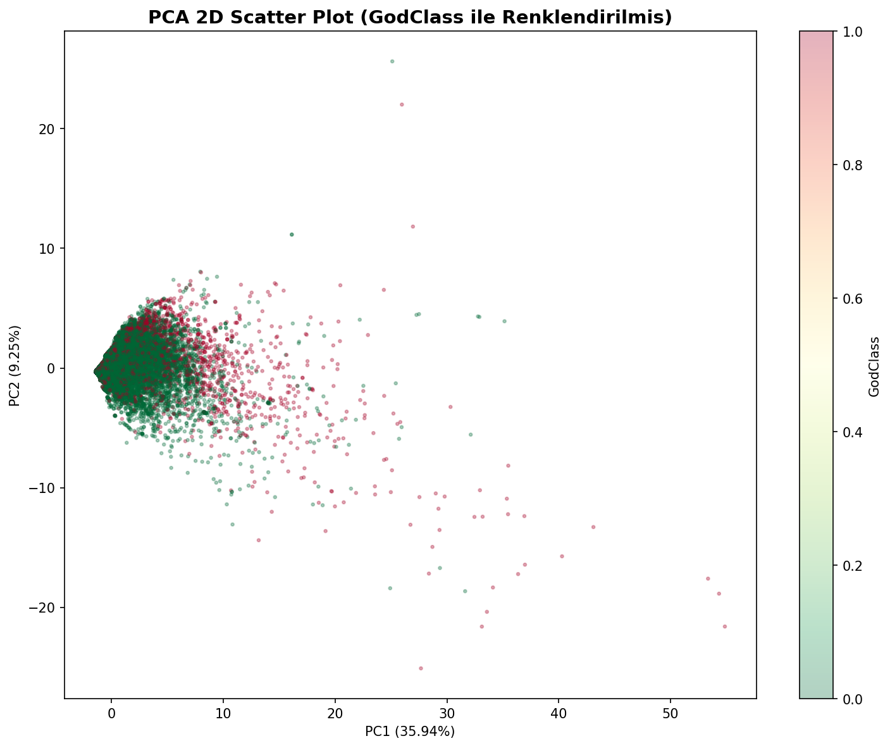

## 9. Veri Kalitesi Değerlendirmesi (Data Quality Assessment)

### 9.1 Eksik Veri (Missing Values)

**Sınıf Düzeyinde Metrikler (%0.03 eksik):**

| Sütun | Eksik Değer | Oran (%) |
|-------|-------------|----------|
| CBO, RFC, SRFC, DIT, NOC, WMC, LOC, CMLOC, NOF, NOSF, NOM, NOSM, LCOM, LCAM, LTCC, ATFD, SI, LOC.1, WMC.1 | 60 (her biri) | %0.03 |
| NORM | 1,079 | %0.57 |
| Name | 66 | %0.03 |

**Tamamen Boş Sütunlar (%100 eksik) - Paket ve Metot Düzeyindeki Metrikler:**

| Sütun | Açıklama |
|-------|----------|
| Coverage, #(C&I), #C, #I | Paket kapsamı metrikleri |
| AC, EC, Abs, Ins, ND | Paket bağımlılık metrikleri |
| Coverage.1, MCC, NBD, LOC.2, #Pa, #MC, #AF | Metot düzeyi metrikleri |

**Yorum:** Ana kalite metrikleri (sınıf düzeyi) neredeyse eksiksizdir (%0.03 eksik). 
Ancak paket ve metot düzeyindeki 14 sütun tamamen boştur; bu sütunlar ana birleştirilmiş 
dosyaya dahil edilmiş ancak bu düzeyde veri toplanmamıştır.

### 9.2 Tekrarlayan Kayıtlar (Duplicates)

- **Toplam tekrarlayan satır:** 0
- **Tekrarlama oranı:** %0.0

### 9.3 Gürültülü Veri ve Anormal Değerler

IQR yöntemiyle tespit edilen outlier'lar:

| Değişken | Alt Sınır | Üst Sınır | Outlier Sayısı | Oran (%) |
|----------|-----------|-----------|----------------|----------|
| CBO | -1.5 | 2.5 | 30,839 | 16.18 |
| RFC | -10.5 | 17.5 | 27,608 | 14.48 |
| SRFC | -3.0 | 5.0 | 29,099 | 15.26 |
| DIT | -1.5 | 2.5 | 13,172 | 6.91 |
| NOC | 0.0 | 0.0 | 18,106 | 9.50 |
| WMC | -9.0 | 15.0 | 20,404 | 10.70 |
| LOC | -58.0 | 118.0 | 20,580 | 10.79 |
| CMLOC | -27.0 | 45.0 | 21,124 | 11.08 |
| NOF | -1.5 | 2.5 | 25,435 | 13.34 |
| NOSF | 0.0 | 0.0 | 34,379 | 18.03 |
| NOM | -6.0 | 10.0 | 12,919 | 6.78 |
| NOSM | 0.0 | 0.0 | 15,800 | 8.29 |
| LCOM | 0.0 | 0.0 | 36,618 | 19.21 |
| LCAM | -0.56 | 0.94 | 30 | 0.02 |
| LTCC | 0.0 | 0.0 | 42,502 | 22.29 |
| ATFD | 0.0 | 0.0 | 11,384 | 5.97 |
| SI | 0.0 | 0.0 | 8,542 | 4.48 |

**Yorum:** Yazılım kalite metrikleri doğası gereği sağa çarpık dağılıma sahiptir. 
`LTCC` (%22.29), `LCOM` (%19.21) ve `NOSF` (%18.03) değişkenlerinde yüksek outlier 
oranları gözlemlenmektedir. Bu outlier'lar, God Class veya karmaşık sınıfların doğal 
varlığını yansıtmaktadır.

### 9.4 Feature Scaling Gereksinimi

| Değişken | Min | Max | Aralık | Std |
|----------|-----|-----|--------|-----|
| CBO | 0.0 | 199.0 | 199.0 | 4.7696 |
| RFC | 0.0 | 4,185.0 | 4,185.0 | 68.507 |
| SRFC | 0.0 | 780.0 | 780.0 | 12.9411 |
| DIT | 0.0 | 10.0 | 10.0 | 1.1541 |
| NOC | 0.0 | 171.0 | 171.0 | 2.5099 |
| WMC | 0.0 | 1,262.0 | 1,262.0 | 19.5985 |
| LOC | 0.0 | 40,736.0 | 40,736.0 | 309.3402 |
| CMLOC | 0.0 | 4,113.0 | 4,113.0 | 64.4645 |
| NOF | 0.0 | 76.0 | 76.0 | 2.6566 |
| NOM | 0.0 | 349.0 | 349.0 | 6.9281 |
| LCOM | 0.0 | 2.0 | 2.0 | 0.3198 |
| LCAM | 0.0 | 0.97 | 0.97 | 0.2551 |
| LTCC | 0.0 | 1.0 | 1.0 | 0.3463 |
| ATFD | 0.0 | 41.0 | 41.0 | 0.6007 |
| SI | 0.0 | 12.0 | 12.0 | 0.3116 |

- **Scaling gerekli mi?** Evet

Değişkenler arasında çok büyük ölçek farklılıkları bulunmaktadır (ör: `LOC` aralığı 40,736 
iken `LCOM` aralığı 2.0). Makine öğrenmesi modelleri öncesinde **RobustScaler** (yüksek 
outlier oranları nedeniyle) veya **StandardScaler** ile ölçeklendirme yapılması önerilir.

## 10. Sonuç ve Akademik Çıkarımlar (Conclusion)

### 10.1 Genel Değerlendirme

Bu analiz kapsamında, 10 büyük ölçekli açık kaynak Java projesinden toplanan yazılım kalite 
nitelikleri veri seti detaylı olarak incelenmiştir. Veri seti, sınıf düzeyinde CK metrikleri, 
uyum/bağımlılık ölçümleri ve God Class tespiti bilgilerini içermektedir.

### 10.2 Temel Bulgular

1. **Veri Kalitesi:** Sınıf düzeyindeki ana metrikler neredeyse eksiksizdir (%0.03). 
Paket ve metot düzeyindeki 14 sütun tamamen boş olup, analiz dışı bırakılmıştır.

2. **Sınıf Dengesi:** God Class hedef değişkeni belirgin dengesizlik göstermektedir 
(4.84:1 oranı, %17.11 GodClass). SMOTE veya ADASYN gibi tekniklerle dengeleme 
yapılması önerilmektedir.

3. **Korelasyon Yapısı:** `WMC`-`CMLOC` (0.91), `CBO`-`SRFC` (0.83) arasında güçlü 
korelasyonlar bulunmaktadır. `WMC`/`WMC.1` ve `LOC`/`LOC.1` çiftleri aynı bilgiyi 
taşımaktadır.

4. **Multicollinearity:** Ciddi multicollinearity tespit edilmemiştir (tüm VIF < 10). 
Orta düzeyde `CMLOC` (7.35), `SRFC` (5.85) ve `WMC` (5.54) bulunmaktadır.

5. **Boyut İndirgeme:** PCA'da ilk bileşen varyansın %35.94'ünü açıklamaktadır. 
%85 varyans için 9 bileşen (17 üzerinden) yeterlidir.

6. **ANOVA Sonuçları:** `NOC` hariç tüm metrikler God Class ile anlamlı farklılık 
göstermektedir. En güçlü ayırt ediciler: `WMC`, `CMLOC`, `SRFC`, `NOM`, `NOF`.

### 10.3 Yazılım Test Optimizasyonu Perspektifi

- **God Class Tespiti:** Bu veri seti, God Class anti-pattern'inin otomatik tespiti için 
sınıflandırma modelleri (Random Forest, XGBoost, SMOTE+SVM) ile kullanılabilir.

- **Kod Kalitesi İzleme:** CK metrikleri ve kalite nitelikleri, CI/CD pipeline'larına 
entegre edilerek sürekli kod kalitesi izleme sistemleri oluşturulabilir.

- **Test Önceliklendirme:** God Class olasılığı yüksek sınıflar, test süreçlerinde 
öncelikli olarak ele alınabilir. `mdi_godclass` skoru, risk tabanlı test 
stratejilerinde kullanılabilir.

- **Refactoring Önerisi:** Yüksek `WMC`, `LOC` ve `ATFD` değerlerine sahip sınıflar 
için otomatik refactoring önerileri üretilebilir.

- **Proje Karşılaştırması:** Farklı projelerdeki God Class oranları, yazılım mimarisi 
kalitesinin karşılaştırmalı analizi için kullanılabilir.

---

## Ödev Maddeleri Karşılama Tablosu

| Madde | Başlık | Rapordaki Bölüm | Karşılandı? |
|-------|--------|-----------------|-------------|
| 1.1 | Veri Seti Dosya Yapısı | Bölüm 1, 2.1 | ✅ |
| 1.2 | Veri Boyutu (satır, sütun, tipler) | Bölüm 2.2, 2.3 | ✅ |
| 2 | Temel İstatistik (ort, medyan, std, min/max, skew, kurt) | Bölüm 3 | ✅ |
| 3 | Dağılım (histogram, boxplot, outlier) | Bölüm 4 | ✅ |
| 4.1 | Korelasyon Analizi | Bölüm 6.1, 6.2 | ✅ |
| 4.2 | Chi-Square (Kategorik) | Bölüm 6.3 | ✅ |
| 4.3 | Sayısal – Hedef Analizi | Bölüm 6.5 | ✅ |
| 5 | Sınıf Dengesi (imbalance, SMOTE) | Bölüm 5 | ✅ |
| 6 | PCA Analizi | Bölüm 8 | ✅ |
| 7 | Multicollinearity (VIF) | Bölüm 7 | ✅ |
| 8 | Veri Kalitesi (missing, duplicate, gürültü, scaling) | Bölüm 9 | ✅ |
| 9 | Rapor Formatı (akademik başlıklar) | Tüm rapor | ✅ |
| 10 | Değerlendirme Kriterleri | Bu tablo | ✅ |
