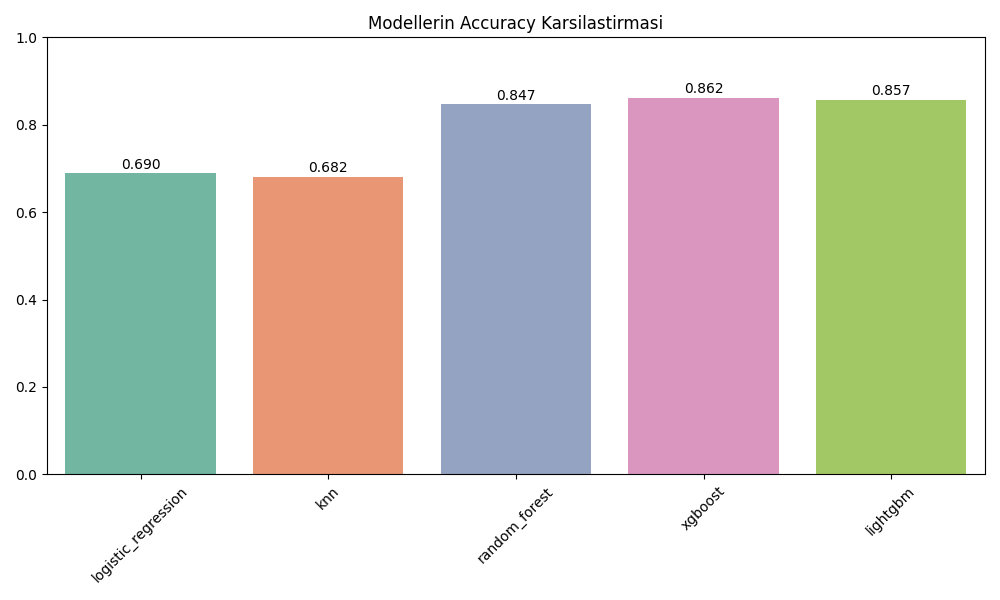
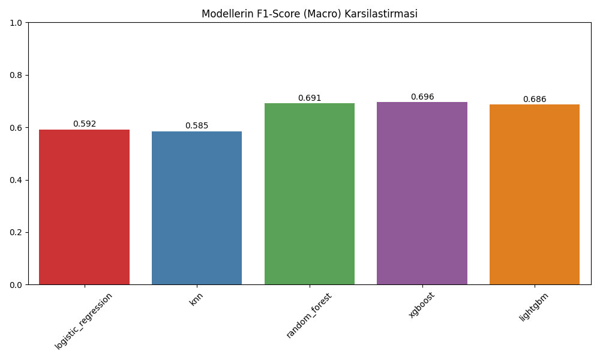

# SQA GodClass Tahmini - Modellerin Karsilastirilmasi

Bu belgede 5 farkli makine ogrenmesi modelinin `GodClass` ihtiyaci uzerindeki (SMOTE eklenmis) performanslari ozetlenmistir.

## 1. Sonuclar Tablosu

| Model | Accuracy | F1-Score (Macro) |
|-------|----------|-----------------|
| **xgboost** | 0.8616 | 0.6964 |
| **lightgbm** | 0.8570 | 0.6865 |
| **random_forest** | 0.8467 | 0.6910 |
| **logistic_regression** | 0.6895 | 0.5918 |
| **knn** | 0.6815 | 0.5852 |

## 2. Grafiksel Gorseller

