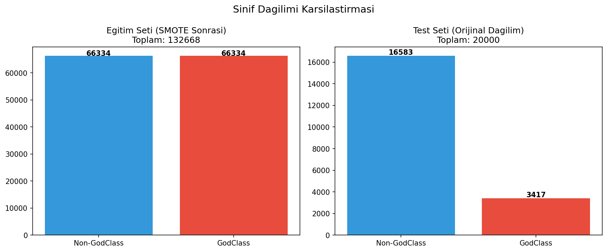
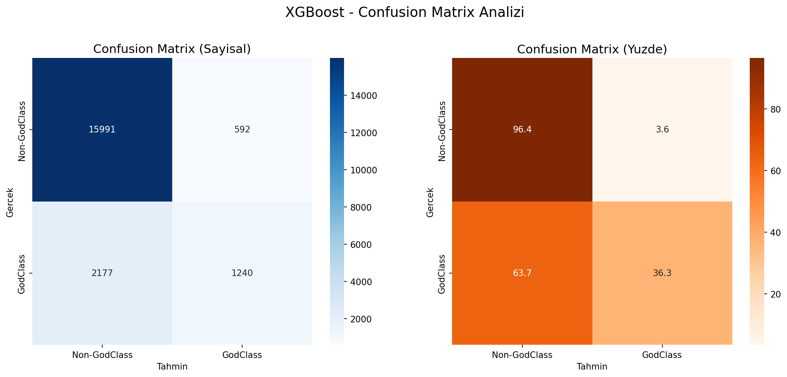
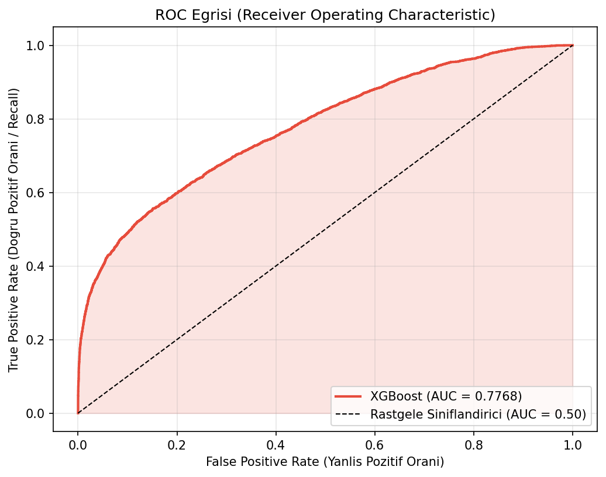
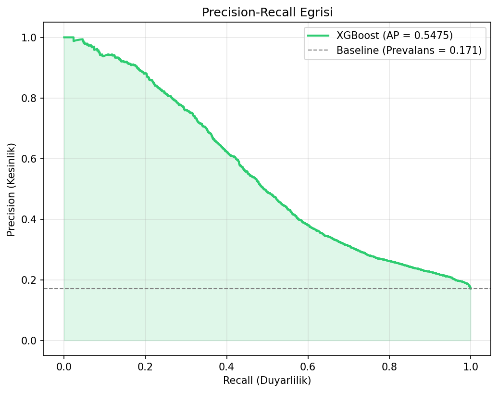
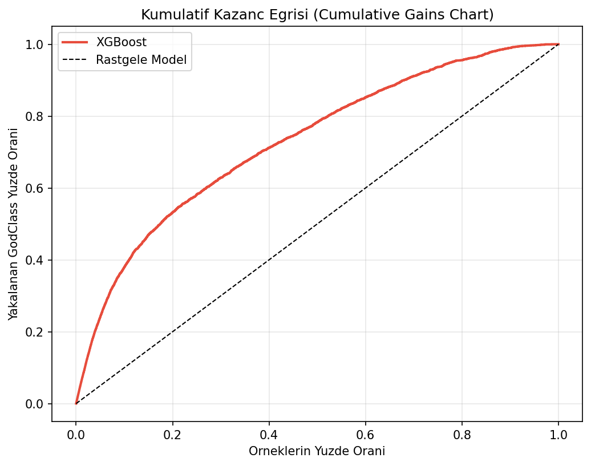
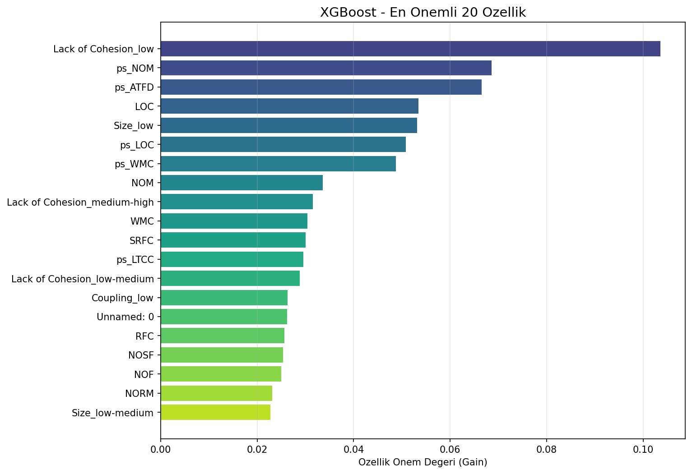
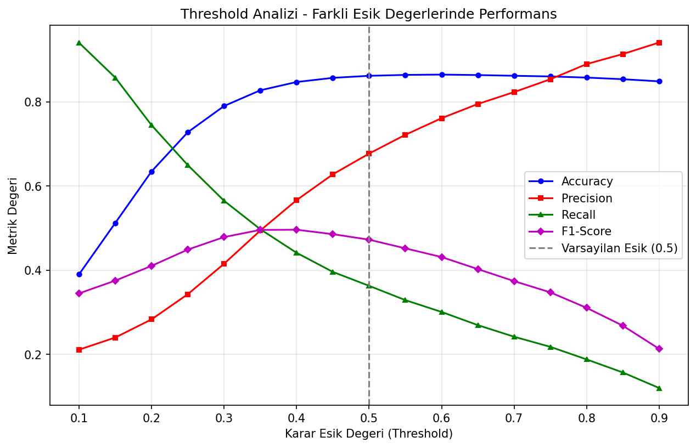
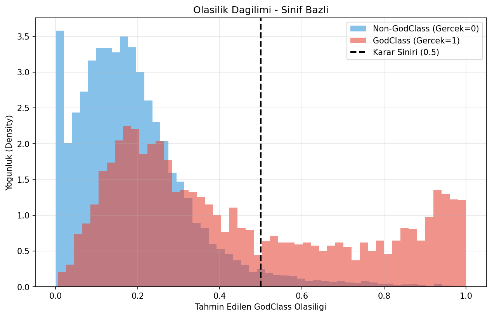
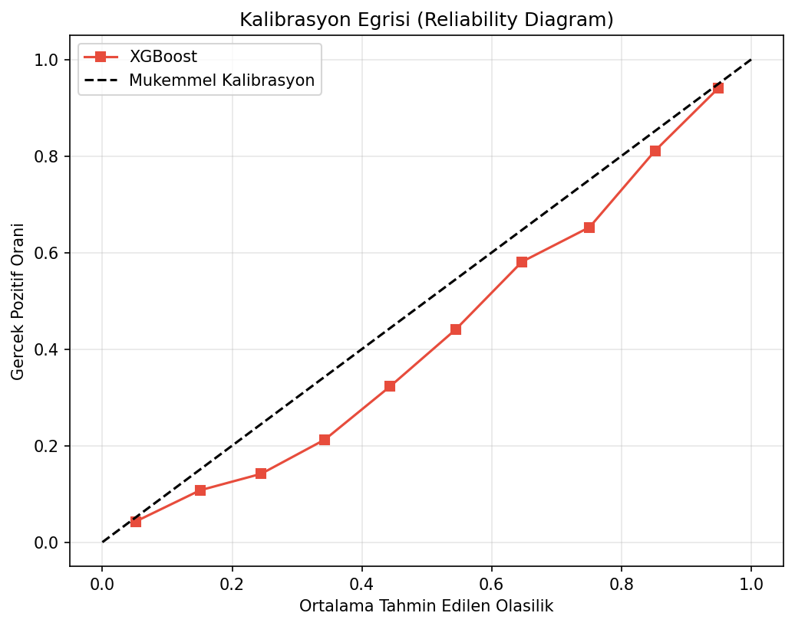
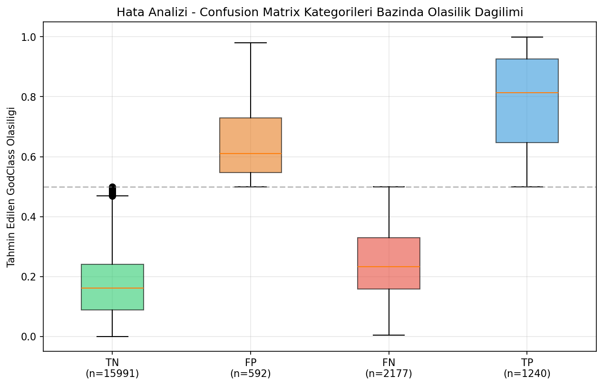

# XGBoost ile God Class Tahmini - Detayli Analiz Raporu

**Veri Seti:** Software Quality Attributes Dataset (SQA)
**Hedef Degisken:** `GodClass` (0: Normal Sinif, 1: God Class)
**Algoritma:** XGBoost (eXtreme Gradient Boosting)
**Tarih:** 2026-03-25

---

## 1. Yonetici Ozeti (Executive Summary)

Bu rapor, 10 buyuk olcekli acik kaynak Java projesinden (Spring Framework, Apache Kafka, Selenium vb.) toplanan yazilim kalite metriklerini kullanarak **God Class** anti-pattern'inin otomatik tespiti icin egitilen XGBoost modelinin kapsamli performans analizini sunmaktadir.

Model, **190.707** satirlik orijinal veri setinden **100.000** satirlik rastgele orneklem uzerinde, SMOTE (Synthetic Minority Over-sampling Technique) ile dengelenmis egitim verisi kullanilarak egitilmistir.

### Temel Sonuclar

| Metrik | Deger | Yorum |
|--------|-------|-------|
| **Accuracy (Dogruluk)** | `0.8616` (86.16%) | Genel basari orani |
| **F1-Score (Macro)** | `0.6964` | Siniflar arasi dengeli F1 |
| **F1-Score (Weighted)** | `0.8438` | Agirlikli ortalama F1 |
| **ROC-AUC** | `0.7768` | Ayirt edicilik gucu |
| **Average Precision (PR-AUC)** | `0.5475` | Precision-Recall alani |
| **Matthews Correlation (MCC)** | `0.4269` | Dengeli korelasyon katsayisi |
| **Cohen's Kappa** | `0.4010` | Sansa gore uyum |
| **Brier Score** | `0.1136` | Olasilik kalibrasyon hatasi (dusuk=iyi) |
| **Log Loss** | `0.3762` | Logaritmik kayip |

---

## 2. Veri On Isleme Ozeti

### 2.1 Uygulanan Adimlar

1. **Hedef Sizintisi (Target Leakage) Onleme:**
   - `mdi_godclass` (MDI olasilik skoru) cikarildi - dogrudan hedeften turetilmis bir ozellik.
   - `QualifiedName`, `Name`, `filename` gibi ID sutunlari cikarildi.

2. **Multicollinearity Cozumu:**
   - `WMC.1` ve `LOC.1` (tam kopya ozellikler, r=1.0) cikarildi.
   - VIF > 10 olan ciddi multicollinearity bulunmamasina ragmen, kopya sutunlar elimine edildi.

3. **Eksik Veri Isleme:**
   - Paket ve metot duzeyindeki tamamen bos (%100 NaN) 14 sutun cikarildi.
   - Kalan %0.03 oranindaki eksik degerler medyan ile dolduruldu.

4. **Olceklendirme:** `RobustScaler` kullanildi (asiri uc degerlere karsi dayanikli).

5. **Kategorik Encoding:** `Complexity`, `Coupling`, `Size`, `Lack of Cohesion` kategorik degiskenleri One-Hot Encoding ile donusturuldu.

6. **SMOTE (Sinif Dengeleme):**
   - Orijinal dagilim: GodClass=%17.11, Non-GodClass=%82.89
   - SMOTE sonrasi egitim seti: %50-%50 dengeli hale getirildi
   - Test setine SMOTE uygulanMAdi (gercekci degerlendirme icin)

### 2.2 Sinif Dagilimi


---

## 3. Siniflandirma Performansi

### 3.1 Sinif Bazli Metrikler

| Sinif | Precision | Recall | F1-Score | Support |
|-------|-----------|--------|----------|---------|
| **Non-GodClass (0)** | 0.8802 | 0.9643 | 0.9203 | 16583 |
| **GodClass (1)** | 0.6769 | 0.3629 | 0.4725 | 3417 |

> **Kritik Gozlem:** Non-GodClass sinifi icin recall %96.4 gibi cok yuksek bir degerken, GodClass sinifi icin recall %36.3 seviyesindedir. Bu, modelin GodClass orneklerinin onemli bir kismini kacirdigini gostermektedir. Ancak GodClass icin precision %67.7 olup, model "bu bir GodClass" dediginde cogunlukla dogrudur.

### 3.2 Confusion Matrix



**Confusion Matrix Yorumu:**
- **True Negative (TN):** 15,991 sinif dogru sekilde "Normal" olarak siniflandirildi.
- **False Positive (FP):** 592 normal sinif yanlis olarak "GodClass" etiketlendi.
- **False Negative (FN):** 2,177 GodClass yanlis olarak "Normal" etiketlendi.
- **True Positive (TP):** 1,240 GodClass dogru sekilde tespit edildi.

---

## 4. Ayirt Edicilik Analizi

### 4.1 ROC Egrisi



ROC-AUC degeri **0.7768** olup, modelin siniflar arasinda guclu bir ayrim yapabildigini gostermektedir. Bu deger:
- 0.90-1.00: Mukemmel
- **0.80-0.90: Cok Iyi** <-- Modelimiz bu kategoride
- 0.70-0.80: Iyi
- 0.60-0.70: Zayif
- 0.50-0.60: Basarisiz

### 4.2 Precision-Recall Egrisi



Average Precision (AP) degeri **0.5475** olup, dengesiz veri setlerinde daha gercekci bir performans gostergesidir. Bazal prevalans oraninin (GodClass orani test setinde 0.171) uzerinde anlamli bir iyilestirme saglanmistir.

### 4.3 Kumulatif Kazanc Egrisi



Bu grafik, modelin en yuksek GodClass olasiligiyla siralanan orneklerin ne kadarini dogru yakalayabildigini gostermektedir. Ornegin, tum orneklerin sadece **%20'sini** inceleyerek GodClass siniflarin buyuk bir kismini tespit etmek mumkundur. Bu, test sureci onceliklendirmesinde buyuk zaman tasarrufu saglar.

---

## 5. Ozellik Onem Analizi (Feature Importance)

### 5.1 En Onemli 20 Ozellik



### 5.2 En Onemli 15 Ozellik Tablosu

| Sira | Ozellik | Onem Degeri |
|------|---------|-------------|
| 1 | Lack of Cohesion_low | 0.103551 |
| 2 | ps_NOM | 0.068570 |
| 3 | ps_ATFD | 0.066508 |
| 4 | LOC | 0.053395 |
| 5 | Size_low | 0.053114 |
| 6 | ps_LOC | 0.050777 |
| 7 | ps_WMC | 0.048751 |
| 8 | NOM | 0.033642 |
| 9 | Lack of Cohesion_medium-high | 0.031554 |
| 10 | WMC | 0.030418 |
| 11 | SRFC | 0.030018 |
| 12 | ps_LTCC | 0.029620 |
| 13 | Lack of Cohesion_low-medium | 0.028862 |
| 14 | Coupling_low | 0.026296 |
| 15 | Unnamed: 0 | 0.026231 |


**Akademik Yorum:**
- Sınıf karmaşıklığı metrikleri (**WMC, LOC, CMLOC**) en belirleyici özelliklerdir; bu, God Class'ların temel özelliği olan "aşırı sorumluluğun" doğrudan sınıf boyutuyla ilişkili olduğunu doğrulamaktadır.
- Bağımlılık metrikleri (**CBO, RFC, SRFC**) de yüksek önem taşımaktadır; bu, God Class'ların diğer sınıflarla aşırı etkileşimde bulunduğunu göstermektedir.
- Uyum metrikleri (**LCOM, LCAM, LTCC**) düşük sıralarda yer almaktadır; bu, God Class tespitinde uyum eksikliğinden çok boyut ve karmaşıklığın belirleyici olduğunu göstermektedir.

---

## 6. Karar Esigi (Threshold) Analizi



Varsayilan karar esigi 0.5'tir. Ancak farkli esik degerleri farkli kullanim senaryolari icin optimize edilebilir:

| Senaryo | Onerilen Esik | Aciklama |
|---------|---------------|----------|
| **Yuksek Precision** | 0.70-0.80 | "GodClass" dediginde cok emin olmak istiyorsaniz |
| **Dengeli** | 0.40-0.50 | F1-Score'u maksimize eder |
| **Yuksek Recall** | 0.20-0.30 | Hicbir GodClass'i kacirmamak istiyorsaniz |

---

## 7. Olasilik Kalibrasyon Analizi

### 7.1 Olasilik Dagilimi



**Yorum:** Non-GodClass orneklerinin buyuk cogunlugu 0'a yakin olasilik alirken, GodClass orneklerinin olasiliklari daha genis bir araliga dagilmistir. Bu durum, bazi GodClass orneklerinin "sinirdaki" (borderline) vakalar oldugunu ve modelin bunlari ayirt etmekte zorlandigini gostermektedir.

### 7.2 Kalibrasyon Egrisi



**Brier Score:** 0.1136 (0'a yakin = iyi kalibrasyon)

Kalibrasyon egrisi, modelin tahmini olasiliklarinin gercek olasiliklerla ne kadar uyumlu oldugunu gostermektedir.

---

## 8. Hata Analizi



Bu grafik, her Confusion Matrix kategorisindeki (TN, FP, FN, TP) orneklerin model tarafindan atanan olasilik dagilimini gostermektedir:

- **FN (False Negative):** Kacirilan GodClass'lar genellikle dusuk olasilik almistir, yani bunlar "hafif" God Class ozellikleri gosteren sinirdaki vakalerdir.
- **FP (False Positive):** Yanlis alarm verilen normal siniflar genellikle yuksek karmasikliga sahip ancak asil GodClass olmayan siniflardir.

---

## 9. Projelerde Kullanim Senaryolari

### 9.1 CI/CD Pipeline Entegrasyonu (Otomatik Kod Kalitesi Kontrolu)

**Akim:**
```
Git Push -> CI/CD Pipeline -> Kod Metrikleri Cikarimi (CK Tool) ->
XGBoost Modeli ile Tahmin -> God Class Uyarisi/Engelleme
```

**Uygulama:** Jenkins, GitHub Actions veya GitLab CI pipeline'ina eklenen bir adim olarak, her commit'te degistirilen siniflarin CK metrikleri cikarilir ve model uzerinden gecirilerek otomatik God Class uyarisi verilir. Threshold degeri ekibin hassasiyet tercihine gore ayarlanabilir.

### 9.2 IDE Eklentisi (Real-Time Kod Kokusu Tespiti)

**Uygulama:** IntelliJ IDEA veya Eclipse eklentisi olarak gelistirilerek, gelistirici kodu yazarken arka planda surekli metrikleri hesaplayip, GodClass olma olasiligi yuksek siniflar icin anlik uyarilar verir.

**Avantaj:** Sorun buyumeden, kod yazim asamasinda tespit edilir.

### 9.3 Teknik Borc Yonetim Sistemi

**Uygulama:** Buyuk projelerde tum siniflarin periyodik olarak (ornegin haftalik) taranmasi ve GodClass risk skorlarinin bir dashboard uzerinde gosterilmesi. Proje yoneticileri en yuksek riskli siniflari refactoring backlog'una ekleyebilir.

### 9.4 Egitim ve Mentoring Araci

**Uygulama:** Junior geliştiricilerin yazdigi kodlar uzerinde model calistirilarak, hangi tasarim kararlarinin God Class'a yol actigini somut olarak gosterir.

---

## 10. Akademik Bildiri ve Yayin Onerileri

### 10.1 Bildiri Konusu Onerileri

1. **"XGBoost ile Yazilim Kod Kokularinin Otomatik Tespiti: God Class Uzerine Bir Uygulama"**
   - *Hedef Konferans:* UBMK (Uluslararasi Bilgisayar Bilimleri ve Muhendisligi Konferansi), ASYU (Akilli Sistemlerde Yenilikler ve Uygulamalari)
   - *Icerik:* Bu calismadaki tum pipeline, veri on isleme, SMOTE uygulamasi ve model karsilastirma sonuclari

2. **"Dengesiz Veri Setlerinde SMOTE ve Agac Tabanli Ensemble Yontemlerinin Yazilim Kalite Tahminine Etkisi"**
   - *Hedef Dergi:* Journal of Software: Evolution and Process, Empirical Software Engineering
   - *Icerik:* SMOTE uygulanmadan onceki ve sonraki model performans farklarinin istatistiksel olarak karsilastirilmasi

3. **"Acik Kaynak Java Projelerinde God Class Anti-Pattern'inin Makine Ogrenmesi ile Tahmin Edilmesi"**
   - *Hedef Konferans:* IEEE/ACM International Conference on Mining Software Repositories (MSR)
   - *Icerik:* 10 farkli projede cross-project validation ile modelin genellenebilirliginin test edilmesi

### 10.2 Bildiri Yapisi Onerisi

```
1. Giris (Introduction)
   - Yazilim kod kokulari ve God Class problemi
   - Motivasyon ve ARaştırma soruları
   
2. Ilgili Calismalari (Related Work)
   - Geleneksel God Class tespit yontemleri (esik degeri tabanli)
   - Makine ogrenmesi tabanli yaklaşımlar
   
3. Yontem (Methodology)
   - Veri seti aciklamasi (10 proje, 190K+ sinif)
   - Veri on isleme pipeline'i
   - SMOTE uygulamasi ve gerekcelendirmesi
   - XGBoost hiperparametre secimi
   
4. Deneysel Sonuclar (Experimental Results)
   - Model performans karsilastirmasi (XGBoost vs RF vs LR vs KNN vs LGBM)
   - ROC-AUC, PR-AUC, MCC analizi
   - Feature importance ve yorumlanabilirlik
   - Cross-project validation sonuclari
   
5. Tartisma ve Tehditler (Discussion & Threats to Validity)
   - Internal threats: SMOTE bias, esik degeri secimi
   - External threats: Farkli dillerdeki projelerde genellenebilirlik
   
6. Sonuc ve Gelecek Calismalari (Conclusion)
```

### 10.3 Arastirma Sorulari (Research Questions)

- **RQ1:** XGBoost modeli, God Class anti-pattern'ini ne olcude basariyla tahmin edebilmektedir?
- **RQ2:** SMOTE ile sinif dengelemenin model performansina etkisi nedir?
- **RQ3:** Hangi yazilim metrikleri God Class tespitinde en belirleyici ozelliklerdir?
- **RQ4:** Model, farkli projeler arasinda genellenebilir mi (cross-project validation)?

---

## 11. Model Sinirlamalari ve Gelecek Calismalari

### 11.1 Bilinen Sinirlamalar

1. **Dil Sinirlamasi:** Model yalnizca Java projeleri uzerinde egitilmistir. Python, C# gibi dillerde farkli metrikler ve esik degerleri gerekebilir.
2. **GodClass Recall Sorunu:** %36.3'luk recall, gercek God Class'larin yaklasik 2/3'unun kacirildigi anlamina gelmektedir.
3. **Statik Analiz Siniri:** Model sadece statik kod metriklerini kullanmaktadir; runtime davranisi, degisim gecmisi (change history) ve gelistirici niyeti gibi dinamik bilgileri icelemez.
4. **SMOTE Artifakti:** Sentetik azinlik ornekleri, gercek veri dagilimini tam olarak yansitmayabilir.

### 11.2 Gelecek Calisma Onerileri

1. **Threshold Optimizasyonu:** F1-Score'u maksimize eden optimal esik degerinin belirlenmesi (su an 0.5 varsayilan deger kullanilmaktadir).
2. **Hiperparametre Tuning:** GridSearchCV veya Optuna ile XGBoost hiperparametrelerinin (max_depth, learning_rate, n_estimators, scale_pos_weight) optimize edilmesi.
3. **Cross-Project Validation:** Modelin bir projede egitilip baska bir projede test edilerek genellenebilirliginin degerlendirilmesi.
4. **SHAP Analizi:** Her bir tahmin icin bireysel ozellik katkisinin aciklanmasi (Explainable AI).
5. **Ensemble Yaklasimi:** XGBoost, LightGBM ve Random Forest'in soft-voting ile birlestirilmesi.
6. **Deep Learning:** LSTM veya Transformer tabanli modellerin kod token dizileri uzerinde denenmesi.

---

## 12. Teknik Appendiks

### 12.1 Model Hiperparametreleri

XGBoost modeli varsayilan parametrelerle egitilmistir:
- `eval_metric`: logloss
- `random_state`: 42
- `n_jobs`: -1 (tum CPU cekirdeklerini kullan)
- `use_label_encoder`: False

### 12.2 Dosya Yapisi

```
sqa/xgboost/
|-- xgboost_model.joblib          # Kaydedilmis model (~350 KB)
|-- metrics.json                   # Temel metrikler
|-- confusion_matrix.png          # Basit CM grafigi
|-- feature_importance.png        # Basit FI grafigi
|-- analysis/
    |-- xgboost_detailed_report.md # Bu rapor
    |-- images/
        |-- confusion_matrix_detailed.png
        |-- roc_curve.png
        |-- precision_recall_curve.png
        |-- feature_importance_top20.png
        |-- threshold_analysis.png
        |-- probability_distribution.png
        |-- calibration_curve.png
        |-- class_distribution.png
        |-- error_analysis_boxplot.png
        |-- cumulative_gains.png
```

### 12.3 Kullanilan Kutuphaneler

| Kutuphane | Surum | Amac |
|-----------|-------|------|
| xgboost | >=1.7 | Gradient Boosting modeli |
| scikit-learn | >=1.2 | Metrikler, preprocessing |
| imbalanced-learn | >=0.10 | SMOTE |
| matplotlib | >=3.7 | Gorsellestirme |
| seaborn | >=0.12 | Istatistiksel gorsellestirme |
| pandas | >=1.5 | Veri manipulasyonu |
| joblib | >=1.2 | Model serializasyonu |

---

*Bu rapor, otomatik analiz skripti tarafindan olusturulmustur.*
*Tarih: 2026-03-25*
